# C4 Component Diagram — Error Notebook Service

## Description
Shows the internal components of the Error Notebook Service, which manages error collection, classification, spaced repetition scheduling, mastery testing, weakness analysis, and PDF export.

## Diagram

```mermaid
C4Component
    title Error Notebook Service — Component Diagram

    Container_Boundary(errorNotebookService, "Error Notebook Service") {

        Component(errorController, "Error Notebook Controller", "Spring MVC", "REST endpoints for error entries CRUD, review sessions, mastery tests, weakness reports, PDF export.")
        Component(errorCollector, "Error Collector", "Spring AMQP Listener", "Consumes GradingCompleted events from RabbitMQ. Auto-collects incorrect answers as error entries with knowledge point tags.")
        Component(classificationEngine, "Classification Engine", "Spring Bean", "Classifies errors by subject, knowledge point (ltree path), difficulty level, error type (conceptual/careless/incomplete).")
        Component(spacedRepetition, "Spaced Repetition Scheduler", "Spring Bean", "Fixed-interval scheduling (1d, 3d, 7d, 14d, 30d — admin-configured). Schema designed for future FSRS evolution. Calculates next review dates.")
        Component(practiceGenerator, "Practice Question Generator", "Spring AMQP + Spring AI", "Pre-generates practice questions asynchronously via RabbitMQ background job. Invokes LLM to create similar questions for mastery testing.")
        Component(masteryEvaluator, "Mastery Evaluator", "Spring Bean", "Evaluates mastery test results. Promotes entries to 'mastered' status. Feeds back into spaced repetition interval adjustment.")
        Component(weaknessAnalyzer, "Weakness Analyzer", "Spring Bean", "Aggregates error patterns across knowledge points. Identifies top-N weakness areas per student. Generates weakness trend reports.")
        Component(capacityEnforcer, "Capacity Enforcer", "Spring Bean", "Enforces tier-based entry limits. Auto-archives oldest mastered entries to make room. Triggers upgrade prompt for capacity-exceeded users.")
        Component(pdfExporter, "PDF Export Service", "Spring Bean + iText", "Generates formatted PDF error notebooks with original images, corrections, knowledge point summaries. Stores to MinIO.")
        Component(errorPersistence, "Error Persistence", "Spring Data JPA", "Manages error_entry, review_schedule, mastery_test, practice_question entities in PostgreSQL.")
        Component(eventPublisher, "Event Publisher", "Spring AMQP", "Publishes ReviewCompleted, MasteryAchieved events to RabbitMQ for analytics and notification consumers.")
    }

    Container(apiGateway, "API Gateway", "Spring Cloud Gateway", "Routes requests")
    Container(rabbitmq, "RabbitMQ", "Message Broker", "GradingCompleted events, practice generation jobs")
    ContainerDb(postgresql, "PostgreSQL 16", "RDBMS", "Error entries, review schedules, mastery tests")
    ContainerDb(objectStorage, "MinIO", "S3-compatible", "Exported PDFs, original images")
    System_Ext(llmProviders, "LLM Providers", "OpenAI, Claude, ZhiPu/Qwen")

    Rel(apiGateway, errorController, "Routes notebook requests", "HTTP")
    Rel(rabbitmq, errorCollector, "GradingCompleted events", "AMQP")
    Rel(errorCollector, classificationEngine, "Classifies new errors")
    Rel(classificationEngine, errorPersistence, "Persists classified entries")
    Rel(errorPersistence, postgresql, "CRUD operations", "JDBC")
    Rel(errorController, spacedRepetition, "Gets review schedule")
    Rel(spacedRepetition, errorPersistence, "Reads/updates review dates")
    Rel(errorCollector, practiceGenerator, "Triggers async practice generation")
    Rel(practiceGenerator, rabbitmq, "Queues generation job", "AMQP")
    Rel(practiceGenerator, llmProviders, "Generates similar questions", "REST")
    Rel(errorController, masteryEvaluator, "Submits mastery test results")
    Rel(masteryEvaluator, spacedRepetition, "Updates mastery status")
    Rel(errorController, weaknessAnalyzer, "Requests weakness report")
    Rel(weaknessAnalyzer, errorPersistence, "Queries error patterns")
    Rel(errorController, capacityEnforcer, "Checks/enforces limits")
    Rel(capacityEnforcer, errorPersistence, "Archives mastered entries")
    Rel(errorController, pdfExporter, "Triggers PDF export")
    Rel(pdfExporter, objectStorage, "Stores exported PDFs", "S3 API")
    Rel(masteryEvaluator, eventPublisher, "Publishes mastery events")
    Rel(eventPublisher, rabbitmq, "ReviewCompleted, MasteryAchieved events", "AMQP")
```

## Notes
- **11 internal components** within the Error Notebook Service boundary
- **Event-driven collection**: Errors auto-collected from GradingCompleted events — no manual entry required
- **Classification**: Errors tagged by subject, knowledge point (PostgreSQL ltree path), difficulty, and error type
- **Spaced repetition**: Fixed intervals (1d, 3d, 7d, 14d, 30d) configurable via admin-service / Nacos. Schema includes FSRS-compatible fields (`stability`, `difficulty`, `elapsed_days`) for future evolution
- **Async practice generation**: Practice questions pre-generated via RabbitMQ background job to eliminate wait time during mastery tests
- **Capacity enforcement**: Auto-archive strategy — oldest mastered entries archived first; upgrade prompt for exceeded users
- **PDF export**: Full error notebook export with original images, corrections, and knowledge point summaries via iText library, stored to MinIO
