# C4 Component Diagram — Grading Service

## Description
Shows the internal components of the Grading Service, the most complex microservice in the AI Smart Grader platform. Handles AI model routing, LLM invocation, streaming response parsing, result caching, and event publishing.

## Diagram

```mermaid
C4Component
    title Grading Service — Component Diagram

    Container_Boundary(gradingService, "Grading Service") {

        Component(gradingController, "Grading Controller", "Spring MVC + SSE", "REST endpoints for grading requests. Produces SSE/WebSocket streams for real-time results.")
        Component(cascadeRouter, "Cascade Router", "Spring Bean", "Routes to optimal LLM based on subject + complexity estimation + user tier. Maintains routing rules from Nacos config.")
        Component(complexityEstimator, "Complexity Estimator", "Spring Bean", "Pre-analyzes image metadata and question count to estimate complexity tier (simple/medium/complex).")
        Component(cacheManager, "Result Cache Manager", "Spring Bean + Redis", "Dual-layer caching: SHA-256 exact hash + pHash perceptual hash. Checks cache before LLM invocation.")
        Component(llmInvoker, "LLM Invoker", "Spring AI", "Invokes target LLM provider via Spring AI abstraction. Handles streaming, retries, and fallback to secondary model.")
        Component(responseParser, "Streaming Response Parser", "Spring Bean", "Real-time structured extraction from LLM stream: judgment -> answer -> explanation -> knowledge points. Per-question granularity.")
        Component(confidenceScorer, "Confidence Scorer", "Spring Bean", "Evaluates grading confidence. Triggers OCR fallback for low-confidence handwritten text (< threshold).")
        Component(ocrFallback, "OCR Fallback Handler", "Spring Bean", "Invokes PaddleOCR for low-confidence handwriting. Merges OCR text with LLM re-grading request.")
        Component(resultPersistence, "Result Persistence", "Spring Data JPA", "Persists per-question grading results to PostgreSQL. Stores image-question mapping, knowledge point tags.")
        Component(eventPublisher, "Event Publisher", "Spring AMQP", "Publishes GradingCompleted events to RabbitMQ for downstream consumers (error-notebook, analytics, notification).")
        Component(promptManager, "Prompt Template Manager", "Spring Bean", "Loads and assembles prompt templates from admin-service config. Supports A/B testing of prompt variants.")
    }

    Container(apiGateway, "API Gateway", "Spring Cloud Gateway", "Routes and authenticates requests")
    ContainerDb(redis, "Redis 7.x", "Cache", "AI result cache (hash-keyed)")
    ContainerDb(postgresql, "PostgreSQL 16", "RDBMS", "Grading results, question records")
    Container(rabbitmq, "RabbitMQ", "Message Broker", "Async event processing")
    System_Ext(llmProviders, "LLM Providers", "OpenAI, Claude, ZhiPu/Qwen")
    System_Ext(paddleOCR, "PaddleOCR", "Fallback OCR service")
    Container(adminService, "Admin Service", "Spring Boot", "Prompt/model config, A/B testing")
    Container(imageService, "Image Service", "Spring Boot", "Pre-processed images")

    Rel(apiGateway, gradingController, "Routes grading requests", "HTTP")
    Rel(gradingController, cacheManager, "Checks cache first")
    Rel(cacheManager, redis, "GET/SET cached results", "Redis Protocol")
    Rel(gradingController, complexityEstimator, "Estimates complexity")
    Rel(gradingController, cascadeRouter, "Gets target LLM")
    Rel(cascadeRouter, adminService, "Loads routing rules", "HTTP")
    Rel(gradingController, promptManager, "Assembles prompt")
    Rel(promptManager, adminService, "Loads prompt templates", "HTTP/Nacos")
    Rel(gradingController, llmInvoker, "Invokes LLM")
    Rel(llmInvoker, llmProviders, "Sends image + prompt, receives stream", "REST + SSE")
    Rel(llmInvoker, responseParser, "Pipes raw stream")
    Rel(responseParser, confidenceScorer, "Evaluates confidence")
    Rel(confidenceScorer, ocrFallback, "Triggers OCR if low confidence")
    Rel(ocrFallback, paddleOCR, "Extracts text", "REST")
    Rel(responseParser, resultPersistence, "Persists structured results")
    Rel(resultPersistence, postgresql, "Writes grading results", "JDBC")
    Rel(responseParser, eventPublisher, "Publishes completion event")
    Rel(eventPublisher, rabbitmq, "GradingCompleted event", "AMQP")
    Rel(imageService, gradingController, "Provides pre-processed image URL", "HTTP")
```

## Notes
- **11 internal components** within the Grading Service boundary
- **Cascade routing**: subject (math/chinese/english/science) + complexity (simple/medium/complex) + user tier (free/basic/premium) determines LLM selection
- **Dual-layer caching**: SHA-256 for exact match, pHash for perceptual similarity (re-photographed same page)
- **Real-time structured parsing**: LLM stream is parsed in-flight to extract per-question results (judgment, answer, explanation, knowledge points)
- **Confidence scoring**: Triggers PaddleOCR fallback when handwriting recognition confidence drops below configurable threshold
- **Event-driven**: GradingCompleted events fan out to error-notebook-service (auto-collect errors), analytics-service (aggregate stats), notification-service (notify student)
- **A/B testing**: Prompt variants managed by admin-service; grading-service selects variant per routing rules
