# C4 Container Diagram — AI Smart Grader

## Description
Shows the major containers (applications, data stores, message brokers) that make up the AI Smart Grader platform, and how they interact.

## Diagram

```mermaid
C4Container
    title AI Smart Grader — Container Diagram

    Person(student, "Student/Guest", "Uploads exercises, views grading results, manages error notebook")
    Person(teacher, "Teacher", "Manages classes, views analytics")
    Person(parent, "Parent", "Views learning reports")
    Person(admin, "Administrator", "Configures system, monitors health")

    System_Boundary(platform, "AI Smart Grader Platform") {

        Container(flutterApp, "Mobile App", "Flutter/Dart", "iOS and Android native app. Offline error notebook via Drift/SQLite.")
        Container(angularWeb, "Web Application", "Angular 18/TypeScript", "Web browser and H5 mobile client. Student/Teacher/Parent interfaces.")
        Container(miniProgram, "WeChat Mini Program", "Native WXML/WXSS", "WeChat ecosystem client. WebSocket for streaming.")
        Container(adminConsole, "Admin Console", "Angular 18/NG-ZORRO", "Separate SPA for system administration.")

        Container(apiGateway, "API Gateway", "Spring Cloud Gateway", "Single entry point. JWT validation, rate limiting, circuit breaker, request routing, tenant context injection.")

        Container(authService, "Auth Service", "Spring Boot", "Multi-method auth (Phone, Email, WeChat, Google, Apple). JWT issuance. Age gate + parental consent. RBAC.")
        Container(gradingService, "Grading Service", "Spring Boot + Spring AI", "AI grading pipeline: model routing, LLM invocation, streaming SSE/WebSocket, result caching, confidence scoring.")
        Container(imageService, "Image Service", "Spring Boot", "Image upload, quality validation, content moderation gate, format conversion, object storage management.")
        Container(errorNotebookService, "Error Notebook Service", "Spring Boot", "Error collection, classification, spaced repetition scheduling, mastery testing, weakness analysis, PDF export.")
        Container(analyticsService, "Analytics Service", "Spring Boot", "Pre-computed aggregations, student/teacher/parent dashboards, knowledge mastery reports.")
        Container(userService, "User Service", "Spring Boot", "User profiles, parent-child linking, teacher class management, guest device fingerprint tracking.")
        Container(paymentService, "Payment Service", "Spring Boot", "Payment adapter gateway (5 providers), order lifecycle, subscription management, refund processing.")
        Container(notificationService, "Notification Service", "Spring Boot", "Multi-channel delivery orchestration. Publishes to fanout exchange.")
        Container(adminService, "Admin Service", "Spring Boot", "AI prompt/model management, A/B testing, multi-tenant admin, audit logging, 40+ config params.")
        Container(configService, "Config Service", "Nacos 2.x", "Service discovery, configuration hot-reload, namespace/group management.")

        ContainerDb(postgresql, "PostgreSQL 16", "RDBMS", "Primary data store. Row-Level Security for multi-tenancy. ltree for knowledge taxonomy. Read replicas.")
        ContainerDb(redis, "Redis 7.x", "Cache/Store", "AI result cache (hash-keyed), session store, rate limiting, distributed locks, config cache.")
        ContainerDb(objectStorage, "MinIO / Cloud OSS", "S3-compatible", "Uploaded images, PDF exports, static assets.")
        Container(rabbitmq, "RabbitMQ", "Message Broker", "Async event processing: grading events, error collection, notification fanout, practice question generation.")
        ContainerDb(elasticsearch, "Elasticsearch", "Search/Logging", "Centralized logging (ELK), question bank search.")
    }

    System_Ext(llmProviders, "LLM Providers", "OpenAI, Claude, ZhiPu/Qwen")
    System_Ext(paymentProviders, "Payment Providers", "WeChat Pay, Alipay, Apple Pay, Google Pay, Stripe")
    System_Ext(authProviders, "OAuth Providers", "WeChat, Google, Apple")
    System_Ext(messagingProviders, "Messaging", "SMS Gateway, Email Service")
    System_Ext(moderationAPI, "Content Moderation", "Cloud moderation API")

    Rel(student, flutterApp, "Uses", "HTTPS")
    Rel(student, angularWeb, "Uses", "HTTPS")
    Rel(student, miniProgram, "Uses", "HTTPS")
    Rel(teacher, angularWeb, "Uses", "HTTPS")
    Rel(parent, flutterApp, "Uses", "HTTPS")
    Rel(admin, adminConsole, "Uses", "HTTPS")

    Rel(flutterApp, apiGateway, "API calls", "HTTPS + SSE")
    Rel(angularWeb, apiGateway, "API calls", "HTTPS + SSE")
    Rel(miniProgram, apiGateway, "API calls", "HTTPS + WebSocket")
    Rel(adminConsole, apiGateway, "API calls", "HTTPS")

    Rel(apiGateway, authService, "Routes auth requests", "HTTP")
    Rel(apiGateway, gradingService, "Routes grading requests", "HTTP")
    Rel(apiGateway, imageService, "Routes upload requests", "HTTP")
    Rel(apiGateway, errorNotebookService, "Routes notebook requests", "HTTP")
    Rel(apiGateway, analyticsService, "Routes analytics requests", "HTTP")
    Rel(apiGateway, userService, "Routes user requests", "HTTP")
    Rel(apiGateway, paymentService, "Routes payment requests", "HTTP")
    Rel(apiGateway, notificationService, "Routes notification requests", "HTTP")
    Rel(apiGateway, adminService, "Routes admin requests", "HTTP")

    Rel(gradingService, llmProviders, "Sends images, receives streaming results", "REST + SSE")
    Rel(imageService, moderationAPI, "Pre-screens images", "REST")
    Rel(imageService, objectStorage, "Stores/retrieves images", "S3 API")
    Rel(authService, authProviders, "OAuth authentication", "OAuth 2.0")
    Rel(paymentService, paymentProviders, "Processes payments", "REST")
    Rel(notificationService, messagingProviders, "Sends SMS/email", "REST/SMTP")

    Rel(gradingService, postgresql, "Reads/writes grading results", "JDBC")
    Rel(gradingService, redis, "Caches results (hash-keyed)", "Redis Protocol")
    Rel(gradingService, rabbitmq, "Publishes grading events", "AMQP")
    Rel(errorNotebookService, postgresql, "Reads/writes error entries", "JDBC")
    Rel(errorNotebookService, rabbitmq, "Consumes grading events, publishes review events", "AMQP")
    Rel(analyticsService, postgresql, "Reads/writes aggregations", "JDBC")
    Rel(analyticsService, rabbitmq, "Consumes events for aggregation", "AMQP")
    Rel(notificationService, rabbitmq, "Consumes notification events, fanout to channel workers", "AMQP")
    Rel(userService, postgresql, "Reads/writes user data", "JDBC")
    Rel(authService, redis, "Stores refresh tokens, rate limits", "Redis Protocol")
    Rel(adminService, postgresql, "Reads/writes config, audit logs", "JDBC")

    Rel(configService, redis, "Caches config values", "Redis Protocol")
```

## Notes
- 4 client containers: Flutter App, Angular Web, WeChat Mini Program, Admin Console (separate SPA)
- 10 microservice containers behind Spring Cloud Gateway
- 4 data store containers: PostgreSQL (primary), Redis (cache), MinIO (objects), Elasticsearch (logs/search)
- 1 message broker: RabbitMQ for async event processing
- Nacos serves as both service discovery and configuration center
- API Gateway handles: JWT validation, rate limiting, circuit breaker, tenant context injection (X-Tenant-Id, X-User-Id, X-User-Role headers)
