# C4 Context Diagram — AI Smart Grader

## Description
Shows the AI Smart Grader system boundary, its users (5 roles), and all external systems it interacts with.

## Diagram

```mermaid
C4Context
    title AI Smart Grader — System Context Diagram

    Person(student, "Student", "Primary school through university. Uploads exercise photos, reviews AI grading, manages error notebook.")
    Person(teacher, "Teacher", "Manages classes, views class analytics, generates mastery reports, sends messages.")
    Person(parent, "Parent", "Views child's learning reports, configures automated report delivery.")
    Person(admin, "System Administrator", "Configures AI/business rules, manages users/tenants, monitors system health.")
    Person(guest, "Guest", "Unauthenticated visitor. Tries AI grading with limited quota, tracked by device fingerprint.")

    System(smartGrader, "AI Smart Grader Platform", "Cloud-native AI-powered homework grading and intelligent error notebook platform. 10 microservices on Kubernetes.")

    System_Ext(llmOpenAI, "OpenAI API", "GPT-4o multimodal LLM for grading analysis")
    System_Ext(llmClaude, "Anthropic Claude API", "Claude Vision for complex grading")
    System_Ext(llmChinese, "Chinese LLM API", "ZhiPu GLM / Qwen for Chinese-language subjects")
    System_Ext(ocrEngine, "PaddleOCR", "Fallback OCR for low-confidence handwritten text")
    System_Ext(contentMod, "Content Moderation API", "Cloud image moderation service")

    System_Ext(wechatAuth, "WeChat Open Platform", "OAuth 2.0 authentication + Mini Program APIs")
    System_Ext(googleAuth, "Google Identity", "OAuth 2.0 / OIDC authentication")
    System_Ext(appleAuth, "Apple Identity", "Sign in with Apple (OAuth 2.0 + JWT)")

    System_Ext(wechatPay, "WeChat Pay", "Payment processing (China)")
    System_Ext(alipay, "Alipay", "Payment processing (China)")
    System_Ext(applePay, "Apple Pay", "Payment processing (iOS)")
    System_Ext(googlePay, "Google Pay", "Payment processing (Android)")
    System_Ext(stripe, "Stripe", "Payment processing (International)")

    System_Ext(smsGateway, "SMS Gateway", "SMS OTP and notification delivery")
    System_Ext(emailService, "Email Service", "SES/SendGrid for email notifications and reports")
    System_Ext(cdn, "CDN", "Static asset and image delivery")

    Rel(student, smartGrader, "Uploads photos, views results, manages error notebook", "HTTPS")
    Rel(teacher, smartGrader, "Manages classes, views analytics", "HTTPS")
    Rel(parent, smartGrader, "Views child's reports", "HTTPS")
    Rel(admin, smartGrader, "Configures system, monitors health", "HTTPS")
    Rel(guest, smartGrader, "Tries AI grading (limited)", "HTTPS")

    Rel(smartGrader, llmOpenAI, "Sends images for grading", "REST + SSE")
    Rel(smartGrader, llmClaude, "Sends images for grading", "REST + SSE")
    Rel(smartGrader, llmChinese, "Sends images for grading", "REST + SSE")
    Rel(smartGrader, ocrEngine, "Fallback text extraction", "REST")
    Rel(smartGrader, contentMod, "Pre-screens uploaded images", "REST")

    Rel(smartGrader, wechatAuth, "Authenticates users", "OAuth 2.0")
    Rel(smartGrader, googleAuth, "Authenticates users", "OAuth 2.0/OIDC")
    Rel(smartGrader, appleAuth, "Authenticates users", "OAuth 2.0")

    Rel(smartGrader, wechatPay, "Processes payments", "REST")
    Rel(smartGrader, alipay, "Processes payments", "REST")
    Rel(smartGrader, applePay, "Processes payments", "REST")
    Rel(smartGrader, googlePay, "Processes payments", "REST")
    Rel(smartGrader, stripe, "Processes payments", "REST")

    Rel(smartGrader, smsGateway, "Sends SMS", "REST")
    Rel(smartGrader, emailService, "Sends emails", "REST/SMTP")
    Rel(smartGrader, cdn, "Serves static assets", "HTTPS")
```

## Notes
- 5 user roles interact with a single system boundary
- 17 external system integrations grouped by: AI/ML, Authentication, Payment, Messaging, Infrastructure
- All client communication over HTTPS; AI providers use REST + SSE for streaming
- Content moderation runs as a pre-gate before any LLM call
- PaddleOCR deployed as internal service but shown externally for clarity at context level
