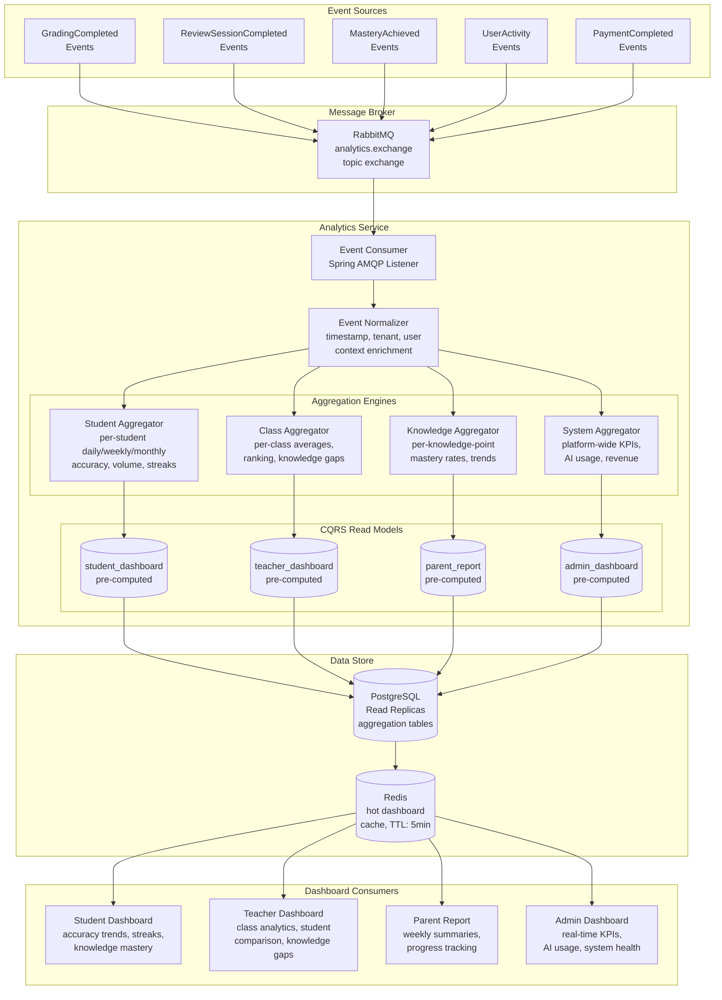

# Data Flow Diagram — Analytics Aggregation Pipeline

## Description
Shows how raw events from grading, error notebook, and user activity flow through the analytics aggregation pipeline to produce pre-computed dashboard data for students, teachers, parents, and admins.

## Diagram

## Aggregation Schedules

| Aggregator | Trigger | Freshness | Output |
|:---|:---|:---|:---|
| Student Aggregator | On each GradingCompleted/ReviewCompleted event | ≤ 1 min | Daily accuracy, weekly volume, streaks, knowledge mastery % |
| Class Aggregator | Batch every 5 min | ≤ 5 min | Class averages, student ranking, knowledge gap matrix |
| Knowledge Aggregator | Batch every 5 min | ≤ 5 min | Per-knowledge-point mastery rates, error frequency, trend |
| System Aggregator | Batch every 1 min | ≤ 1 min | Active users, AI calls/min, cache hit rate, revenue, error rate |

## Notes
- **CQRS pattern**: Write-side events processed by aggregators; read-side dashboards served from pre-computed tables
- **Data freshness**: Student/admin dashboards ≤ 1 min; teacher/parent dashboards ≤ 5 min (per NFR requirements)
- **Redis caching**: Hot dashboard data cached with 5-minute TTL for high-frequency reads
- **Read replicas**: Aggregation queries run against PostgreSQL read replicas to avoid impacting write workloads
- **Multi-tenant**: All aggregations scoped by tenant_id via Row-Level Security policies
