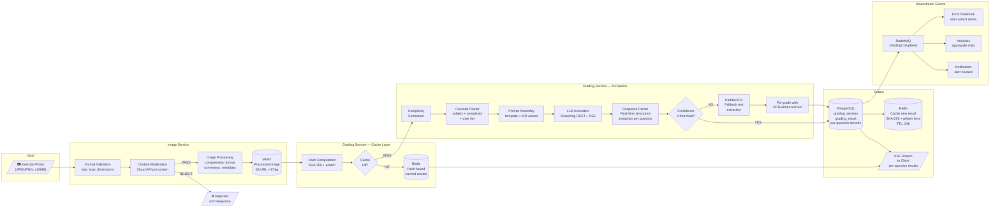

# Data Flow Diagram — AI Grading Pipeline

## Description
Shows how data flows through the AI grading pipeline, from image capture to final result storage and downstream event processing. Highlights data transformations at each stage.

## Diagram

## Data Transformations

| Stage | Input Data | Output Data | Transformation |
|:---|:---|:---|:---|
| Image Upload | Raw photo (JPEG/PNG, ≤10MB) | Processed image (WebP, optimized) | Format conversion, compression, EXIF strip |
| Content Moderation | Image binary | PASS/REJECT verdict | Cloud API classification |
| Hash Computation | Image binary | SHA-256 hash + pHash | Cryptographic hash + perceptual hash |
| Complexity Estimation | Image metadata + question count | Complexity tier (simple/medium/complex) | Heuristic analysis |
| Cascade Routing | Subject + complexity + user tier | Target LLM provider + model ID | Rule-based routing table |
| Prompt Assembly | Template + image URL + context | Complete prompt string | Template interpolation + A/B variant |
| LLM Invocation | Prompt + image | Raw streaming tokens | Multimodal LLM inference |
| Response Parsing | Raw token stream | Structured per-question result | Real-time extraction: {judgment, answer, explanation, knowledgePoints[]} |
| Confidence Scoring | Parsed result | Confidence score (0.0-1.0) | Model output analysis |
| OCR Fallback | Image region | Extracted text | PaddleOCR inference |
| Persistence | Structured results | DB records | JPA entity mapping |
| Caching | Structured results | Redis hash entries | Serialization + TTL |

## Notes
- Data flows left-to-right from input to output
- Content moderation is a hard gate — rejected images never reach the AI pipeline
- Cache layer intercepts before LLM invocation — cache hits bypass the entire AI pipeline
- OCR fallback path only triggered for low-confidence handwriting (< configurable threshold)
- Per-question granularity maintained throughout: each question in an image gets its own result record
- GradingCompleted event carries the full result set for downstream consumers
