# Deployment Architecture Diagram — AI Smart Grader

## Description
Shows the Kubernetes-based deployment topology, including namespace organization, pod scaling, infrastructure services, CI/CD pipeline, and multi-region deployment strategy.

## Diagram

```mermaid
graph TB
    subgraph "Developer Workstation"
        DEV[Developer]
        IDE[IDE + SonarLint]
    end

    subgraph "CI/CD Pipeline"
        GITLAB[GitLab CI]
        SONAR[SonarQube SAST]
        TRIVY[Trivy Container Scan]
        GITLEAKS[Gitleaks Secret Scan]
        HARBOR[Harbor Registry]
        ARGOCD[Argo CD GitOps]
    end

    subgraph "Kubernetes Cluster — Region (e.g., China / EU)"
        subgraph "ingress-ns"
            INGRESS[NGINX Ingress Controller]
            CERT[cert-manager]
            WAF[ModSecurity WAF]
        end

        subgraph "gateway-ns"
            GW1[API Gateway Pod x2]
            GW_HPA[HPA: 2-6 pods]
        end

        subgraph "core-services-ns"
            GRADING[Grading Service x3]
            GRADING_HPA[HPA: 3-10 pods]
            IMAGE[Image Service x2]
            IMAGE_HPA[HPA: 2-6 pods]
            ERROR_NB[Error Notebook Service x2]
            AUTH[Auth Service x2]
            USER[User Service x2]
            ANALYTICS[Analytics Service x2]
            PAYMENT[Payment Service x2]
            NOTIFICATION[Notification Service x2]
            ADMIN[Admin Service x1]
        end

        subgraph "infrastructure-ns"
            NACOS[Nacos Cluster x3]
            RABBIT[RabbitMQ Cluster x3]
            REDIS_M[Redis Sentinel Master]
            REDIS_R1[Redis Sentinel Replica x2]
        end

        subgraph "data-ns"
            PG_PRIMARY[PostgreSQL 16 Primary]
            PG_REPLICA1[PostgreSQL Read Replica 1]
            PG_REPLICA2[PostgreSQL Read Replica 2]
            MINIO[MinIO Cluster x4]
        end

        subgraph "observability-ns"
            SKYWALKING[SkyWalking OAP x2]
            SKYWALKING_UI[SkyWalking UI]
            PROMETHEUS[Prometheus]
            GRAFANA[Grafana]
            ES1[Elasticsearch x3]
            KIBANA[Kibana]
            FLUENTD[Fluentd DaemonSet]
            ALERTMANAGER[Alertmanager]
        end

        subgraph "security-ns"
            VAULT[HashiCorp Vault x3]
            FALCO[Falco DaemonSet]
            ZAP[OWASP ZAP - Scheduled]
        end

        subgraph "canary-ns"
            ARGO_ROLLOUT[Argo Rollouts Controller]
            CANARY_POD[Canary Pods]
        end
    end

    subgraph "External Services"
        CDN[CDN / CloudFront]
        LLM[LLM Providers]
        PAY[Payment Providers]
        OAUTH[OAuth Providers]
        SMS[SMS Gateway]
        EMAIL[Email Service]
        MODERATION[Content Moderation API]
    end

    subgraph "Client Applications"
        FLUTTER[Flutter App iOS/Android]
        ANGULAR[Angular Web/H5]
        MINI[WeChat Mini Program]
        ADMIN_WEB[Admin Console]
    end

    DEV -->|git push| GITLAB
    GITLAB -->|SAST| SONAR
    GITLAB -->|Secret scan| GITLEAKS
    GITLAB -->|Build + scan| TRIVY
    GITLAB -->|Push image| HARBOR
    HARBOR -->|Sync manifest| ARGOCD
    ARGOCD -->|Deploy| GW1

    FLUTTER --> CDN
    ANGULAR --> CDN
    MINI --> CDN
    ADMIN_WEB --> CDN
    CDN --> INGRESS
    INGRESS --> WAF
    WAF --> GW1

    GW1 --> GRADING
    GW1 --> IMAGE
    GW1 --> ERROR_NB
    GW1 --> AUTH
    GW1 --> USER
    GW1 --> ANALYTICS
    GW1 --> PAYMENT
    GW1 --> NOTIFICATION
    GW1 --> ADMIN

    GRADING --> RABBIT
    GRADING --> REDIS_M
    GRADING --> PG_PRIMARY
    GRADING --> LLM
    IMAGE --> MINIO
    IMAGE --> MODERATION
    ERROR_NB --> PG_PRIMARY
    ERROR_NB --> RABBIT
    AUTH --> REDIS_M
    AUTH --> OAUTH
    USER --> PG_PRIMARY
    ANALYTICS --> PG_REPLICA1
    PAYMENT --> PAY
    NOTIFICATION --> SMS
    NOTIFICATION --> EMAIL

    NACOS --> REDIS_M

    PG_PRIMARY --> PG_REPLICA1
    PG_PRIMARY --> PG_REPLICA2

    FLUENTD --> ES1

    ARGO_ROLLOUT --> CANARY_POD

    VAULT --> GW1
    VAULT --> GRADING
```

## Namespace Organization

| Namespace | Components | Purpose |
|:---|:---|:---|
| `ingress-ns` | NGINX Ingress, cert-manager, ModSecurity WAF | Edge traffic, TLS termination, WAF |
| `gateway-ns` | API Gateway (Spring Cloud Gateway) | Request routing, JWT validation, rate limiting |
| `core-services-ns` | 10 microservices | Business logic |
| `infrastructure-ns` | Nacos, RabbitMQ, Redis Sentinel | Service discovery, messaging, caching |
| `data-ns` | PostgreSQL (primary + replicas), MinIO | Persistent data storage |
| `observability-ns` | SkyWalking, Prometheus, Grafana, ELK, Alertmanager | Monitoring, logging, alerting |
| `security-ns` | Vault, Falco, OWASP ZAP | Secret management, runtime security |
| `canary-ns` | Argo Rollouts | Canary/blue-green deployments |

## Scaling Strategy

| Service | Min Pods | Max Pods | HPA Metric | Notes |
|:---|:---|:---|:---|:---|
| API Gateway | 2 | 6 | CPU 70% | PodDisruptionBudget: minAvailable 1 |
| Grading Service | 3 | 10 | CPU 60%, custom: queue depth | Highest resource — GPU-adjacent for OCR |
| Image Service | 2 | 6 | CPU 70%, memory 80% | Image processing is memory-intensive |
| Error Notebook Service | 2 | 4 | CPU 70% | Moderate load |
| Auth Service | 2 | 4 | CPU 70% | Burst during school hours |
| All other services | 2 | 4 | CPU 70% | Standard scaling |

## Multi-Region Strategy
- **Fully independent K8s clusters** per region (China, EU, SEA)
- Same container images from Harbor; region-specific config via Nacos namespace
- No cross-region data flow (compliance: PIPL, GDPR)
- Region selection at DNS/CDN level (geo-routing)
- Each region has its own PostgreSQL, Redis, RabbitMQ, MinIO instances

## Notes
- All services deployed as Kubernetes Deployments with resource limits and liveness/readiness probes
- PodDisruptionBudgets ensure minimum availability during rolling updates
- Argo Rollouts manage canary releases with automated analysis (SkyWalking metrics)
- HashiCorp Vault provides secrets injection via sidecar/init container pattern
- Falco DaemonSet monitors runtime security events across all nodes
- PostgreSQL uses streaming replication; read replicas serve analytics queries
