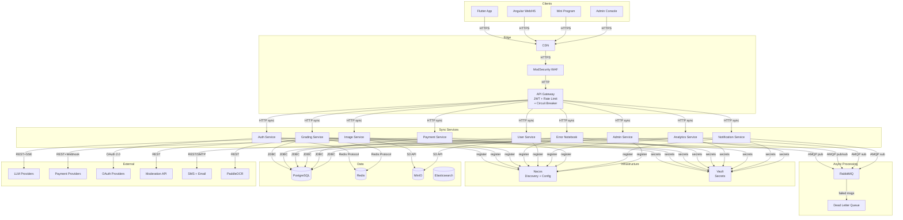

# Interface/Integration View — AI Smart Grader Architecture Design

## Generated: 2026-03-01

---

## 1. Communication Protocols

### 1.1 Internal Service Communication

| Interface | Producer | Consumer | Protocol | Pattern | Description |
|:---|:---|:---|:---|:---|:---|
| API Gateway → All Services | API Gateway | 10 microservices | HTTP/1.1 | Sync Request-Response | Gateway routes requests with JWT validation, rate limiting, tenant context headers (X-Tenant-Id, X-User-Id, X-User-Role) |
| Service Discovery | All Services | Nacos 2.x | HTTP + gRPC | Registration + Heartbeat | Services register on startup; Nacos pushes config changes via long-polling |
| Grading Events | Grading Service | Error Notebook, Analytics, Notification | AMQP (RabbitMQ) | Async Pub/Sub (Topic Exchange) | GradingCompleted events fan out to 3 consumers |
| Review Events | Error Notebook Service | Analytics, Notification | AMQP (RabbitMQ) | Async Pub/Sub (Topic Exchange) | ReviewSessionCompleted, MasteryAchieved events |
| Practice Generation | Error Notebook Service | Error Notebook Service (Worker) | AMQP (RabbitMQ) | Async Work Queue | Background job queue for practice question pre-generation |
| Notification Fanout | Notification Service | Channel Workers (In-app, Push, SMS, Email) | AMQP (RabbitMQ) | Async Fanout Exchange | Multi-channel delivery via channel-specific consumer workers |
| Config Hot-Reload | Nacos 2.x | All Services | HTTP Long-Poll | Push (change notification) | Configuration changes pushed to services without restart |

### 1.2 Client-to-Platform Communication

| Interface | Client | Server | Protocol | Pattern | Description |
|:---|:---|:---|:---|:---|:---|
| REST API | Flutter App, Angular Web | API Gateway | HTTPS (TLS 1.3) | Sync Request-Response | Standard CRUD operations, token refresh |
| Grading Stream (Web/App) | Flutter App, Angular Web | API Gateway → Grading Service | HTTPS + SSE | Server-Sent Events | Real-time grading result streaming |
| Grading Stream (Mini Program) | WeChat Mini Program | API Gateway → Grading Service | WSS | WebSocket | Real-time streaming (SSE not supported in Mini Program) |
| Image Upload | All Clients | API Gateway → Image Service | HTTPS Multipart | Sync Request-Response | Exercise photo upload with progress tracking |
| Admin API | Admin Console | API Gateway → Admin Service | HTTPS | Sync Request-Response | Admin CRUD, config management |

### 1.3 Platform-to-External Communication

| Interface | Internal Service | External System | Protocol | Pattern | Description |
|:---|:---|:---|:---|:---|:---|
| LLM Grading | Grading Service | OpenAI / Claude / ZhiPu/Qwen | HTTPS + SSE | Streaming Request-Response | Multimodal image + prompt → streaming grading result |
| OCR Fallback | Grading Service | PaddleOCR | HTTP | Sync Request-Response | Handwriting text extraction for low-confidence cases |
| Content Moderation | Image Service | Cloud Moderation API | HTTPS | Sync Request-Response | Image pre-screening before LLM call |
| OAuth Authentication | Auth Service | WeChat / Google / Apple | HTTPS | OAuth 2.0 / OIDC | Third-party authentication flows |
| Payment Processing | Payment Service | WeChat Pay / Alipay / Apple Pay / Google Pay / Stripe | HTTPS | Sync + Webhook | Payment initiation (sync) + result notification (async webhook) |
| SMS Delivery | Notification Service | SMS Gateway | HTTPS | Sync Request-Response | OTP and notification SMS |
| Email Delivery | Notification Service | SES / SendGrid | HTTPS / SMTP | Sync Request-Response | Notification and report emails |
| Object Storage | Image Service, Error Notebook | MinIO / Cloud OSS | HTTPS (S3 API) | Sync Request-Response | Image and PDF upload/download |

---

## 2. Interface Contracts

### 2.1 API Contracts (OpenAPI 3.0)

| Contract ID | Producer | Consumers | Format | Schema Location | Versioning |
|:---|:---|:---|:---|:---|:---|
| CON-001 | Grading Service | Flutter, Angular, Mini Program | OpenAPI 3.0 YAML | `/api-specs/grading-service-v1.yaml` | URL path versioning (`/api/v1/`) |
| CON-002 | Image Service | Flutter, Angular, Mini Program | OpenAPI 3.0 YAML | `/api-specs/image-service-v1.yaml` | URL path versioning |
| CON-003 | Error Notebook Service | Flutter, Angular | OpenAPI 3.0 YAML | `/api-specs/error-notebook-service-v1.yaml` | URL path versioning |
| CON-004 | Auth Service | All Clients | OpenAPI 3.0 YAML | `/api-specs/auth-service-v1.yaml` | URL path versioning |
| CON-005 | User Service | Flutter, Angular, Admin | OpenAPI 3.0 YAML | `/api-specs/user-service-v1.yaml` | URL path versioning |
| CON-006 | Analytics Service | Flutter, Angular, Admin | OpenAPI 3.0 YAML | `/api-specs/analytics-service-v1.yaml` | URL path versioning |
| CON-007 | Payment Service | Flutter, Angular | OpenAPI 3.0 YAML | `/api-specs/payment-service-v1.yaml` | URL path versioning |
| CON-008 | Notification Service | Flutter, Angular, Admin | OpenAPI 3.0 YAML | `/api-specs/notification-service-v1.yaml` | URL path versioning |
| CON-009 | Admin Service | Admin Console | OpenAPI 3.0 YAML | `/api-specs/admin-service-v1.yaml` | URL path versioning |

### 2.2 Event Contracts (RabbitMQ Messages)

| Contract ID | Producer | Consumer(s) | Exchange | Routing Key | Schema |
|:---|:---|:---|:---|:---|:---|
| EVT-001 | Grading Service | Error Notebook, Analytics, Notification | `grading.events` (topic) | `grading.completed.{subject}` | JSON: `{sessionId, userId, tenantId, imageId, results[{questionIndex, judgment, answer, explanation, knowledgePoints[], confidence}], timestamp}` |
| EVT-002 | Error Notebook Service | Analytics, Notification | `notebook.events` (topic) | `notebook.review.completed` | JSON: `{sessionId, userId, tenantId, entriesReviewed, masteredCount, accuracy, timestamp}` |
| EVT-003 | Error Notebook Service | Analytics | `notebook.events` (topic) | `notebook.mastery.achieved` | JSON: `{entryId, userId, tenantId, knowledgePoint, reviewCount, timestamp}` |
| EVT-004 | Error Notebook Service | Error Notebook Worker | `notebook.jobs` (direct) | `practice.generate` | JSON: `{entryId, originalQuestion, knowledgePoint, difficulty, subject}` |
| EVT-005 | Payment Service | Notification, Analytics | `payment.events` (topic) | `payment.completed` | JSON: `{orderId, userId, tenantId, amount, plan, provider, timestamp}` |
| EVT-006 | Notification Service | Channel Workers | `notification.fanout` (fanout) | N/A (fanout) | JSON: `{notificationId, userId, channels[], template, params, priority}` |

### 2.3 Client SDK Generation

| Client | Generator | Source | Output | Language |
|:---|:---|:---|:---|:---|
| Flutter App | OpenAPI Generator (dart) | All service OpenAPI specs | `lib/api/` | Dart |
| Angular Web/H5 | OpenAPI Generator (typescript-angular) | All service OpenAPI specs | `src/api/` | TypeScript |
| WeChat Mini Program | OpenAPI Generator (javascript) | All service OpenAPI specs | `utils/api/` | JavaScript |
| Admin Console | OpenAPI Generator (typescript-angular) | Admin + Analytics specs | `src/api/` | TypeScript |

---

## 3. Error Handling & Resilience

### 3.1 Circuit Breaker Patterns

| Pattern | Scope | Configuration | Description |
|:---|:---|:---|:---|
| Circuit Breaker | API Gateway → Each Service | failure_threshold: 5 calls, timeout: 30s, half_open_attempts: 3 | Resilience4j circuit breaker prevents cascade failure. Opens after 5 consecutive failures, tries half-open after 30s. |
| Circuit Breaker | Grading Service → LLM Provider | failure_threshold: 3 calls, timeout: 60s, half_open_attempts: 2 | Protects against LLM provider outages. Triggers fallback to secondary LLM. |
| Circuit Breaker | Payment Service → Payment Provider | failure_threshold: 3 calls, timeout: 45s | Protects against payment provider outages. Returns "payment pending" status. |

### 3.2 Retry Policies

| Pattern | Scope | Configuration | Description |
|:---|:---|:---|:---|
| Retry | Grading Service → LLM Provider | max_retries: 2, backoff: exponential (1s, 2s), retry_on: 429, 500, 503 | Retries transient LLM failures with exponential backoff. |
| Retry | Image Service → Content Moderation | max_retries: 3, backoff: exponential (500ms, 1s, 2s) | Retries moderation API transient failures. |
| Retry | Notification Service → SMS/Email | max_retries: 3, backoff: exponential (2s, 4s, 8s) | Retries delivery failures. Falls back to alternative channel. |
| Retry | RabbitMQ Consumers | max_retries: 3, backoff: fixed 5s, dead_letter_after: 3 failures | Failed messages retried 3 times then routed to Dead Letter Queue (DLQ). |

### 3.3 Timeout Configuration

| Interface | Connect Timeout | Read Timeout | Description |
|:---|:---|:---|:---|
| API Gateway → Services | 3s | 30s | Standard service call timeout |
| Grading Service → LLM | 10s | 120s | Extended timeout for LLM streaming (large images, complex grading) |
| Image Service → Moderation API | 5s | 15s | Moderation should be fast |
| Payment Service → Provider | 5s | 30s | Payment processing timeout |
| All Services → PostgreSQL | 5s | 30s | Database query timeout |
| All Services → Redis | 2s | 5s | Cache should be fast; fail-open on timeout |

### 3.4 Fallback Strategies

| Interface | Primary | Fallback | Strategy |
|:---|:---|:---|:---|
| LLM Invocation | Primary LLM (per cascade route) | Secondary LLM provider | Automatic failover to secondary model when primary circuit opens |
| AI Result Cache | Redis cache lookup | Skip cache, invoke LLM directly | Fail-open: cache unavailability should not block grading |
| Content Moderation | Cloud Moderation API | Queue image for manual review | If moderation API down, images queued for deferred review |
| OCR Fallback | PaddleOCR | Return low-confidence result with flag | If OCR unavailable, return LLM result with low-confidence warning |
| Notification Delivery | Primary channel (in-app) | Alternative channel (SMS/email) | If primary channel fails, attempt next priority channel |
| Config Lookup | Nacos live config | Local cached config | Services cache last-known config; use cached values if Nacos unreachable |

### 3.5 Rate Limiting

| Scope | Strategy | Limits | Description |
|:---|:---|:---|:---|
| API Gateway (global) | Token bucket (Redis) | 100 req/s per user, 1000 req/s per tenant | Global rate limiting at gateway level |
| Grading API | Sliding window (Redis) | Free: 3/day, Basic: 50/day, Premium: unlimited | Tier-based grading quota |
| Image Upload | Fixed window | 10 uploads/min per user | Prevents upload abuse |
| Auth (login) | Sliding window | 5 attempts/15min per IP | Brute-force protection |
| Guest | Token bucket | 3 gradings/24h per fingerprint | Guest trial quota |

---

## 4. Integration Diagram

---

## 5. API Versioning Strategy

- **URL path versioning**: `/api/v1/`, `/api/v2/`
- **Deprecation policy**: Old versions supported for 6 months after new version release
- **Breaking changes**: New major version; non-breaking changes added to current version
- **OpenAPI spec**: Single source of truth; client SDKs auto-generated on spec change
- **Contract testing**: Spring Cloud Contract verifies producer-consumer compatibility in CI

## 6. Idempotency

| Operation | Strategy | Key |
|:---|:---|:---|
| Grading Submit | Client-generated idempotency key in header | `X-Idempotency-Key: {UUID}` |
| Payment Create | Server-generated order ID | `orderId` (unique per payment intent) |
| Image Upload | Content-hash deduplication | SHA-256 of image content |
| Notification Send | Message deduplication window | `{userId}:{templateId}:{contentHash}` TTL 1h |
