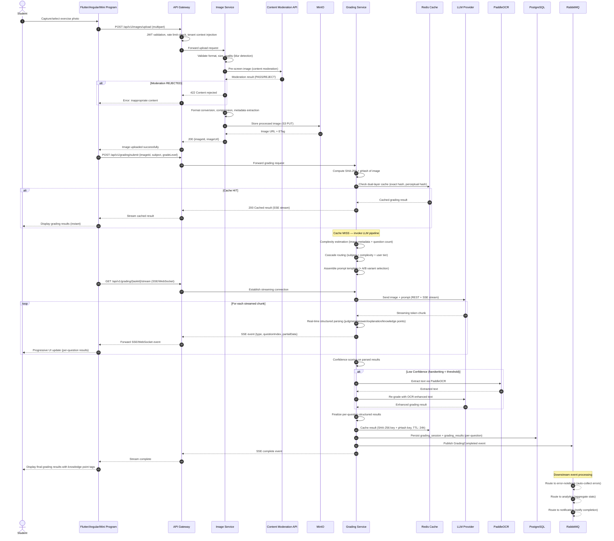

# UML Sequence Diagram — AI Grading Flow

## Description
Shows the end-to-end flow when a student uploads an exercise image and receives AI grading results via streaming. Covers image upload, content moderation, cache check, LLM invocation, real-time response parsing, result persistence, and downstream event publishing.

## Diagram

## Notes
- **Two-phase flow**: Image upload (sync) followed by grading submission (async streaming)
- **Content moderation gate**: Images pre-screened before any LLM call — rejected images never reach grading
- **Dual-layer cache check**: SHA-256 exact hash + pHash perceptual hash checked before LLM invocation
- **Cascade routing**: LLM selection based on subject + complexity estimation + user tier
- **Real-time structured parsing**: LLM stream parsed in-flight, extracting per-question results progressively
- **OCR fallback**: Triggered only when confidence scorer detects low-confidence handwriting recognition
- **Event fan-out**: GradingCompleted event consumed by 3 downstream services (error-notebook, analytics, notification)
- **Streaming protocols**: SSE for Web/Flutter clients; WebSocket for WeChat Mini Program (transparent at gateway)
