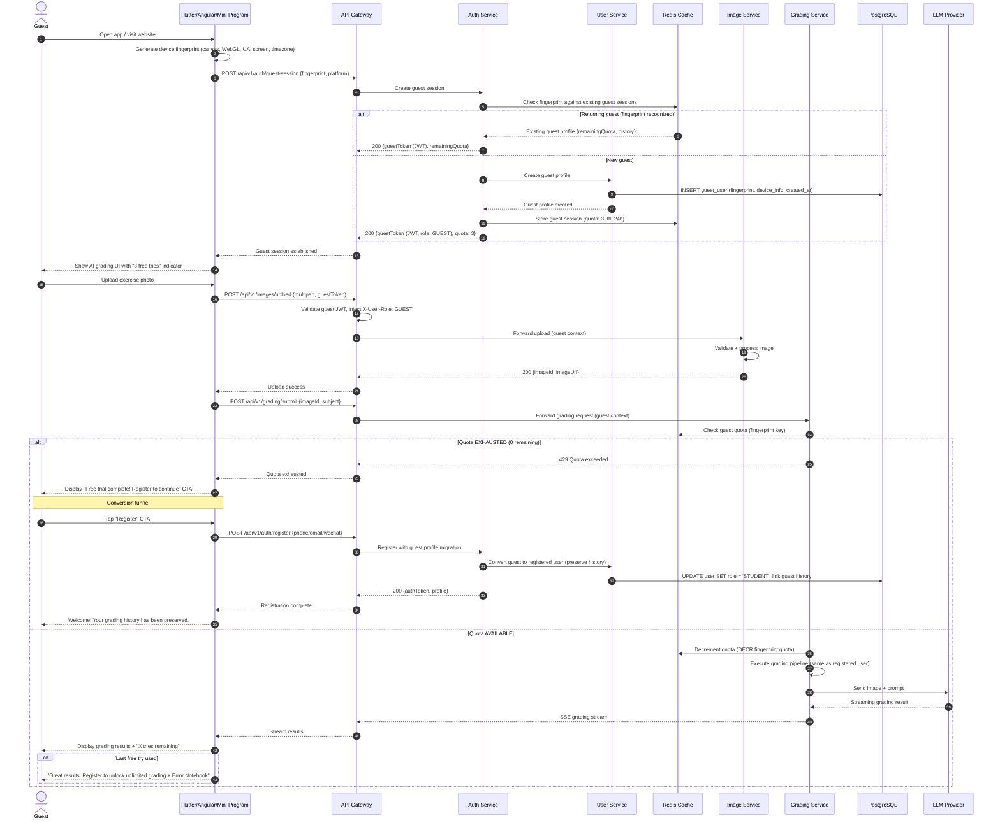

# UML Sequence Diagram — Guest Onboarding Flow

## Description
Shows the flow for an unauthenticated guest user: device fingerprint tracking, limited AI grading trial, quota enforcement, and conversion prompt to registration.

## Diagram

## Notes
- **Device fingerprint**: Composite fingerprint (canvas, WebGL, user agent, screen resolution, timezone) — not PII, used for quota tracking only
- **Guest quota**: 3 free grading attempts per device per 24-hour period (configurable via Nacos)
- **JWT for guests**: Guests receive a JWT with role `GUEST` — same API pipeline, different authorization rules
- **Feature restrictions**: Guests cannot access error notebook, analytics, class features, or payment
- **Seamless conversion**: Guest-to-registered-user migration preserves grading history — no data loss
- **Anti-abuse**: Device fingerprint + Redis TTL prevents trivial quota bypass; rate limiting at gateway level
- **Conversion tracking**: Guest registration events tracked for analytics (conversion rate, time-to-convert, feature that triggered conversion)
