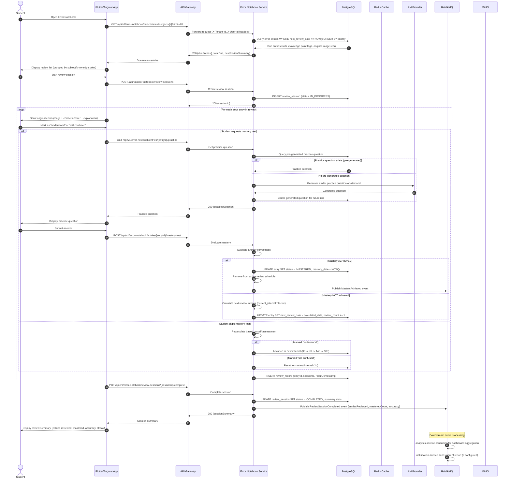

# UML Sequence Diagram — Spaced Repetition Review Flow

## Description
Shows the flow when a student opens their error notebook for a scheduled review session: loading due entries, attempting practice questions, evaluating mastery, updating review schedules, and publishing events.

## Diagram

## Notes
- **Fixed-interval spaced repetition**: Intervals of 1d, 3d, 7d, 14d, 30d — admin-configurable via Nacos
- **Schema FSRS-ready**: Database schema includes `stability`, `difficulty`, `elapsed_days` fields for future FSRS algorithm upgrade
- **Pre-generated practice questions**: Most practice questions are pre-generated asynchronously; on-demand LLM generation as fallback
- **Dual assessment modes**: Student self-assessment ("understood"/"confused") or active mastery test with practice questions
- **Mastery promotion**: Entries achieving mastery are removed from active review queue; tracked for weakness analysis trends
- **Event-driven**: ReviewSessionCompleted and MasteryAchieved events flow to analytics and notification services
- **Capacity awareness**: Capacity enforcer (not shown) may auto-archive oldest mastered entries when tier limit reached
