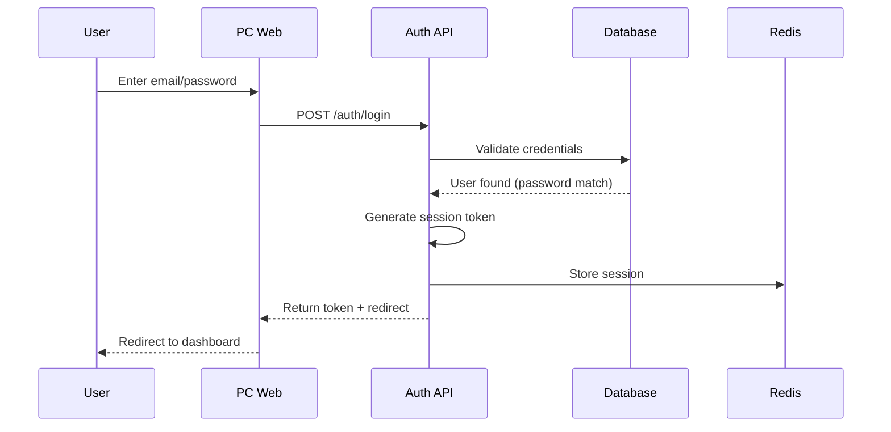
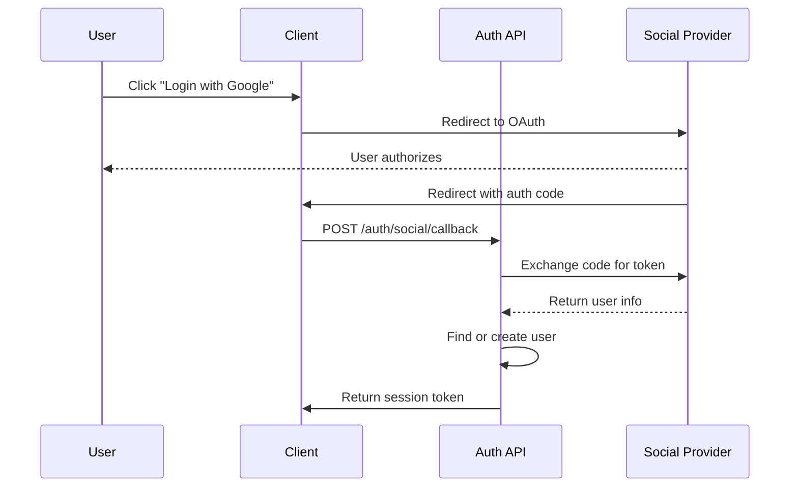
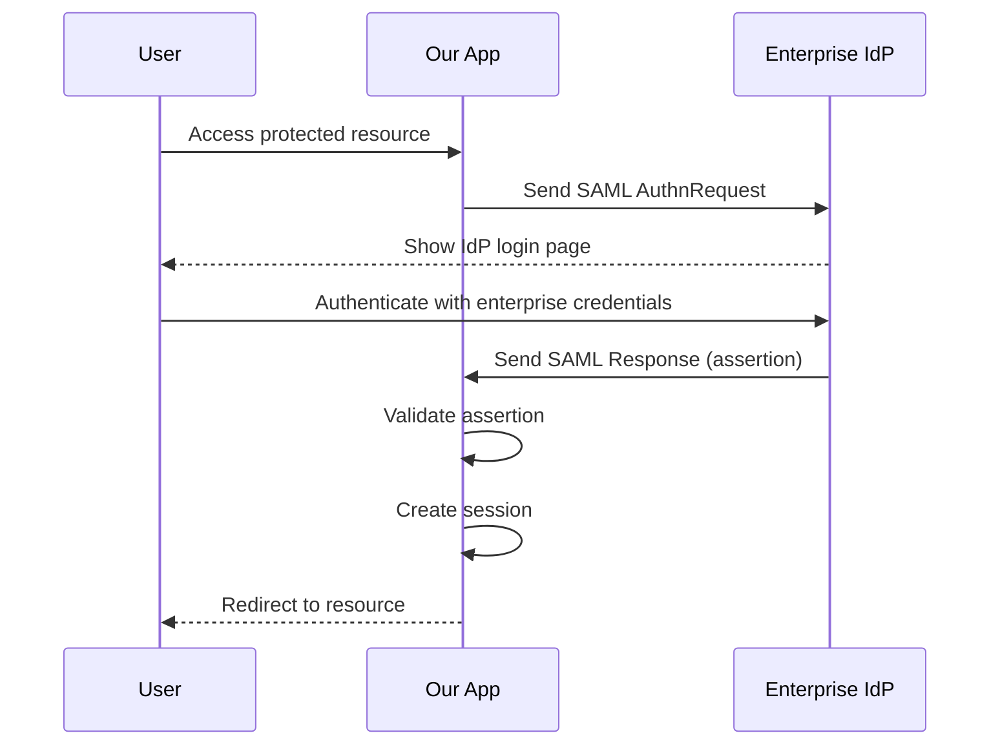

# Business Requirements Document (BRD)

## Document Control

| Field | Value |
|-------|-------|
| Document Title | User Login Module for JIRA-Like Project Management Application |
| Version | 1.0 |
| Date | 2026-02-24 |
| Author | BRD Writer AI Agent |
| Status | Draft |
| Reviewer(s) | TBD |

### Change Log

| Version | Date | Author | Description |
|---------|------|--------|-------------|
| 0.1 | 2026-02-24 | BRD Writer AI Agent | Initial draft |

---

## 1. Executive Summary

This Business Requirements Document (BRD) defines the requirements for a comprehensive user authentication and identity management module for a JIRA-like project management SaaS application. The module will support multi-platform access including PC web, Flutter mobile applications, WeChat integration (personal and enterprise), and Microsoft Teams integration. 

The system will serve both enterprise and individual users with a team scale of up to 500 users, following industry best practices as exemplified by Atlassian JIRA Cloud. Key capabilities include social login (Google, Apple, Microsoft, WeChat), enterprise SSO via SAML 2.0/OIDC with Azure AD and Google Workspace, mandatory MFA for enterprise users with optional MFA for individual users, and a hybrid registration model combining self-registration with administrator approval.

This authentication module will serve as the foundational security layer for the entire project management platform, ensuring secure, compliant, and user-friendly access across all supported platforms.

---

## 2. Business Objectives

| ID | Objective | Success Metric | Target | Timeline |
|----|-----------|---------------|--------|----------|
| BO-01 | Deploy production-ready authentication module | Module deployed and operational | 100% uptime | Q2 2026 |
| BO-02 | Achieve SOC 2 Type II compliance for auth module | SOC 2 audit passed | Compliant | Q3 2026 |
| BO-03 | Support 500 concurrent users with < 200ms login latency | Login response time | < 200ms p95 | Q2 2026 |
| BO-04 | Zero security incidents related to authentication | Security incidents | 0 incidents | 12 months |
| BO-05 | Achieve > 95% user satisfaction for login experience | User survey score | > 95% | Q3 2026 |
| BO-06 | Enable enterprise customer onboarding with SSO | Enterprise customers onboarded | 10+ enterprises | Q3 2026 |

---

## 3. Project Background & Context

### 3.1 Business Problem / Opportunity

The organization is building a JIRA-like project management SaaS application targeting enterprise teams up to 500 users. A robust, modern authentication system is essential to:

- **Secure access**: Protect sensitive project data with enterprise-grade security
- **Multi-platform support**: Enable users to access the platform via PC web, mobile apps, WeChat, and Microsoft Teams
- **Enterprise readiness**: Meet enterprise security requirements including SSO and MFA mandates
- **Compliance**: Support regulatory requirements for data security and audit trails
- **User experience**: Provide seamless login experience comparable to JIRA Cloud

### 3.2 Current State (As-Is)

The project is in greenfield state. No existing authentication infrastructure is in place. The authentication module must be built from scratch with the following considerations:

- No existing user database
- No existing identity provider integrations
- No existing multi-platform authentication flows

### 3.3 Future State (To-Be)

The authentication module will provide:

- Unified identity management across all platforms (PC, Mobile, WeChat, Teams)
- Multiple authentication methods including password, social login, and enterprise SSO
- Comprehensive user management with role-based access control
- Enterprise-grade security with MFA enforcement options
- Audit logging for compliance and security monitoring
- API authentication for third-party integrations

---

## 4. Project Scope

### 4.1 In Scope

| Category | Items |
|----------|-------|
| **Authentication Methods** | Email/Password, Social Login (Google, Apple, Microsoft, WeChat), Enterprise SSO (Azure AD, Google Workspace, Custom SAML/OIDC), WeChat Personal + Enterprise WeChat |
| **Platforms** | PC Web (Responsive), Flutter Mobile (iOS/Android), WeChat Mini Program, Microsoft Teams Integration |
| **Security Features** | MFA/2FA (TOTP, SMS, Email), Session management, Device management, Account lockout, Password policy |
| **User Management** | User registration (open + admin approval), User invitation, Role management (Super Admin, Org Admin, User, Viewer), Organization/Tenant management |
| **Compliance** | Audit logs, Login history, Session timeout configuration |

### 4.2 Out of Scope

| Category | Items |
|----------|-------|
| **Authentication** | Hardware token-based authentication (YubiKey), Biometric authentication on web |
| **Platforms** | Desktop native applications (Electron), Smart TV apps |
| **Features** | Passwordless authentication (FIDO2/WebAuthn), Live chat support integration |
| **Integration** | Legacy system integrations, Custom enterprise directory sync (beyond SCIM) |

---

## 5. Stakeholders

| ID | Name / Role | Department | Interest Level | Influence Level | RACI |
|----|------------|------------|---------------|-----------------|------|
| SH-01 | Product Owner | Product | High | High | A |
| SH-02 | Project Manager | Project Management | High | High | C |
| SH-03 | Solution Architect | Engineering | High | High | C |
| SH-04 | Security Engineer | Engineering | High | High | C |
| SH-05 | Frontend Developer | Engineering | High | Medium | R |
| SH-06 | Backend Developer | Engineering | High | Medium | R |
| SH-07 | QA Engineer | Engineering | Medium | Low | C |
| SH-08 | Enterprise Customer | External | High | High | I |
| SH-09 | Individual User | External | High | Medium | I |

---

## 6. Business Requirements

| ID | Requirement | Priority | Source | Acceptance Criteria |
|----|-------------|----------|--------|-------------------|
| BR-01 | System shall support email/password authentication with secure password hashing (bcrypt/argon2) | Must | Product Owner | Users can register with email/password and login successfully |
| BR-02 | System shall support social login via Google, Apple, Microsoft, and WeChat | Must | Product Owner | Users can authenticate using any supported social provider |
| BR-03 | System shall support enterprise SSO via SAML 2.0 and OIDC protocols | Must | Enterprise Customer | Enterprise users can authenticate using Azure AD or Google Workspace |
| BR-04 | System shall support custom SAML/OIDC identity providers | Should | Enterprise Customer | Admin can configure custom IdP with metadata upload |
| BR-05 | System shall support WeChat authentication (Personal + Enterprise WeChat) | Must | Market Requirement | Chinese users can login via WeChat QR code or in-app browser |
| BR-06 | System shall support Microsoft Teams integration authentication | Must | Enterprise Customer | Users can authenticate via Microsoft 365 account |
| BR-07 | System shall enforce MFA for enterprise users | Must | Enterprise Customer | Enterprise domain users cannot login without completing MFA |
| BR-08 | System shall allow MFA for individual users (optional) | Should | Product Owner | Individual users can enable MFA in account settings |
| BR-09 | System shall support MFA via TOTP (authenticator apps) | Must | Security Requirement | Users can use Google Authenticator or similar TOTP apps |
| BR-10 | System shall support MFA via SMS verification code | Should | Product Owner | Users can receive MFA codes via SMS |
| BR-11 | System shall support MFA via email verification code | Should | Product Owner | Users can receive MFA codes via email |
| BR-12 | System shall support session management with configurable timeout | Must | Enterprise Customer | Admin can configure session timeout (default 8 hours) |
| BR-13 | System shall support "Remember this device" functionality | Should | User Experience | Users can skip MFA on trusted devices |
| BR-14 | System shall support user self-registration with admin approval | Must | Product Owner | New users can register but require admin approval before access |
| BR-15 | System shall support admin user invitation via email | Should | Enterprise Customer | Admins can invite users who receive registration links |
| BR-16 | System shall support role-based access control (RBAC) | Must | Product Owner | Users are assigned roles that control access to features |
| BR-17 | System shall support multi-tenant organization structure | Must | Enterprise Customer | Multiple organizations can use the platform independently |
| BR-18 | System shall maintain audit logs of all authentication events | Must | Compliance | All login attempts, MFA events, and security events are logged |
| BR-19 | System shall support account lockout after failed login attempts | Must | Security Requirement | Account locked after 5 failed attempts for 15 minutes |
| BR-20 | System shall enforce password complexity requirements | Must | Security Requirement | Minimum 8 chars, uppercase, lowercase, number, special char |

---

## 7. Functional Requirements

### 7.1 User Authentication

| ID | Requirement | Priority | Related BR | Acceptance Criteria |
|----|-------------|----------|-----------|-------------------|
| FR-01 | User registration with email verification | Must | BR-01 | User receives verification email, account activated after click |
| FR-02 | User login with email/password | Must | BR-01 | Valid credentials redirect to dashboard; invalid shows error |
| FR-03 | Social login flow for each provider | Must | BR-02 | OAuth2/OIDC redirect, callback processes token, user created/linked |
| FR-04 | SAML SSO initialization and processing | Must | BR-03 | SP-initiated and IdP-initiated SSO supported |
| FR-05 | OIDC SSO initialization and processing | Must | BR-03 | OAuth2/OIDC flow with token exchange |
| FR-06 | WeChat QR code login (PC) | Must | BR-05 | Display QR code, poll for scan result, authenticate on success |
| FR-07 | WeChat OAuth login (Mobile) | Must | BR-05 | Redirect to WeChat OAuth, handle callback |
| FR-08 | Enterprise WeChat (WeCom) login | Must | BR-05 | Support WeCom corp ID authentication |
| FR-09 | Microsoft 365/Teams authentication | Must | BR-06 | Microsoft OAuth2 flow, validate tenant if configured |

### 7.2 Multi-Factor Authentication

| ID | Requirement | Priority | Related BR | Acceptance Criteria |
|----|-------------|----------|-----------|-------------------|
| FR-10 | MFA setup flow (TOTP app) | Must | BR-09 | Display QR code for scanning, verify with code before activation |
| FR-11 | MFA setup flow (SMS) | Should | BR-10 | Verify phone number with SMS code before activation |
| FR-12 | MFA setup flow (Email) | Should | BR-11 | Verify email with code before activation |
| FR-13 | MFA challenge on login | Must | BR-07, BR-08 | Prompt for MFA code after password verification |
| FR-14 | MFA remember device | Should | BR-13 | Option to skip MFA for N days on trusted device |
| FR-15 | MFA backup codes generation | Should | BR-08 | Generate 10 backup codes for account recovery |

### 7.3 Session Management

| ID | Requirement | Priority | Related BR | Acceptance Criteria |
|----|-------------|----------|-----------|-------------------|
| FR-16 | Session creation on login | Must | BR-12 | Generate secure session token stored in database |
| FR-17 | Session validation on API calls | Must | BR-12 | Validate session token, check expiration |
| FR-18 | Session termination (logout) | Must | BR-12 | Invalidate session token, clear client storage |
| FR-19 | Session timeout enforcement | Must | BR-12 | Auto-logout after configured idle time |
| FR-20 | Concurrent session management | Should | BR-12 | Limit max sessions per user (configurable) |
| FR-21 | Device management view | Should | BR-13 | User can view and revoke trusted devices |

### 7.4 User Management

| ID | Requirement | Priority | Related BR | Acceptance Criteria |
|----|-------------|----------|-----------|-------------------|
| FR-22 | User self-registration flow | Must | BR-14 | Registration form, email verification, pending approval status |
| FR-23 | Admin approval of new users | Must | BR-14 | Admin sees pending users, can approve/reject |
| FR-24 | Admin user invitation | Should | BR-15 | Admin enters email, system sends invitation |
| FR-25 | User profile management | Must | BR-16 | Users can update name, avatar, password |
| FR-26 | Password change flow | Must | BR-01 | Current password required, validate new password |
| FR-27 | Password reset flow | Must | BR-01 | Email reset link, set new password |
| FR-28 | User deactivation | Should | BR-16 | Admin can deactivate user, prevent login |

### 7.5 Role & Permission Management

| ID | Requirement | Priority | Related BR | Acceptance Criteria |
|----|-------------|----------|-----------|-------------------|
| FR-29 | Predefined roles | Must | BR-16 | Super Admin, Organization Admin, User, Viewer |
| FR-30 | Role assignment | Must | BR-16 | Admin can assign roles to users |
| FR-31 | Role-based access enforcement | Must | BR-16 | API validates user role before allowing action |
| FR-32 | Organization creation | Must | BR-17 | First user becomes organization owner |
| FR-33 | Organization member management | Must | BR-17 | Admin can add/remove members |

### 7.6 Platform-Specific Authentication

| ID | Requirement | Priority | Related BR | Acceptance Criteria |
|----|-------------|----------|-----------|-------------------|
| FR-34 | PC Web responsive login page | Must | - | Login page works on desktop browsers |
| FR-35 | Flutter iOS authentication | Must | - | Native iOS login with biometrics option |
| FR-36 | Flutter Android authentication | Must | - | Native Android login with biometrics option |
| FR-37 | WeChat Mini Program login | Must | BR-05 | WeChat mini program OAuth flow |
| FR-38 | Teams tab authentication | Must | BR-06 | Microsoft Teams tab SSO |

### 7.7 Security & Compliance

| ID | Requirement | Priority | Related BR | Acceptance Criteria |
|----|-------------|----------|-----------|-------------------|
| FR-39 | Login attempt audit logging | Must | BR-18 | Log timestamp, IP, user agent, result |
| FR-40 | Account lockout enforcement | Must | BR-19 | Lock account after 5 failures, 15 min cooldown |
| FR-41 | Password policy enforcement | Must | BR-20 | Reject passwords not meeting complexity |
| FR-42 | Password history enforcement | Should | BR-20 | Cannot reuse last 10 passwords |
| FR-43 | Admin audit dashboard | Should | BR-18 | Admin can view authentication reports |

---

## 8. Non-Functional Requirements

| ID | Category | Requirement | Priority | Acceptance Criteria |
|----|----------|-------------|----------|-------------------|
| NFR-01 | Performance | Login response time | Must | < 200ms p95 for login API |
| NFR-02 | Performance | Concurrent users | Must | Support 500 concurrent authenticated users |
| NFR-03 | Performance | Token validation | Must | < 50ms for session validation |
| NFR-04 | Security | Encryption at rest | Must | Passwords hashed with bcrypt/argon2 |
| NFR-05 | Security | Encryption in transit | Must | TLS 1.3 for all communications |
| NFR-06 | Security | Session token security | Must | Cryptographically random, HttpOnly cookies |
| NFR-07 | Security | OAuth state validation | Must | CSRF protection via state parameter |
| NFR-08 | Scalability | Horizontal scaling | Must | Auth service stateless for load balancing |
| NFR-09 | Availability | Uptime SLA | Should | 99.9% uptime (excludes planned maintenance) |
| NFR-10 | Usability | Error messages | Must | Clear, user-friendly error messages |
| NFR-11 | Accessibility | WCAG 2.1 AA | Should | Login page meets accessibility standards |
| NFR-12 | Compatibility | Browser support | Must | Chrome, Firefox, Safari, Edge (latest 2 versions) |
| NFR-13 | Compatibility | Mobile OS support | Must | iOS 14+, Android 10+ |
| NFR-14 | Compliance | GDPR data handling | Must | User data export/delete capabilities |
| NFR-15 | Compliance | Audit retention | Must | Audit logs retained for 12 months |

---

## 9. Data Requirements

### 9.1 Data Entities

| Entity | Attributes | Description |
|--------|------------|-------------|
| **User** | id, email, password_hash, name, avatar_url, phone, status, mfa_enabled, mfa_type, created_at, updated_at | Core user entity |
| **Organization** | id, name, plan_type, settings, created_at, updated_at | Tenant organization |
| **UserOrganization** | user_id, organization_id, role, status | User-Org association with role |
| **Session** | id, user_id, token_hash, device_info, ip_address, created_at, expires_at | Active sessions |
| **AuthProvider** | id, user_id, provider_type, provider_id, access_token, refresh_token | Social/SSO provider links |
| **MFADevice** | id, user_id, type, secret, phone, verified_at, created_at | MFA device records |
| **AuditLog** | id, user_id, event_type, ip_address, user_agent, metadata, created_at | Authentication audit trail |
| **Invitation** | id, organization_id, email, token, status, expires_at, created_at | User invitations |
| **LoginAttempt** | id, user_id, ip_address, user_agent, success, created_at | Login attempt history |

### 9.2 Data Flows

```
User → Login Form → API Gateway → Auth Service → Validate Credentials → Create Session → Return Token
                                                                              ↓
                                                                      Audit Logger → Audit Database
                                                                              ↓
                                                                      Cache (Redis) → Session Store
```

### 9.3 Data Migration

Not applicable (greenfield project). No data migration required.

---

## 10. Assumptions

| ID | Assumption | Impact if Invalid |
|----|-----------|-------------------|
| AS-01 | Backend will use RESTful API design | May require API redesign |
| AS-02 | Flutter app will use secure storage for tokens | Security vulnerability |
| AS-03 | Organization agrees to use recommended auth provider (e.g., Auth0, AWS Cognito) or build custom | May need to re-evaluate SSO support |
| AS-04 | Email sending service (SES/SendGrid) available | User verification flow blocked |
| AS-05 | SMS sending service available for MFA | SMS MFA unavailable |
| AS-06 | WeChat developer account and AppID available | WeChat login cannot be implemented |
| AS-07 | Microsoft Azure AD tenant available for testing | Teams integration cannot be tested |

---

## 11. Constraints

| ID | Type | Constraint | Impact |
|----|------|-----------|--------|
| CN-01 | Budget | Use open-source auth libraries where possible | May limit vendor options |
| CN-02 | Timeline | Phase 1 (basic auth) to be completed in 8 weeks | May reduce feature scope |
| CN-03 | Technology | Must use Flutter for mobile | No React Native option |
| CN-04 | Technology | Must support PostgreSQL as primary database | No alternative databases |
| CN-05 | Compliance | Must support GDPR right to erasure | Requires data deletion workflow |
| CN-06 | Resource | Backend team of 2-3 developers | May need phased delivery |

---

## 12. Dependencies

| ID | Dependency | Type | Owner | Status |
|----|-----------|------|-------|--------|
| DP-01 | Identity Provider (Azure AD) configuration | External | IT Admin | Pending |
| DP-02 | Identity Provider (Google Workspace) configuration | External | IT Admin | Pending |
| DP-03 | WeChat Open Platform developer account | External | Product Owner | Pending |
| DP-04 | Microsoft Azure AD application registration | External | IT Admin | Pending |
| DP-05 | Email delivery service (AWS SES) | Internal | DevOps | In Progress |
| DP-06 | SMS delivery service (Twilio) | Internal | DevOps | Pending |
| DP-07 | Redis for session storage | Internal | DevOps | Pending |
| DP-08 | SSL certificates for domain | Internal | DevOps | Pending |

---

## 13. Risks & Mitigation

| ID | Risk | Probability | Impact | Mitigation Strategy | Owner |
|----|------|------------|--------|---------------------|-------|
| RK-01 | SSO integration complexity (multiple IdPs) | High | High | Proof of concept with each IdP before full implementation | Tech Lead |
| RK-02 | WeChat API changes break login flow | Medium | Medium | Version pin, monitor WeChat developer announcements | Backend Dev |
| RK-03 | MFA user experience friction | Medium | High | Clear UX guidance, optional MFA for individuals | Product Manager |
| RK-04 | Session performance at scale | Low | High | Redis clustering, load testing | DevOps |
| RK-05 | Security vulnerabilities in auth library | Low | Critical | Regular dependency updates, security audits | Security Engineer |
| RK-06 | Enterprise customer deadline pressure | Medium | Medium | Prioritize SSO features, phased rollout | Project Manager |
| RK-07 | Mobile biometric integration issues | Medium | Medium | Test on multiple devices, fallback to PIN | Mobile Dev |

---

## 14. Success Metrics & KPIs

| ID | KPI | Baseline | Target | Measurement Method | Frequency |
|----|-----|---------|--------|-------------------|-----------|
| KPI-01 | Login success rate | N/A (new) | > 99% | (Successful logins / Total login attempts) | Daily |
| KPI-02 | Average login time | N/A | < 200ms | API response time p95 | Real-time |
| KPI-03 | MFA adoption rate (enterprise) | N/A | > 80% | (Users with MFA enabled / Total users) | Monthly |
| KPI-04 | Account lockout rate | N/A | < 1% | (Locked accounts / Total accounts) | Monthly |
| KPI-05 | SSO adoption rate | N/A | > 60% | (SSO logins / Total logins) | Monthly |
| KPI-06 | Login-related support tickets | N/A | < 5% of users | Support ticket count | Monthly |
| KPI-07 | Audit log completeness | N/A | 100% | Events logged / Events expected | Real-time |

---

## 15. Cost-Benefit Analysis

### 15.1 Estimated Costs

| Category | Item | Estimated Cost (USD) |
|----------|------|---------------------|
| **Development** | Backend developer (2 x 8 weeks) | $32,000 |
| **Development** | Frontend developer (1 x 6 weeks) | $12,000 |
| **Development** | Mobile developer (Flutter, 1 x 6 weeks) | $12,000 |
| **Infrastructure** | Auth service hosting (monthly) | $500 |
| **Infrastructure** | Redis cluster (monthly) | $200 |
| **Infrastructure** | SSL certificates | $300/year |
| **Services** | Email delivery (SES) | $100/month |
| **Services** | SMS for MFA (Twilio) | $200/month |
| **Security** | Security audit | $10,000 |
| **Compliance** | SOC 2 certification | $15,000 |
| **Total Year 1** | | ~$92,400 |

### 15.2 Expected Benefits

| Benefit | Quantification |
|---------|----------------|
| Reduced password reset support tickets | 50% reduction (~100 tickets/month saved) |
| Enterprise customer acquisition | Enable 10+ enterprise deals ($50K avg value) |
| Reduced security incidents | Prevent estimated $100K potential breach costs |
| Competitive advantage | Match JIRA Cloud authentication capabilities |

### 15.3 ROI Projection

- **Year 1 ROI**: (Enterprise deals enabled - Total Cost) / Total Cost = ($500,000 - $92,400) / $92,400 = **441%**
- **Break-even**: Month 1 (with first enterprise customer)

---

## 16. Implementation Timeline

| Milestone | Target Date | Dependencies | Owner |
|-----------|------------|-------------|-------|
| Phase 1: Core Auth (Email/Password) | 2026-04-01 | Infrastructure setup | Backend Team |
| Phase 2: Social Login (Google, Apple, Microsoft) | 2026-04-22 | Phase 1 complete | Backend Team |
| Phase 3: Enterprise SSO (Azure AD, Google Workspace) | 2026-05-15 | IdP configurations | Backend Team |
| Phase 4: WeChat Integration | 2026-06-01 | WeChat account ready | Backend Team |
| Phase 5: MFA Implementation | 2026-06-15 | Phase 1-3 complete | Backend Team |
| Phase 6: User Management & RBAC | 2026-07-01 | Core auth ready | Backend Team |
| Phase 7: Flutter Mobile Auth | 2026-07-15 | Core auth APIs | Mobile Team |
| Phase 8: Teams Integration | 2026-08-01 | Microsoft app registration | Backend Team |
| Phase 9: Security Audit & Compliance | 2026-08-15 | All phases complete | Security Engineer |
| Phase 10: Production Launch | 2026-09-01 | All phases + testing | PM |

---

## 17. Glossary

| Term | Definition |
|------|-----------|
| **SSO** | Single Sign-On - Authentication method allowing users to access multiple applications with one set of credentials |
| **SAML** | Security Assertion Markup Language - XML-based standard for exchanging authentication data between IdP and SP |
| **OIDC** | OpenID Connect - Identity layer on top of OAuth 2.0 for authentication |
| **OAuth 2.0** | Authorization framework enabling third-party access without sharing credentials |
| **MFA/2FA** | Multi-Factor Authentication / Two-Factor Authentication - Using two or more verification methods |
| **TOTP** | Time-based One-Time Password - Algorithm generating temporary codes (e.g., Google Authenticator) |
| **IdP** | Identity Provider - Service managing user identities (e.g., Azure AD) |
| **SP** | Service Provider - Application consuming authentication services |
| **SCIM** | System for Cross-domain Identity Management - Standard for user provisioning |
| **JWT** | JSON Web Token - Compact, URL-safe token format for claims exchange |
| **WeChat OAuth** | Authentication via WeChat platform (Personal WeChat) |
| **WeCom OAuth** | Authentication via Enterprise WeChat (WeCom) |
| **RBAC** | Role-Based Access Control - Access management based on user roles |

---

## 18. Appendices

### Appendix A: Authentication Flow Diagrams

#### Login Flow (Email/Password)


#### Social Login Flow


#### SSO Flow (SAML)


### Appendix B: Requirements Traceability Matrix

| Requirement ID | Source | Related Requirements | Test Case |
|---------------|--------|---------------------|-----------|
| BR-01 | Product Owner | FR-01, FR-02, FR-26, FR-27 | TC-01, TC-02 |
| BR-02 | Product Owner | FR-03 | TC-03 |
| BR-03 | Enterprise Customer | FR-04, FR-05 | TC-04, TC-05 |
| BR-04 | Enterprise Customer | FR-04, FR-05 | TC-06 |
| BR-05 | Market Requirement | FR-06, FR-07, FR-08 | TC-07, TC-08, TC-09 |
| BR-06 | Enterprise Customer | FR-09, FR-38 | TC-10 |
| BR-07 | Enterprise Customer | FR-13, FR-14 | TC-11 |
| BR-08 | Product Owner | FR-10, FR-11, FR-12, FR-15 | TC-12 |
| BR-09 | Security Requirement | FR-10 | TC-13 |
| BR-10 | Product Owner | FR-11 | TC-14 |
| BR-11 | Product Owner | FR-12 | TC-15 |
| BR-12 | Enterprise Customer | FR-16, FR-17, FR-18, FR-19 | TC-16 |
| BR-13 | User Experience | FR-14, FR-21 | TC-17 |
| BR-14 | Product Owner | FR-22, FR-23 | TC-18 |
| BR-15 | Enterprise Customer | FR-24 | TC-19 |
| BR-16 | Product Owner | FR-25, FR-27, FR-28, FR-29, FR-30, FR-31 | TC-20 |
| BR-17 | Enterprise Customer | FR-32, FR-33 | TC-21 |
| BR-18 | Compliance | FR-39, FR-40, FR-43 | TC-22 |
| BR-19 | Security Requirement | FR-40 | TC-23 |
| BR-20 | Security Requirement | FR-42 | TC-24 |

### Appendix C: Supporting Documents

| Document | Description | Location |
|----------|-------------|----------|
| API Specification | Auth API endpoints documentation | /docs/api/auth.yaml |
| Security Design | Security architecture and threat model | /docs/security/auth-design.md |
| UI Mockups | Login page and auth flow designs | /design/auth/ |
| IdP Configuration Guides | Azure AD, Google Workspace setup | /docs/integration/idp-guides/ |
| Testing Strategy | Auth module test plan | /docs/testing/auth-test-plan.md |

---

## 19. Approval Sign-off

| Role | Name | Signature | Date |
|------|------|-----------|------|
| Project Sponsor | | _________ | |
| Project Manager | | _________ | |
| Business Analyst | BRD Writer AI Agent | _________ | |
