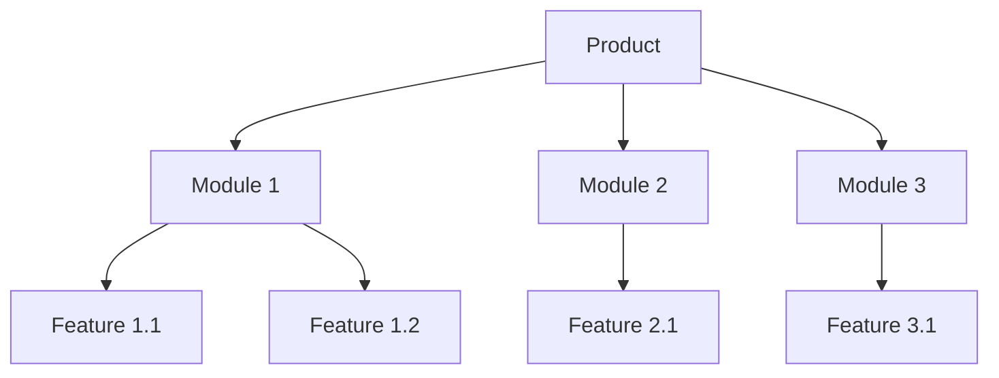
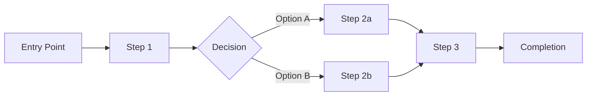
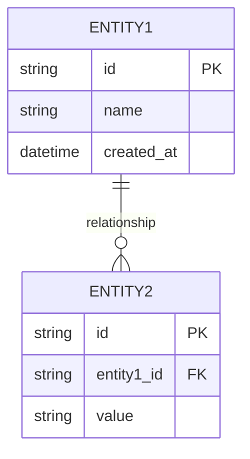
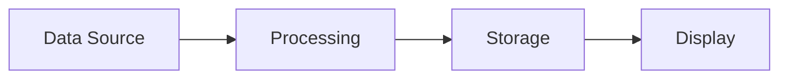
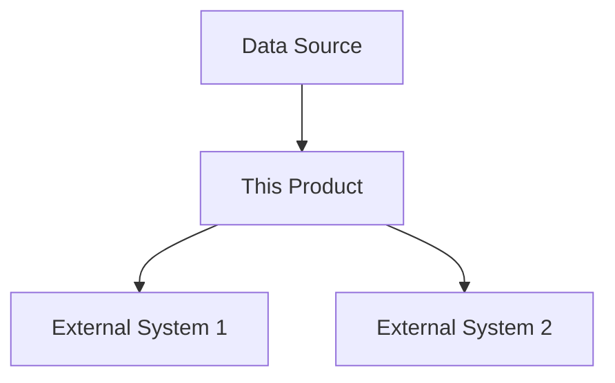

# PRD Output Template
# Use this template structure when generating the final PRD document.
# All sections are required unless marked [Optional].

---

# Product Requirements Document (PRD)

## Document Information

| Field | Value |
|-------|-------|
| Document Title | {Product Name} - Product Requirements Document |
| Version | {version} |
| Date | {date} |
| Author | PRD Writer AI Agent |
| Status | Draft / In Review / Approved |
| Source BRD | {BRD file path and version} |
| Confidentiality | {Internal / Confidential / Public} |

### Change Log

| Version | Date | Author | Changes |
|---------|------|--------|---------|
| 0.1 | {date} | PRD Writer Agent | Initial draft |

---

## 1. Executive Summary

{1-2 paragraph overview of the product, its purpose, target users, and key value proposition. Write this section LAST after all other sections are complete.}

---

## 2. BRD Traceability

### 2.1 Source BRD Reference

| Field | Value |
|-------|-------|
| BRD Document | {BRD title and file path} |
| BRD Version | {version} |
| BRD Approval Date | {date} |

### 2.2 BRD-to-PRD Requirements Mapping

| BRD Req ID | BRD Requirement Summary | PRD Req ID(s) | PRD Feature Module |
|------------|------------------------|---------------|-------------------|
| BRD-001 | {summary} | PRD-001, PRD-002 | {module name} |
| ... | ... | ... | ... |

---

## 3. Product Overview

### 3.1 Product Vision

{Brief product vision statement aligned with BRD business objectives.}

### 3.2 Product Goals & Objectives

| ID | Goal | Measurable Outcome | BRD Alignment |
|----|------|--------------------|---------------|
| G-01 | {goal} | {metric} | BRD-{id} |
| ... | ... | ... | ... |

### 3.3 Success Metrics (KPIs)

| Metric | Target | Measurement Method | Frequency |
|--------|--------|-------------------|-----------|
| {metric name} | {target value} | {how to measure} | {daily/weekly/monthly} |
| ... | ... | ... | ... |

---

## 4. Scope

### 4.1 In Scope

- {Feature/capability 1}
- {Feature/capability 2}
- ...

### 4.2 Out of Scope

- {Explicitly excluded item 1}
- {Explicitly excluded item 2}
- ...

### 4.3 Future Considerations

- {Potential future enhancement 1}
- {Potential future enhancement 2}
- ...

---

## 5. User Personas

### Persona 1: {Persona Name}

| Attribute | Detail |
|-----------|--------|
| Role | {user role} |
| Demographics | {age range, tech proficiency, etc.} |
| Goals | {primary goals} |
| Pain Points | {frustrations with current solutions} |
| Behaviors | {relevant behavioral patterns} |
| Scenarios | {typical usage contexts} |

### Persona 2: {Persona Name}

{Same structure as Persona 1}

---

## 6. Feature Modules

### 6.1 Feature Module Overview

### 6.2 Module: {Module Name}

#### 6.2.1 Description

{Module description and purpose.}

#### 6.2.2 User Stories

**US-{ID}: {User Story Title}**

> As a {persona}, I want {capability}, so that {benefit}.

**Acceptance Criteria:**

- Given {precondition}, When {action}, Then {expected result}
- Given {precondition}, When {action}, Then {expected result}
- Given {precondition}, When {action}, Then {expected result}

**Priority:** {Must Have / Should Have / Could Have / Won't Have}
**BRD Trace:** BRD-{id}

{Repeat for each user story in this module}

#### 6.2.3 Business Rules

| Rule ID | Rule | Condition | Action |
|---------|------|-----------|--------|
| BR-{id} | {rule name} | {when condition} | {then action} |

{Repeat section 6.2 for each feature module}

---

## 7. Functional Requirements

| Req ID | Requirement | Description | Priority | BRD Trace | User Story |
|--------|-------------|-------------|----------|-----------|------------|
| PRD-F001 | {requirement name} | {detailed description} | {P0/P1/P2} | BRD-{id} | US-{id} |
| PRD-F002 | ... | ... | ... | ... | ... |

---

## 8. Non-Functional Requirements

### 8.1 Performance

| Req ID | Requirement | Target | Measurement |
|--------|-------------|--------|-------------|
| PRD-NF001 | Response time | {e.g., < 200ms p95} | {method} |
| PRD-NF002 | Throughput | {e.g., 1000 req/s} | {method} |

### 8.2 Security

| Req ID | Requirement | Standard/Framework |
|--------|-------------|-------------------|
| PRD-NF010 | {requirement} | {e.g., OWASP Top 10} |

### 8.3 Scalability

| Req ID | Requirement | Target |
|--------|-------------|--------|
| PRD-NF020 | {requirement} | {metric} |

### 8.4 Availability & Reliability

| Req ID | Requirement | Target |
|--------|-------------|--------|
| PRD-NF030 | Uptime | {e.g., 99.9%} |

### 8.5 Accessibility

| Req ID | Requirement | Standard |
|--------|-------------|----------|
| PRD-NF040 | {requirement} | {e.g., WCAG 2.1 AA} |

### 8.6 Compliance [Optional]

| Req ID | Requirement | Regulation |
|--------|-------------|------------|
| PRD-NF050 | {requirement} | {e.g., GDPR, HIPAA} |

---

## 9. UX Flows & Interaction Design

### 9.1 High-Level User Flow

### 9.2 Detailed Flow: {Flow Name}

**Primary Flow:**
1. User {action 1}
2. System {response 1}
3. User {action 2}
4. System {response 2}

**Alternate Flows:**
- {Alternate flow description}

**Exception Flows:**
- {Error condition} → {System response} → {Recovery path}

{Repeat for each major user flow}

---

## 10. Data Requirements

### 10.1 Data Entities

### 10.2 Data Flow

### 10.3 Data Validation Rules

| Entity | Field | Validation Rule |
|--------|-------|----------------|
| {entity} | {field} | {rule description} |

---

## 11. System & Integration Requirements [Optional]

### 11.1 System Architecture Context

### 11.2 Integration Points

| Integration | System | Protocol | Data Format | Direction |
|-------------|--------|----------|-------------|-----------|
| {name} | {system} | {REST/GraphQL/etc.} | {JSON/XML/etc.} | {In/Out/Bidirectional} |

### 11.3 Environment Requirements [Optional]

| Environment | Purpose | Requirements |
|-------------|---------|-------------|
| Development | {purpose} | {specs} |
| Staging | {purpose} | {specs} |
| Production | {purpose} | {specs} |

---

## 12. Release Criteria

### 12.1 Release Readiness Checklist

- [ ] All P0 (Must Have) requirements implemented and tested
- [ ] All P1 (Should Have) requirements implemented or deferred with approval
- [ ] Performance benchmarks met
- [ ] Security review completed
- [ ] Accessibility audit passed
- [ ] User acceptance testing completed
- [ ] Documentation updated
- [ ] Deployment plan reviewed

### 12.2 Go/No-Go Criteria

| Criterion | Target | Status |
|-----------|--------|--------|
| {criterion} | {target} | {Pending} |

---

## 13. Assumptions & Constraints

### 13.1 Assumptions

| ID | Assumption | Impact if Invalid |
|----|-----------|-------------------|
| A-01 | {assumption} | {impact description} |

### 13.2 Constraints

| ID | Constraint | Type | Impact |
|----|-----------|------|--------|
| C-01 | {constraint} | {Budget/Time/Tech/Regulatory} | {impact} |

---

## 14. Dependencies & Risks

### 14.1 Dependencies

| ID | Dependency | Type | Owner | Status |
|----|-----------|------|-------|--------|
| D-01 | {dependency} | {External/Internal} | {team/person} | {Active/Resolved} |

### 14.2 Risk Register

| ID | Risk | Probability | Impact | Mitigation Strategy | Owner |
|----|------|-------------|--------|---------------------|-------|
| R-01 | {risk description} | {High/Medium/Low} | {High/Medium/Low} | {mitigation plan} | {owner} |

---

## 15. Stakeholders

| Role | Name/Team | RACI | Responsibilities |
|------|-----------|------|-----------------|
| Product Owner | {name} | A | {responsibilities} |
| Tech Lead | {name} | C | {responsibilities} |
| ... | ... | ... | ... |

---

## 16. Glossary

| Term | Definition |
|------|-----------|
| {term} | {definition} |
| ... | ... |

---

## 17. Appendix [Optional]

### A. Research References

{Links to research documents, competitive analysis, market reports used during PRD creation.}

### B. Related Documents

| Document | Location | Purpose |
|----------|----------|---------|
| BRD | {file path} | Source business requirements |
| Research Log | {file path} | Research process and findings |
| Question Lists | {file path} | Elicitation question records |

### C. Diagrams

{Any additional diagrams not included inline.}
