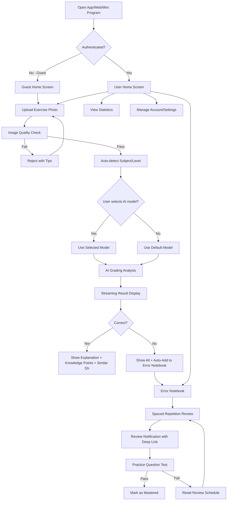
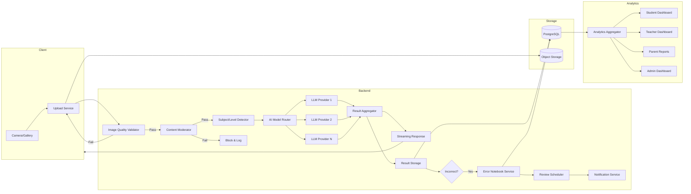
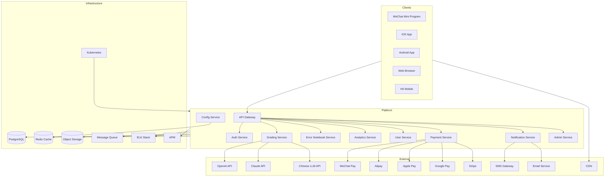

# Product Requirements Document (PRD)

## Document Information

| Field | Value |
|-------|-------|
| Document Title | AI Smart Grader — Product Requirements Document |
| Version | 1.0 |
| Date | 2026-02-28 |
| Author | PRD Writer AI Agent |
| Status | Draft |
| Source BRD | `brd/ai-smart-grader/BRD-AI-Smart-Grader-v1.0.md` (v1.0) |
| Confidentiality | Internal |

### Change Log

| Version | Date | Author | Changes |
|---------|------|--------|---------|
| 0.1 | 2026-02-28 | PRD Writer AI Agent | Initial draft |
| 1.0 | 2026-02-28 | PRD Writer AI Agent | Complete PRD with all sections populated |

---

## 1. Executive Summary

AI Smart Grader is a cloud-native, AI-powered intelligent homework grading and error notebook platform serving students (primary school through university), teachers, parents, and administrators across four client platforms: WeChat Mini Program, native App (iOS/Android), Web, and H5 mobile. The product's core workflow enables users to photograph and upload completed exercises, which are analyzed by configurable AI large language models to deliver streaming grading results with six analysis components — correct/incorrect judgment, correct answers, step-by-step explanations, knowledge point annotations, difficulty ratings, and similar question recommendations. The platform's primary differentiator is its intelligent error notebook, which automatically collects incorrect answers and provides classification, knowledge point tagging, spaced repetition review reminders based on the Ebbinghaus forgetting curve, practice-question-based mastery testing, statistical weakness analysis, and personalized exercise recommendations.

The system supports five user roles (Student, Teacher, Parent, System Administrator, Guest) with a freemium business model (Free/Basic/Premium/Pro tiers), multi-tenant institutional administration, and 40+ admin-configurable system parameters covering AI engine settings, business rules, payment configuration, and operations controls. The backend is built on Java with Spring Cloud microservices and Spring AI for LLM integration, following a fully open-source, commercially licensable technology stack deployed on Kubernetes. The MVP targets Web and WeChat Mini Program launch within 6 months, scaling to 10,000–50,000 registered users and 1,000–5,000 DAU, with a 24-month roadmap to 5 million registered users across all four platforms.

This PRD translates the approved BRD (v1.0) into 120+ detailed product requirements across 8 feature modules, with full BRD-to-PRD traceability, user stories with acceptance criteria, and MoSCoW-prioritized requirements.

---

## 2. BRD Traceability

### 2.1 Source BRD Reference

| Field | Value |
|-------|-------|
| BRD Document | AI Smart Grader — Business Requirements Document (`brd/ai-smart-grader/BRD-AI-Smart-Grader-v1.0.md`) |
| BRD Version | 1.0 |
| BRD Approval Date | 2026-02-28 (confirmed by Product Owner) |

### 2.2 BRD-to-PRD Requirements Mapping

| BRD Req ID | BRD Requirement Summary | PRD Req ID(s) | PRD Feature Module |
|------------|------------------------|---------------|-------------------|
| BR-01 | Multi-platform photo upload | PRD-F001 – PRD-F005 | M1: AI Grading Engine |
| BR-02 | AI LLM-powered grading analysis | PRD-F006 – PRD-F012 | M1: AI Grading Engine |
| BR-03 | 6-component analysis results | PRD-F013 – PRD-F019 | M1: AI Grading Engine |
| BR-04 | Intelligent error notebook | PRD-F020 – PRD-F035 | M2: Error Notebook, M3: Analytics |
| BR-05 | All subjects, all academic levels | PRD-F036 – PRD-F038 | M1: AI Grading, M7: Admin Console |
| BR-06 | Handwritten + printed recognition | PRD-F039 – PRD-F041 | M1: AI Grading Engine |
| BR-07 | Admin-configurable AI prompts | PRD-F042 – PRD-F048 | M7: Admin Console |
| BR-08 | Streaming response delivery | PRD-F049 – PRD-F051 | M1: AI Grading Engine |

### 2.3 BRD Functional Requirements Mapping

| BRD FR ID | BRD Requirement Summary | PRD Req ID(s) | PRD Feature Module |
|-----------|------------------------|---------------|-------------------|
| FR-01 | Guest free AI grading quota | PRD-F052 – PRD-F054 | M4: User & Account |
| FR-02 | Guest first vs. subsequent result display | PRD-F055 – PRD-F056 | M4: User & Account |
| FR-03 | Guest error data sync on registration | PRD-F057 – PRD-F058 | M4: User & Account |
| FR-04 | Shareable grading result cards | PRD-F059 – PRD-F060 | M1: AI Grading |
| FR-05 | Natural registration prompts | PRD-F061 | M4: User & Account |
| FR-06 | Multi-format image upload | PRD-F001 – PRD-F005 | M1: AI Grading |
| FR-07 | Grading result display (9 components) | PRD-F013 – PRD-F019 | M1: AI Grading |
| FR-08 | Error notebook management | PRD-F020 – PRD-F028 | M2: Error Notebook |
| FR-09 | Spaced repetition review reminders | PRD-F029 – PRD-F031 | M2: Error Notebook |
| FR-10 | Learning statistics | PRD-F062 – PRD-F066 | M3: Analytics |
| FR-11 | Error notebook PDF export | PRD-F032 | M2: Error Notebook |
| FR-12 | Parent-child account linking | PRD-F067 – PRD-F069 | M4: User & Account |
| FR-13 | Teacher class management | PRD-F070 – PRD-F073 | M4: User & Account |
| FR-14 | Class error analysis dashboard | PRD-F074 – PRD-F076 | M3: Analytics |
| FR-15 | Knowledge mastery reports | PRD-F077 – PRD-F079 | M3: Analytics |
| FR-16 | Configurable class/student limits | PRD-F080 | M7: Admin Console |
| FR-17 | Parent learning report viewing | PRD-F081 – PRD-F083 | M3: Analytics |
| FR-18 | Parent account linking | PRD-F067 – PRD-F069 | M4: User & Account |
| FR-19 | Admin user management | PRD-F084 – PRD-F086 | M7: Admin Console |
| FR-20 | RBAC permission management | PRD-F087 – PRD-F089 | M7: Admin Console |
| FR-21 | AI Prompt template management | PRD-F042 – PRD-F046 | M7: Admin Console |
| FR-22 | AI model management | PRD-F047 – PRD-F048 | M7: Admin Console |
| FR-23 | Content/taxonomy management | PRD-F090 – PRD-F091 | M7: Admin Console |
| FR-24 | Order/membership management | PRD-F092 – PRD-F095 | M5: Subscription |
| FR-25 | Data statistics dashboard | PRD-F096 – PRD-F098 | M7: Admin Console |
| FR-26 | System configuration | PRD-F099 – PRD-F103 | M7: Admin Console |
| FR-27 | System monitoring | PRD-F104 – PRD-F106 | M7: Admin Console |
| FR-28 | Operations tools | PRD-F107 – PRD-F109 | M7: Admin Console |
| FR-29 | Audit logs | PRD-F110 – PRD-F112 | M7: Admin Console |
| FR-30 | Notification channels | PRD-F113 – PRD-F115 | M6: Notifications |
| FR-31 | Notification types | PRD-F116 – PRD-F118 | M6: Notifications |
| FR-32 | Do-not-disturb periods | PRD-F119 | M6: Notifications |
| FR-33 | Notification template management | PRD-F120 – PRD-F121 | M6: Notifications |
| FR-34 – FR-39 | System configurability (40 params) | PRD-F099 – PRD-F103 | M7: Admin Console |

---

## 3. Product Overview

### 3.1 Product Vision

Empower every student to learn from their mistakes through AI-powered instant grading and intelligent error analysis, while giving teachers and parents the data-driven insights they need to support effective learning — accessible anywhere, on any device.

### 3.2 Product Goals & Objectives

| ID | Goal | Measurable Outcome | BRD Alignment |
|----|------|--------------------|---------------|
| G-01 | Launch MVP with core AI grading + error notebook | Functional release on Web + WeChat Mini Program | BO-01 |
| G-02 | Acquire initial user base | 10,000–50,000 registered users by Month 6 | BO-02 |
| G-03 | Achieve product-market fit | 1,000–5,000 DAU by Month 6 | BO-03 |
| G-04 | Scale user base | 50,000–500,000 registered / 5,000–50,000 DAU by Month 12 | BO-04 |
| G-05 | Establish recurring revenue | Positive MRR by Month 9 | BO-05 |
| G-06 | Full platform coverage | All 4 client platforms live by Month 12 | BO-06 |
| G-07 | Institutional adoption | 500+ teacher accounts, 50+ institutions by Month 18 | BO-07 |
| G-08 | Global scale | 500K–5M registered / 50K–500K DAU by Month 24 | BO-08 |

### 3.3 Success Metrics (KPIs)

| Metric | Target | Measurement Method | Frequency |
|--------|--------|-------------------|-----------|
| Daily Active Users (DAU) | 5,000 (M6) → 50,000 (M12) → 500,000 (M24) | Analytics platform | Daily |
| AI Grading Accuracy Rate | ≥ 85% user-confirmed accuracy | User feedback (thumbs up/down) | Weekly |
| AI Response Time P50 | ≤ 5 seconds | APM monitoring | Real-time |
| Error Notebook Adoption Rate | ≥ 60% of active students use weekly | Feature usage analytics | Weekly |
| Guest-to-Registered Conversion | ≥ 15% | Registration funnel analytics | Weekly |
| Paid Subscription Conversion | ≥ 5% of registered users | Payment analytics | Monthly |
| Monthly Recurring Revenue (MRR) | Positive by Month 9 | Financial reporting | Monthly |
| System Availability | ≥ 99.9% | Uptime monitoring | Monthly |
| User Retention (Day 7) | ≥ 30% | Cohort analysis | Weekly |
| User Retention (Day 30) | ≥ 15% | Cohort analysis | Monthly |
| Teacher Account Adoption | 500+ by Month 18 | User management data | Monthly |
| NPS (Net Promoter Score) | ≥ 40 | In-app survey | Quarterly |

---

## 4. Scope

### 4.1 In Scope

- **Core AI Grading**: Photo upload (multi-format), image quality pre-validation, AI model routing with user model selection, LLM-powered grading with 6 analysis components, streaming result delivery, confidence score display
- **Intelligent Error Notebook**: Auto-collection with user removal, classification/tagging, spaced repetition review (Ebbinghaus curve, admin default + student override), practice-question-based mastery testing, weakness analysis, personalized recommendations, manual entry from non-AI sources, PDF export, admin-configurable capacity per tier
- **Learning Analytics**: Student statistics (error trends, mastery charts, streaks), teacher class analytics (common errors, weakness distribution, per-student breakdown), knowledge mastery reports (per-student, per-class, exportable), parent learning reports (on-demand + configurable auto-reports)
- **Multi-Role Support**: Student, Teacher, Parent, System Administrator, Guest roles
- **Multi-Platform**: WeChat Mini Program, native App (iOS/Android), Web, H5 mobile
- **User & Account**: Multi-method auth (phone, email, WeChat, Google, Apple ID), many-to-many parent-child linking, teacher class management, guest experience with device fingerprint tracking, mandatory age gate with parental consent
- **Subscription & Payment**: Freemium tiers (Free/Basic/Premium/Pro), admin-configurable quotas/pricing/billing, multi-provider payment (WeChat Pay, Alipay, Apple Pay, Google Pay, Stripe), sharing rewards
- **Notifications**: Multi-channel (in-app, push, SMS, email), deep-linked review reminders, teacher custom messages, DND periods, admin-configurable templates
- **Admin Console**: Full multi-tenant administration, user/RBAC management, AI prompt/model management with A/B testing (admin-defined metrics), content taxonomy, order/membership management, data dashboard, 40+ configurable parameters, system monitoring, operations tools, audit logs
- **Platform & Infrastructure**: i18n (Chinese + English), offline error notebook with auto-sync + conflict resolution, GDPR/PIPL compliance with self-service deletion (7-day cooling), DevOps (canary/A/B testing, APM, ELK, alerting), security (encryption, anti-scraping, rate limiting, content moderation)

### 4.2 Out of Scope

- Live tutoring / video conferencing
- Content creation tools (teachers creating original questions/exams)
- Full LMS course management and curriculum tracking
- Dedicated hardware devices
- Social features (forums, chat between users)
- Offline AI processing (grading requires network)
- On-premise deployment (cloud-only)
- Languages beyond Chinese and English in initial release

### 4.3 Future Considerations

- Additional languages (Japanese, Korean, Spanish, etc.)
- On-premise/hybrid deployment for enterprise institutions
- AI-powered study plan generation based on error analytics
- Gamification (XP, badges, leaderboards, study streaks rewards)
- Integration with school LMS platforms (Canvas, Blackboard, etc.)
- Voice-based question input
- Collaborative study groups
- Hardware integration (smart pens, learning tablets)

---

## 5. User Personas

### Persona 1: Xiao Ming (Student)

| Attribute | Detail |
|-----------|--------|
| Role | Student |
| Demographics | 10–22 years old; primary school through university; moderate to high tech proficiency; uses smartphone and tablet daily |
| Goals | Get instant feedback on homework; understand why answers are wrong; systematically review weak areas; improve grades efficiently |
| Pain Points | No immediate feedback after completing exercises; manual error notebooks are tedious and rarely maintained; cannot identify knowledge weaknesses systematically; feels overwhelmed by volume of mistakes |
| Behaviors | Completes 10–30 exercise questions daily; takes photos with smartphone; prefers quick interactions (< 10 seconds); checks error notebook during commute or before bed; motivated by visible progress |
| Scenarios | Finishes math homework at home → photographs page → uploads to app → reviews AI grading with explanations → adds difficult errors to notebook → reviews flagged errors before next exam |

### Persona 2: Teacher Zhang (Teacher)

| Attribute | Detail |
|-----------|--------|
| Role | Teacher |
| Demographics | 28–55 years old; subject teacher managing 2–5 classes of 30–50 students; moderate tech proficiency; primarily uses laptop and tablet |
| Goals | Reduce grading burden (currently 5–10 hrs/week); identify class-wide knowledge gaps; tailor instruction based on data; communicate targeted review guidance to students |
| Pain Points | Repetitive manual grading consumes instruction preparation time; difficult to track individual student progress across assignments; no systematic way to identify common class errors; limited tools for data-driven teaching decisions |
| Behaviors | Reviews class analytics weekly; exports mastery reports for parent conferences; sends review reminders before tests; manages 2–3 classes actively |
| Scenarios | Logs into web dashboard Monday morning → reviews weekend submission analytics → identifies that 40% of class struggles with fractions → sends targeted review notification → exports knowledge mastery report for upcoming parent meeting |

### Persona 3: Parent Wang (Parent)

| Attribute | Detail |
|-----------|--------|
| Role | Parent |
| Demographics | 30–50 years old; working professional; limited time for homework oversight; moderate tech proficiency; primarily uses smartphone |
| Goals | Stay informed about child's learning progress; identify areas where child needs help; support child's study habits without micromanaging |
| Pain Points | Cannot tell if child is completing homework correctly; only learns about problems at report card time; lacks accessible tools for monitoring learning progress; wants to help but doesn't have subject expertise |
| Behaviors | Checks learning reports 2–3 times per week; prefers push notification summaries; links accounts with 1–2 children; reads weekly automated reports via email |
| Scenarios | Receives weekly email summary → sees child's error rate in math increased → opens app to view detailed knowledge mastery chart → notices child struggles with geometry → discusses with child and suggests extra review |

### Persona 4: Admin Li (System Administrator)

| Attribute | Detail |
|-----------|--------|
| Role | System Administrator |
| Demographics | 25–40 years old; technical operations background; high tech proficiency; uses desktop/laptop |
| Goals | Keep platform running smoothly; optimize AI performance and costs; configure business rules without code changes; monitor system health and user metrics |
| Pain Points | AI costs can spike unexpectedly; need to adjust business rules frequently for promotions; monitoring multiple microservices is complex; institutional tenants need isolated management |
| Behaviors | Checks system dashboard daily; adjusts AI model routing based on cost/quality metrics; configures promotional campaigns; manages institutional tenant setups; reviews audit logs for security |
| Scenarios | Notices AI costs trending 20% over budget → adjusts model routing to use faster/cheaper model for simple questions → monitors accuracy impact via A/B test → reviews cost dashboard next day to confirm savings |

### Persona 5: Casual Visitor (Guest)

| Attribute | Detail |
|-----------|--------|
| Role | Guest (unauthenticated) |
| Demographics | Any age; discovered app through word-of-mouth, ad, or shared grading result card; skeptical about value; low commitment |
| Goals | Try the grading feature without commitment; evaluate if the app is worth registering for; get immediate value on first use |
| Pain Points | Doesn't want to create yet another account; skeptical about AI accuracy; wants to see real results before committing personal information |
| Behaviors | Uses app 1–3 times before deciding to register or leave; shares interesting results with friends; triggered to register when shown limited features or reaching quota |
| Scenarios | Sees friend's shared grading result card → opens app → uploads a math exercise photo → receives full AI analysis on first use → impressed → tries 2nd question but sees limited result → prompted to register → creates account → syncs previous guest data |

---

## 6. Feature Modules

### 6.1 Feature Module Overview

```mermaid
graph TD
    A[AI Smart Grader Platform] --> M1[M1: AI Grading Engine]
    A --> M2[M2: Intelligent Error Notebook]
    A --> M3[M3: Learning Analytics & Reports]
    A --> M4[M4: User & Account Management]
    A --> M5[M5: Subscription & Payment]
    A --> M6[M6: Notification System]
    A --> M7[M7: Admin Console]
    A --> M8[M8: Platform & Infrastructure]

    M1 --> M1A[Photo Upload & Validation]
    M1 --> M1B[AI Model Routing & Selection]
    M1 --> M1C[LLM Grading Analysis]
    M1 --> M1D[Streaming Result Delivery]
    M1 --> M1E[Confidence Scoring]
    M1 --> M1F[Similar Question Recommendations]

    M2 --> M2A[Auto Error Collection]
    M2 --> M2B[Classification & Tagging]
    M2 --> M2C[Spaced Repetition Review]
    M2 --> M2D[Practice-Based Mastery Testing]
    M2 --> M2E[Weakness Analysis]
    M2 --> M2F[Manual Entry]
    M2 --> M2G[PDF Export]

    M3 --> M3A[Student Statistics]
    M3 --> M3B[Teacher Class Analytics]
    M3 --> M3C[Knowledge Mastery Reports]
    M3 --> M3D[Parent Learning Reports]

    M4 --> M4A[Multi-Method Authentication]
    M4 --> M4B[Role-Based Profiles]
    M4 --> M4C[Guest Experience]
    M4 --> M4D[Parent-Child Linking]
    M4 --> M4E[Teacher Class Management]
    M4 --> M4F[Age Verification]

    M5 --> M5A[Membership Tiers]
    M5 --> M5B[Payment Processing]
    M5 --> M5C[Order Management]
    M5 --> M5D[Sharing Rewards]

    M6 --> M6A[Multi-Channel Delivery]
    M6 --> M6B[Review Reminders with Deep Links]
    M6 --> M6C[Teacher Custom Messages]
    M6 --> M6D[DND & Templates]

    M7 --> M7A[User & RBAC Management]
    M7 --> M7B[AI Prompt & Model Management]
    M7 --> M7C[Multi-Tenant Administration]
    M7 --> M7D[Data Dashboard]
    M7 --> M7E[System Configuration 40+ Params]
    M7 --> M7F[Monitoring & Audit]

    M8 --> M8A[Multi-Platform Clients]
    M8 --> M8B[Internationalization]
    M8 --> M8C[Offline Mode & Sync]
    M8 --> M8D[Compliance & Security]
    M8 --> M8E[DevOps & Observability]
```



### 6.2 Module 1: AI Grading Engine

#### 6.2.1 Description

The core value-delivery module. Handles the complete pipeline from photo upload through AI-powered grading to streaming result delivery. Includes image quality pre-validation, intelligent AI model routing with user model selection, multimodal LLM analysis, confidence scoring, and hybrid similar question recommendations.

#### 6.2.2 User Stories

**US-001: Upload Exercise Photo**

> As a student, I want to upload photos of my completed exercises from my device, so that I can get AI-powered grading and feedback.

**Acceptance Criteria:**

- Given I have an exercise photo, When I tap the upload button, Then I can select single or multiple images from my device camera or gallery
- Given I select multiple images, When I begin upload, Then I am prompted to choose whether to treat them as separate submissions or one multi-page assignment
- Given my image is in JPG, PNG, PDF, HEIC, or WebP format, When I upload it, Then the system accepts it for processing
- Given my image exceeds the configured size limit, When I attempt to upload, Then the system rejects it with a clear error message showing the maximum allowed size
- Given my image is blurry, too dark, or cropped, When the system pre-validates quality, Then it rejects the image with specific tips (e.g., "Image is too blurry, please retake with better lighting")

**Priority:** Must Have
**BRD Trace:** BR-01, FR-06

---

**US-002: Select AI Model**

> As a student, I want to optionally choose which AI model to use for grading, so that I can balance speed, accuracy, and my quota.

**Acceptance Criteria:**

- Given I am on the upload screen, When I view the AI model selector, Then I see the system's default model pre-selected
- Given multiple AI models are available, When I tap the model selector, Then I see a list of available models with brief descriptions
- Given I do not change the model selection, When I submit, Then the system uses the default model configured by the admin
- Given I select a specific model, When I submit, Then the system uses my selected model for this grading session

**Priority:** Should Have
**BRD Trace:** BR-02, BR-07

---

**US-003: Auto-Detect Subject and Level**

> As a student, I want the system to auto-detect the subject and academic level from my uploaded image, so that I don't have to manually configure it every time.

**Acceptance Criteria:**

- Given I upload an exercise image, When the AI processes it, Then the system auto-detects the subject (e.g., Math, Physics) and academic level (e.g., Grade 8) and pre-fills these fields
- Given the auto-detected subject/level is incorrect, When I tap the subject/level field, Then I can override it with the correct values from a dropdown
- Given I manually override the subject/level, When the system processes the image, Then it uses my specified values instead of the auto-detected ones

**Priority:** Must Have
**BRD Trace:** BR-05

---

**US-004: View AI Grading Results**

> As a student, I want to see comprehensive AI grading results with streaming delivery, so that I get quick feedback on correctness and can progressively review detailed explanations.

**Acceptance Criteria:**

- Given my image is submitted for grading, When the AI begins processing, Then I see the correct/incorrect judgment within 2 seconds via streaming response
- Given the initial judgment is displayed, When the AI continues processing, Then the full explanation (correct answer, step-by-step solution, knowledge points, difficulty rating, similar questions) streams in progressively
- Given the grading result is fully loaded, When I view the result page, Then I see all 9 components: original image with correct/incorrect markers, judgment result, correct answer, step-by-step explanation, knowledge point tags, difficulty rating, similar question recommendations, add-to-error-notebook button, share button
- Given the AI has low confidence in its analysis, When the result is displayed, Then a confidence score is shown (e.g., "AI confidence: 70%")
- Given the end-to-end grading completes, When measured, Then P50 response time is ≤ 5 seconds, P90 ≤ 8 seconds, P99 ≤ 15 seconds

**Priority:** Must Have
**BRD Trace:** BR-03, BR-08, FR-07

---

**US-005: Receive Similar Question Recommendations**

> As a student, I want to see similar questions after viewing my grading result, so that I can practice more on topics I got wrong.

**Acceptance Criteria:**

- Given a grading result is displayed, When I scroll to the recommendations section, Then I see 3–5 similar questions related to the same knowledge points
- Given the system has a question bank with matching knowledge points, When generating recommendations, Then it prioritizes curated questions from the bank supplemented by AI-generated questions
- Given no question bank entries match, When generating recommendations, Then the AI generates similar questions dynamically
- Given I tap a recommended question, When I view it, Then I see the question with an option to attempt it and check my answer

**Priority:** Should Have
**BRD Trace:** BR-03

---

**US-006: Share Grading Result**

> As a student or guest, I want to share my grading result as a visual card, so that I can show friends and earn bonus grading quota.

**Acceptance Criteria:**

- Given a grading result is displayed, When I tap the share button, Then a shareable card image is generated with the question, result, and app branding
- Given I successfully share the card to a social platform, When the share is confirmed, Then I receive bonus grading quota as configured by the admin
- Given I have already earned the maximum sharing quota for the day, When I share again, Then no additional quota is credited and a message explains the daily limit

**Priority:** Should Have
**BRD Trace:** FR-04

---

#### 6.2.3 Business Rules

| Rule ID | Rule | Condition | Action |
|---------|------|-----------|--------|
| GR-01 | Image quality gate | Image fails quality pre-validation (blur, darkness, crop) | Reject upload; display specific remediation tips; do not consume grading quota |
| GR-02 | File format validation | Uploaded file is not JPG, PNG, PDF, HEIC, or WebP | Reject with message listing accepted formats |
| GR-03 | File size limit | Image exceeds admin-configured size limit | Reject with message showing limit and current file size |
| GR-04 | Grading quota enforcement | User has exhausted their tier's daily grading quota | Block grading; show upgrade prompt with tier comparison |
| GR-05 | AI model fallback | Selected AI model is unavailable or times out | Automatically failover to next available model per routing rules; log the failover event |
| GR-06 | Content moderation | Uploaded image contains inappropriate content | Block before AI processing; log the event; do not consume grading quota |
| GR-07 | Streaming timeout | AI response exceeds configured timeout | Display partial results with "Analysis incomplete" message; offer retry option |
| GR-08 | Confidence threshold | AI confidence score is below admin-configured threshold | Display confidence warning alongside results |

---

### 6.3 Module 2: Intelligent Error Notebook

#### 6.3.1 Description

The platform's core differentiator. Automatically collects incorrect answers from AI grading results, enables manual entry from external sources, provides deep classification with knowledge point tagging, implements Ebbinghaus spaced repetition with practice-question-based mastery testing, delivers statistical weakness analysis, and supports PDF export. Capacity per tier is admin-configurable.

#### 6.3.2 User Stories

**US-007: Auto-Collect Errors**

> As a student, I want all my incorrect answers to be automatically added to my error notebook, so that I never miss tracking a mistake.

**Acceptance Criteria:**

- Given an AI grading result contains an incorrect answer, When the result is saved, Then the incorrect item is automatically added to my error notebook with subject, knowledge points, difficulty, and source reference
- Given an error is auto-added, When I view it in my error notebook, Then I can remove/dismiss it if I consider it a trivial mistake
- Given my error notebook has reached the admin-configured capacity for my membership tier, When a new error is auto-added, Then the system notifies me of the capacity limit and suggests upgrading or removing old entries

**Priority:** Must Have
**BRD Trace:** BR-04, FR-08

---

**US-008: Manually Add Errors**

> As a student, I want to manually add errors from classroom tests or textbook exercises to my error notebook, so that all my mistakes are in one place.

**Acceptance Criteria:**

- Given I want to add an error from a non-AI source, When I tap "Add manually" in the error notebook, Then I can either photograph the question or type it in
- Given I photograph a manual entry, When the system processes it, Then the AI auto-detects the subject and knowledge points (with my override option)
- Given I type a manual entry, When I save it, Then I must specify the subject and can optionally tag knowledge points

**Priority:** Must Have
**BRD Trace:** BR-04

---

**US-009: Browse and Filter Error Notebook**

> As a student, I want to browse and filter my error notebook by subject, knowledge point, date, and difficulty, so that I can focus my review on specific areas.

**Acceptance Criteria:**

- Given I open my error notebook, When I view the list, Then I see all active error entries sorted by most recent
- Given I apply filters (subject, knowledge point, date range, difficulty), When the list updates, Then only matching entries are displayed
- Given I select an error entry, When I view its detail page, Then I see the original question, my incorrect answer, the correct answer, step-by-step explanation, knowledge point tags, and difficulty rating
- Given an entry is marked as "mastered", When I view my notebook, Then mastered entries appear in a separate "Reviewed" section

**Priority:** Must Have
**BRD Trace:** BR-04, FR-08

---

**US-010: Spaced Repetition Review**

> As a student, I want to receive review reminders based on the Ebbinghaus forgetting curve, so that I review errors at optimal intervals for memory retention.

**Acceptance Criteria:**

- Given an error is added to my notebook, When the spaced repetition scheduler runs, Then it schedules review reminders at admin-configured default intervals (e.g., 1d, 3d, 7d, 14d, 30d)
- Given I want to customize my review intervals, When I access my review settings, Then I can adjust intervals within the admin-allowed range
- Given a review reminder triggers, When I receive the notification, Then it deep-links directly to the specific error notebook entry
- Given I tap the review notification, When the error entry opens, Then the system presents a similar practice question for me to solve

**Priority:** Must Have
**BRD Trace:** BR-04, FR-09

---

**US-011: Practice-Based Mastery Testing**

> As a student, I want to prove I've mastered a concept by answering a similar practice question, so that mastery is validated through testing rather than just re-reading.

**Acceptance Criteria:**

- Given I am reviewing an error notebook entry, When I tap "Test mastery", Then the system presents a similar practice question (generated by AI or from question bank)
- Given I answer the practice question correctly, When the system verifies, Then the error entry is marked as "mastered" and moved to the "Reviewed" section
- Given I answer the practice question incorrectly, When the system verifies, Then the error entry remains active and the review schedule resets from the beginning
- Given I answer incorrectly, When the result is shown, Then I see the correct answer and explanation for the practice question as well

**Priority:** Must Have
**BRD Trace:** BR-04

---

**US-012: Weakness Analysis**

> As a student, I want to see which knowledge points I'm weakest in, so that I can focus my study time on the areas that need the most improvement.

**Acceptance Criteria:**

- Given I have 10+ error notebook entries, When I view my weakness analysis, Then the system identifies and ranks my top 5 weakest knowledge points based on error frequency and recency
- Given I view a weakness area, When I tap on it, Then I see all related error entries filtered by that knowledge point
- Given I have mastered several entries in a weak area, When the weakness analysis recalculates, Then the weakness ranking updates to reflect my progress

**Priority:** Must Have
**BRD Trace:** BR-04, FR-10

---

**US-013: Export Error Notebook as PDF**

> As a student, I want to export my error notebook as a PDF, so that I can print it for offline study.

**Acceptance Criteria:**

- Given I want to export my error notebook, When I tap "Export PDF", Then I can choose to export all entries or filter by subject/date range/status
- Given I initiate the export, When the PDF is generated, Then it includes the original question, correct answer, step-by-step explanation, and knowledge point tags for each entry
- Given the export is complete, When the PDF is ready, Then I can download it within 30 seconds for up to 500 entries
- Given the PDF is generated, When I view it, Then the formatting is clear and suitable for printing on A4/Letter paper

**Priority:** Should Have
**BRD Trace:** BR-04, FR-11

---

#### 6.3.3 Business Rules

| Rule ID | Rule | Condition | Action |
|---------|------|-----------|--------|
| ER-01 | Auto-collection trigger | AI grading result contains incorrect answer | Automatically add to error notebook with full metadata |
| ER-02 | Capacity enforcement | Error notebook reaches admin-configured tier limit | Notify user; block new entries until space is freed or tier upgraded |
| ER-03 | Mastery validation | Student answers practice question correctly | Mark entry as "mastered"; stop future review reminders for this entry |
| ER-04 | Failed mastery reset | Student answers practice question incorrectly | Reset review schedule to Day 1; keep entry active |
| ER-05 | Manual entry processing | Student adds error via photo | AI auto-detects subject/knowledge points; student can override |
| ER-06 | Review schedule | Review reminder due date arrives | Send notification with deep-link to entry; present practice question |

---

### 6.4 Module 3: Learning Analytics & Reports

#### 6.4.1 Description

Aggregates grading and error notebook data into actionable insights for students, teachers, and parents. Supports multiple time granularities, exportable reports, and configurable automated report delivery.

#### 6.4.2 User Stories

**US-014: Student Learning Statistics**

> As a student, I want to view my learning statistics showing error rate trends, knowledge mastery, and study streaks, so that I can track my progress over time.

**Acceptance Criteria:**

- Given I open my statistics page, When the data loads, Then I see: error rate trend chart (over time), knowledge point mastery chart, subject-wise analysis breakdown, and current study streak
- Given I select a time range (daily/weekly/monthly/custom), When the charts update, Then the data reflects the selected period
- Given I have grading history, When I view statistics, Then all metrics accurately reflect my actual grading results

**Priority:** Must Have
**BRD Trace:** BR-04, FR-10

---

**US-015: Teacher Class Error Analytics**

> As a teacher, I want to view aggregated error analysis for my class, so that I can identify common knowledge gaps and tailor my instruction.

**Acceptance Criteria:**

- Given I manage a class, When I open the class analytics dashboard, Then I see: most common errors, knowledge point weakness distribution chart, and student-by-student error breakdown
- Given new student submissions are processed, When I view the dashboard, Then data reflects submissions made within the last 5 minutes
- Given I select a time range (daily/weekly/monthly/custom), When the dashboard updates, Then all analytics reflect the selected period
- Given I want to drill down, When I click on a knowledge point, Then I see all related student errors grouped by question type

**Priority:** Must Have
**BRD Trace:** BR-04, FR-14

---

**US-016: Teacher Knowledge Mastery Reports**

> As a teacher, I want to generate knowledge mastery reports showing per-student and per-class coverage, so that I can prepare for parent conferences and adjust curriculum.

**Acceptance Criteria:**

- Given I select a class, When I open mastery reports, Then I see per-student knowledge point mastery percentages and per-class aggregate mastery
- Given I want to track trends, When I select a date range, Then I see mastery improvement or decline over time for each knowledge point
- Given I need to share reports, When I tap "Export", Then I can download the report as PDF or CSV

**Priority:** Must Have
**BRD Trace:** BR-04, FR-15

---

**US-017: Parent Learning Reports**

> As a parent, I want to view my child's learning report showing grading history, error trends, and knowledge mastery, so that I can understand their academic progress.

**Acceptance Criteria:**

- Given I am linked to my child's account, When I open the learning report, Then I see: grading history, error rate trends, knowledge point mastery chart, and study frequency
- Given I have read-only access, When I view the report, Then I cannot modify any data or settings
- Given I have opted into automated reports, When the configured report period arrives (e.g., weekly), Then I receive a summary via email/push notification

**Priority:** Must Have
**BRD Trace:** BR-04, FR-17

---

**US-018: Configurable Automated Parent Reports**

> As a parent, I want to configure automated periodic learning report delivery, so that I stay informed without having to check the app manually.

**Acceptance Criteria:**

- Given I am in my settings, When I access "Report preferences", Then I can toggle automated reports on/off and configure the frequency (daily/weekly/monthly)
- Given I have enabled automated reports, When the report period arrives, Then the system generates and delivers the report via my preferred channel (email/push)
- Given the automated report is sent, When I open it, Then it contains a summary of grading activity, error trends, and knowledge mastery changes since the last report

**Priority:** Should Have
**BRD Trace:** FR-17

---

#### 6.4.3 Business Rules

| Rule ID | Rule | Condition | Action |
|---------|------|-----------|--------|
| AR-01 | Data freshness | New student submission processed | Analytics data reflects new data within 5 minutes |
| AR-02 | Teacher data isolation | Teacher views analytics | Only show data for students in teacher's own classes |
| AR-03 | Parent data isolation | Parent views child's report | Only show data for linked children; read-only access |
| AR-04 | Automated report delivery | Configured report period arrives | Generate and deliver report via configured channel |
| AR-05 | Minimum data threshold | Student has fewer than 5 grading results | Show "Not enough data" message instead of charts |

---

### 6.5 Module 4: User & Account Management

#### 6.5.1 Description

Handles multi-method authentication, role-based profiles, guest experience with device fingerprint tracking, many-to-many parent-child linking, teacher class management, and mandatory age verification with parental consent.

#### 6.5.2 User Stories

**US-019: Register and Authenticate**

> As a new user, I want to register and log in using my preferred method (phone, email, WeChat, Google, or Apple ID), so that I can access the platform conveniently.

**Acceptance Criteria:**

- Given I am on the registration/login screen, When I view the options, Then I see all 5 authentication methods: phone number, email, WeChat OAuth, Google OAuth, Apple ID
- Given I choose phone number registration, When I enter my number and verify via SMS OTP, Then my account is created with the Student role by default
- Given I have accounts with multiple auth methods, When I link them, Then all methods lead to the same unified account
- Given I register, When the registration form loads, Then I must provide my date of birth for age verification

**Priority:** Must Have
**BRD Trace:** NFR-12

---

**US-020: Age Verification and Parental Consent**

> As a platform operator, I want mandatory age verification at registration, so that the platform complies with GDPR and PIPL requirements for underage users.

**Acceptance Criteria:**

- Given a user is registering, When they enter their date of birth, Then the system calculates their age
- Given the user is under 13 (GDPR) or under 14 (PIPL based on region), When they attempt to complete registration, Then the system requires verified parental consent before the account becomes active
- Given parental consent is required, When the system prompts, Then the parent must authenticate via one of the supported methods and confirm consent
- Given parental consent is not provided within 30 days, When the deadline passes, Then the pending account is automatically deleted

**Priority:** Must Have
**BRD Trace:** NFR-10

---

**US-021: Guest Experience**

> As a guest, I want to try AI grading without registering, so that I can evaluate the product before committing.

**Acceptance Criteria:**

- Given I open the app without an account, When I access the grading feature, Then I can use it up to the admin-configured daily guest quota
- Given I am a guest using AI grading for the first time, When I view my first result, Then I see the complete 6-component analysis
- Given I am a guest using AI grading for the 2nd+ time, When I view subsequent results, Then I see only the correct/incorrect judgment; full analysis requires registration
- Given I reach the 2nd or 3rd usage, When the registration prompt appears, Then it is presented naturally (not a blocking modal on first use)
- Given the system identifies me as a guest, When tracking my quota, Then it uses device fingerprint for identification
- Given I later register, When I log in, Then all my previous guest error data is synced to my new account

**Priority:** Must Have
**BRD Trace:** FR-01, FR-02, FR-03, FR-05

---

**US-022: Parent-Child Account Linking**

> As a parent, I want to link my account to my child's account, so that I can view their learning progress.

**Acceptance Criteria:**

- Given I want to link to my child, When I access account linking, Then I can link via invitation code, QR code scan, or phone number association
- Given I send a link request, When my child receives it, Then they must confirm the link before it becomes active
- Given I am a parent with multiple children, When I link additional accounts, Then each child's data is accessible separately in my dashboard
- Given a student, When they link to parents, Then they can be linked to multiple parent accounts (many-to-many)

**Priority:** Must Have
**BRD Trace:** FR-12, FR-18

---

**US-023: Teacher Class Management**

> As a teacher, I want to create and manage classes where students can join and I can view their analytics.

**Acceptance Criteria:**

- Given I am a teacher, When I create a class, Then the system generates a unique class code for student joining
- Given I have a class, When a student joins via class code, teacher invitation, or school batch import, Then they appear in my class roster
- Given admin has configured class limits, When I attempt to create beyond the limit, Then I see a clear message about the maximum number of classes allowed
- Given admin has configured student-per-class limits, When enrollment reaches the limit, Then new students cannot join and the limit is displayed

**Priority:** Must Have
**BRD Trace:** FR-13, FR-16

---

#### 6.5.3 Business Rules

| Rule ID | Rule | Condition | Action |
|---------|------|-----------|--------|
| UR-01 | Age gate enforcement | User under 13 (EU) or 14 (China) | Require verified parental consent before activation |
| UR-02 | Guest quota tracking | Guest accesses grading | Track via device fingerprint; enforce daily quota |
| UR-03 | Guest data sync | Guest registers | Sync all device-stored error data to new account |
| UR-04 | Guest first use | Guest's first grading result | Show full 6-component analysis |
| UR-05 | Guest subsequent use | Guest's 2nd+ grading result | Show correct/incorrect judgment only; prompt registration for full analysis |
| UR-06 | Parent-child confirmation | Parent sends link request | Child must confirm before link activates |
| UR-07 | Class limits | Teacher creates class beyond limit | Block creation; show limit message |
| UR-08 | Account deletion cooling | User requests account deletion | 7-day cooling period; cancel allowed; auto-delete after cooling |

---

### 6.6 Module 5: Subscription & Payment

#### 6.6.1 Description

Implements the freemium business model with admin-configurable membership tiers, grading quotas, billing periods, and multi-provider payment processing. Supports sharing rewards for viral growth.

#### 6.6.2 User Stories

**US-024: View and Compare Membership Tiers**

> As a user, I want to view and compare membership tiers, so that I can choose the plan that best fits my needs.

**Acceptance Criteria:**

- Given I access the membership page, When the tiers load, Then I see all available tiers (Free/Basic/Premium/Pro) with their features, quotas, and pricing
- Given each tier has different grading quotas, When I compare them, Then the daily grading quota for each tier is clearly displayed
- Given tiers have admin-configurable pricing, When pricing changes, Then the updated prices are reflected in the client within 5 minutes

**Priority:** Must Have
**BRD Trace:** FR-24

---

**US-025: Subscribe and Pay**

> As a user, I want to subscribe to a paid membership using my preferred payment method, so that I can access premium features.

**Acceptance Criteria:**

- Given I choose a paid tier, When I proceed to payment, Then I see available payment methods for my region (WeChat Pay, Alipay, Apple Pay, Google Pay, Stripe)
- Given I select a payment method, When I complete payment, Then my subscription activates immediately and my quotas update
- Given admin has configured billing periods, When I view plan options, Then I see all available billing cycles with respective pricing
- Given I have an active subscription, When it approaches expiry, Then I receive a renewal reminder notification

**Priority:** Must Have
**BRD Trace:** FR-24, NFR-11

---

**US-026: Earn Sharing Rewards**

> As a user, I want to earn bonus grading quota by sharing my results, so that I can use the platform more without paying.

**Acceptance Criteria:**

- Given I share a grading result card, When the share is confirmed, Then I receive admin-configured bonus grading quota within 5 seconds
- Given I have reached the daily sharing reward limit, When I share again, Then no additional quota is credited and the daily limit is displayed

**Priority:** Should Have
**BRD Trace:** FR-04

---

#### 6.6.3 Business Rules

| Rule ID | Rule | Condition | Action |
|---------|------|-----------|--------|
| SR-01 | Quota enforcement | User exceeds tier daily quota | Block grading; display upgrade CTA |
| SR-02 | Payment activation | Payment confirmed by provider | Activate subscription immediately; update quotas |
| SR-03 | Subscription expiry | Subscription reaches end date | Downgrade to Free tier; send notification |
| SR-04 | Refund processing | Admin processes refund | Revert tier to previous; adjust remaining quota pro-rata |
| SR-05 | Regional payment methods | User location detected | Show only payment methods available in user's region |
| SR-06 | Sharing reward cap | Daily sharing reward limit reached | No additional quota; display limit message |

---

### 6.7 Module 6: Notification System

#### 6.7.1 Description

Multi-channel notification delivery system supporting in-app messages, push notifications, SMS, and email. Features deep-linked review reminders, teacher custom messaging, do-not-disturb periods, and admin-configurable templates with multi-language support.

#### 6.7.2 User Stories

**US-027: Receive Review Reminders with Deep Links**

> As a student, I want to receive review reminders that take me directly to the error I need to review, so that I can start reviewing immediately without navigating through the app.

**Acceptance Criteria:**

- Given a review reminder is due, When the notification fires, Then it includes a deep-link to the specific error notebook entry
- Given I tap the notification, When the app opens, Then I land directly on the error entry detail page with the practice question ready

**Priority:** Must Have
**BRD Trace:** FR-09, FR-31

---

**US-028: Teacher Custom Messages**

> As a teacher, I want to send custom messages to my class or individual students, so that I can guide their study activities.

**Acceptance Criteria:**

- Given I am a teacher with a class, When I compose a message, Then I can write free-text content and choose to send to the entire class or specific students
- Given I send a message, When students receive it, Then it appears as an in-app notification and optionally via push notification
- Given I want to remind students about review, When I compose, Then I can include a topic reference (e.g., "Review Chapter 3 errors before Friday's test")

**Priority:** Should Have
**BRD Trace:** FR-31

---

**US-029: Configure Do-Not-Disturb**

> As a user, I want to set do-not-disturb time periods, so that I'm not interrupted during sleep or study time.

**Acceptance Criteria:**

- Given I access notification settings, When I configure DND periods, Then I can set start and end times (e.g., 22:00–07:00)
- Given a notification fires during my DND period, When the system checks my settings, Then the notification is queued and delivered after the DND period ends

**Priority:** Should Have
**BRD Trace:** FR-32

---

#### 6.7.3 Business Rules

| Rule ID | Rule | Condition | Action |
|---------|------|-----------|--------|
| NR-01 | DND enforcement | Notification due during DND period | Queue notification; deliver when DND ends |
| NR-02 | Channel availability | Notification channel toggled off by admin | Do not send via that channel; use remaining active channels |
| NR-03 | Teacher message scope | Teacher sends message | Enforce that teacher can only message students in their own classes |
| NR-04 | Deep-link generation | Review reminder created | Generate platform-appropriate deep-link (Mini Program/App/Web/H5) |

---

### 6.8 Module 7: Admin Console

#### 6.8.1 Description

Comprehensive back-office management with full multi-tenant support. Covers user/RBAC management, AI prompt/model management with configurable A/B testing, content taxonomy, order/membership management, real-time data dashboard, 40+ configurable system parameters, system monitoring, operations tools, and audit logging.

#### 6.8.2 User Stories

**US-030: Manage Users and RBAC**

> As an admin, I want to manage users with role-based access control, so that each user has appropriate permissions.

**Acceptance Criteria:**

- Given I am a system admin, When I access user management, Then I can perform CRUD operations on user accounts, assign roles (Student/Teacher/Parent/Admin), and manage account status
- Given I configure RBAC permissions, When I assign a role, Then menu-level, data-level (teacher sees own classes, parent sees own children), and API-level access controls are enforced
- Given I need to onboard users in bulk, When I use batch import, Then I can upload CSV/Excel files with validation and error reporting
- Given I am an institution admin (multi-tenant), When I view the admin console, Then I see only my institution's users and data

**Priority:** Must Have
**BRD Trace:** FR-19, FR-20

---

**US-031: Manage AI Prompts with A/B Testing**

> As an admin, I want to create, version, and A/B test AI prompt templates, so that I can continuously optimize grading quality.

**Acceptance Criteria:**

- Given I access prompt management, When I create a template, Then I specify subject, academic level, question type, and prompt content
- Given I have multiple prompt versions, When I set up an A/B test, Then I configure traffic split ratios and select admin-defined metrics to track (e.g., user feedback, response time, cost)
- Given an A/B test is running, When I view the effectiveness dashboard, Then I see comparative metrics per variant
- Given I publish a prompt change, When it takes effect, Then it applies without code deployment

**Priority:** Must Have
**BRD Trace:** BR-07, FR-21

---

**US-032: Manage AI Models and Routing**

> As an admin, I want to configure multiple LLM providers and set intelligent routing rules, so that I can optimize cost and quality.

**Acceptance Criteria:**

- Given I access model management, When I configure providers, Then I can set up multiple LLM providers (e.g., OpenAI, Claude, Chinese models) with API keys and routing rules
- Given I configure routing rules, When a grading request comes in, Then the system routes it per the configured rules (e.g., simple questions to fast/cheap model, complex to deep model)
- Given I view the cost dashboard, When I check spending, Then I see per-model and aggregate costs with daily/weekly/monthly breakdowns
- Given a provider is unavailable, When the system detects failure, Then it automatically fails over to the next configured provider

**Priority:** Must Have
**BRD Trace:** BR-07, FR-22

---

**US-033: Configure System Parameters**

> As an admin, I want to configure all 40+ system parameters through the admin console, so that business rules and system behavior can be changed without code deployment.

**Acceptance Criteria:**

- Given I access system configuration, When I view parameters, Then I see all parameters organized by category (AI Engine, User/Permissions, Business Rules, Commerce, Notifications, System Operations)
- Given I change a parameter, When I save, Then the change takes effect across all microservices without restart
- Given I change a business rule (e.g., grading quota), When users are affected, Then the new rule is enforced on their next action
- Given I enable maintenance mode, When I toggle it on, Then all client platforms immediately show a custom maintenance announcement

**Priority:** Must Have
**BRD Trace:** FR-34 – FR-39

---

**US-034: Multi-Tenant Institution Administration**

> As a platform operator, I want multi-tenant administration where each institution has isolated admin access, so that institutional data remains private and manageable.

**Acceptance Criteria:**

- Given an institution is onboarded, When their admin logs in, Then they see only their institution's users, classes, analytics, and configuration
- Given a system-level admin, When they view the console, Then they can see all tenants and cross-tenant aggregate data
- Given an institution admin, When they manage users, Then they can only assign roles within their own tenant scope

**Priority:** Must Have
**BRD Trace:** (Elicitation decision — multi-tenant confirmed)

---

**US-035: View Real-Time Data Dashboard**

> As an admin, I want a real-time data dashboard, so that I can monitor platform health and business metrics at a glance.

**Acceptance Criteria:**

- Given I open the dashboard, When data loads, Then I see: real-time DAU, AI invocation volume, grading success rate, revenue, and trending knowledge points in errors
- Given the data refreshes, When I check metrics, Then data is no more than 1 minute old
- Given I compare with backend data, When I verify, Then dashboard metrics match within 1% accuracy

**Priority:** Must Have
**BRD Trace:** FR-25

---

**US-036: Monitor System Health**

> As an admin, I want to monitor service health, API response times, and error logs, so that I can identify and resolve issues quickly.

**Acceptance Criteria:**

- Given I access monitoring, When I view health checks, Then I see status for all microservices
- Given an alert threshold is breached, When the system detects it, Then an alert notification fires within 1 minute
- Given I view error logs, When I search, Then I can filter by service, time range, severity, and keyword

**Priority:** Must Have
**BRD Trace:** FR-27

---

**US-037: Manage Operations (Announcements, Campaigns)**

> As an admin, I want to manage announcements, banners, and campaigns, so that I can communicate with users and drive engagement.

**Acceptance Criteria:**

- Given I publish an announcement, When I save and activate it, Then it displays on all client platforms within 5 minutes
- Given I create a coupon/promotion campaign, When I configure rules (discount, validity, usage limits), Then the campaign applies automatically to qualifying users
- Given I manage banners, When I set display rules (date range, target audience), Then banners appear/disappear per configuration

**Priority:** Should Have
**BRD Trace:** FR-28

---

**US-038: View Audit Logs**

> As an admin, I want comprehensive audit logs, so that I can track all admin actions for security and compliance.

**Acceptance Criteria:**

- Given any admin performs an action, When the action completes, Then a log entry is created with timestamp, operator, action type, affected resource, and details
- Given I search audit logs, When I filter by operator, action type, date range, or resource, Then matching entries are returned
- Given a sensitive operation occurs (role change, data deletion, payment refund), When it is logged, Then it is flagged as sensitive for easy auditing

**Priority:** Must Have
**BRD Trace:** FR-29

---

#### 6.8.3 Business Rules

| Rule ID | Rule | Condition | Action |
|---------|------|-----------|--------|
| CR-01 | Hot reload | Config parameter changed | Push to all microservices without restart |
| CR-02 | Tenant isolation | Institution admin accesses console | Filter all data to their tenant scope only |
| CR-03 | Audit logging | Any admin action performed | Create immutable audit log entry |
| CR-04 | Sensitive operation | Role change, data deletion, refund | Flag in audit log; require confirmation |
| CR-05 | A/B test traffic | A/B test configured | Distribute traffic per configured ratios; log variant assignment per user |

---

### 6.9 Module 8: Platform & Infrastructure

#### 6.9.1 Description

Cross-cutting capabilities for multi-platform delivery, internationalization, offline support with auto-sync and conflict resolution, data compliance (GDPR/PIPL), and DevOps observability.

#### 6.9.2 User Stories

**US-039: Access from Any Platform**

> As a user, I want to access AI Smart Grader from WeChat Mini Program, iOS App, Android App, Web browser, or H5 mobile, so that I can use it on any device.

**Acceptance Criteria:**

- Given I use any of the 4 client platforms, When I access the core features, Then the functionality and data are consistent across all platforms
- Given I switch devices, When I log in on a new platform, Then all my data (error notebook, grading history, settings) is synchronized

**Priority:** Must Have
**BRD Trace:** NFR-04

---

**US-040: Switch Language**

> As a user, I want to switch between Chinese and English at runtime, so that I can use the platform in my preferred language.

**Acceptance Criteria:**

- Given I am in the app, When I change the language setting, Then all UI text, notifications, and error messages switch to the selected language immediately
- Given an admin updates i18n resources, When the changes are published, Then they are reflected in the client without app update

**Priority:** Must Have
**BRD Trace:** NFR-05

---

**US-041: View Error Notebook Offline**

> As a student, I want to view my error notebook entries without internet, so that I can study during commutes or in areas with poor connectivity.

**Acceptance Criteria:**

- Given I have previously loaded error notebook entries, When I lose internet connectivity, Then I can still browse and view cached entries
- Given I make changes offline (e.g., mark as reviewed), When connectivity is restored, Then changes auto-sync to the server
- Given both local and server data changed while offline, When sync occurs, Then the system detects conflicts and prompts me to choose which version to keep

**Priority:** Should Have
**BRD Trace:** NFR-14

---

**US-042: Delete My Account and Data**

> As a user, I want to delete my account and all associated data, so that I can exercise my right to be forgotten under GDPR/PIPL.

**Acceptance Criteria:**

- Given I access account settings, When I tap "Delete my account", Then I see a clear explanation of what will be permanently deleted
- Given I confirm deletion, When the request is submitted, Then a 7-day cooling period begins and I receive a confirmation notification
- Given the cooling period has not expired, When I log in and cancel deletion, Then my account is restored to full functionality
- Given the 7-day cooling period expires, When the system processes it, Then all my data (profile, grading history, error notebook, analytics) is permanently and irreversibly deleted

**Priority:** Must Have
**BRD Trace:** NFR-10

---

#### 6.9.3 Business Rules

| Rule ID | Rule | Condition | Action |
|---------|------|-----------|--------|
| PR-01 | Offline cache | User loads error notebook online | Cache entries locally for offline access |
| PR-02 | Conflict resolution | Local and server data diverge after offline period | Prompt user to resolve conflicts; default to server version if unresolved |
| PR-03 | Data deletion cooling | User requests account deletion | 7-day cooling period; cancellable; auto-delete after expiry |
| PR-04 | Data residency | User region detected | Store and process data per regional requirements (EU in EU, China in China) |
| PR-05 | Content moderation | Image uploaded | Pre-screen for inappropriate content before AI processing |

---

## 7. Functional Requirements

| Req ID | Requirement | Description | Priority | BRD Trace | User Story |
|--------|-------------|-------------|----------|-----------|------------|
| PRD-F001 | Photo upload - multi-format | Accept JPG, PNG, PDF, HEIC, WebP image uploads | P0 | BR-01, FR-06 | US-001 |
| PRD-F002 | Photo upload - multi-image | Support single and multiple image uploads per session | P0 | BR-01, FR-06 | US-001 |
| PRD-F003 | Upload mode selection | User chooses separate submissions or grouped multi-page assignment | P0 | BR-01 | US-001 |
| PRD-F004 | Image quality pre-validation | Validate image quality (blur, darkness, crop) before AI processing; reject with tips | P0 | BR-01 | US-001 |
| PRD-F005 | File size enforcement | Reject images exceeding admin-configured size limit with clear error message | P0 | BR-01, FR-06 | US-001 |
| PRD-F006 | AI model user selection | Allow users to select AI model; default to admin-configured model | P1 | BR-02, BR-07 | US-002 |
| PRD-F007 | Subject/level auto-detection | AI auto-detects subject and academic level from image; user can override | P0 | BR-05 | US-003 |
| PRD-F008 | AI grading invocation | Send validated image to configured AI LLM for grading analysis | P0 | BR-02 | US-004 |
| PRD-F009 | Streaming result delivery | Deliver grading results progressively: judgment first, then detailed analysis | P0 | BR-08 | US-004 |
| PRD-F010 | Confidence score display | Show AI confidence score alongside grading results | P1 | BR-03 | US-004 |
| PRD-F011 | AI model failover | Automatically failover to next available model on provider failure/timeout | P0 | BR-02 | US-004 |
| PRD-F012 | Content moderation gate | Screen uploaded images for inappropriate content before AI processing | P0 | NFR-13 | US-001 |
| PRD-F013 | Result - correct/incorrect judgment | Display correct/incorrect judgment for each question identified in image | P0 | BR-03, FR-07 | US-004 |
| PRD-F014 | Result - correct answer | Display the correct answer for each question | P0 | BR-03, FR-07 | US-004 |
| PRD-F015 | Result - step-by-step explanation | Display detailed step-by-step solution explanation | P0 | BR-03, FR-07 | US-004 |
| PRD-F016 | Result - knowledge point tags | Tag each question with relevant knowledge points from system taxonomy | P0 | BR-03, FR-07 | US-004 |
| PRD-F017 | Result - difficulty rating | Display difficulty rating for each question | P0 | BR-03, FR-07 | US-004 |
| PRD-F018 | Result - similar questions | Display 3–5 similar question recommendations (hybrid: AI + question bank) | P1 | BR-03, FR-07 | US-005 |
| PRD-F019 | Result - image overlay markers | Display original image with correct/incorrect markers overlaid on each question | P0 | FR-07 | US-004 |
| PRD-F020 | Error auto-collection | Automatically add incorrect answers to error notebook with full metadata | P0 | BR-04, FR-08 | US-007 |
| PRD-F021 | Error removal | Allow users to remove/dismiss auto-collected error entries | P0 | BR-04 | US-007 |
| PRD-F022 | Error capacity enforcement | Enforce admin-configured capacity per tier; notify when limit reached | P0 | BR-04 | US-007 |
| PRD-F023 | Manual error entry - photo | Allow students to add errors by photographing non-AI sources | P0 | BR-04 | US-008 |
| PRD-F024 | Manual error entry - text | Allow students to add errors by typing question and answer | P0 | BR-04 | US-008 |
| PRD-F025 | Error notebook browsing | Browse error entries sorted by most recent; support list and detail views | P0 | BR-04, FR-08 | US-009 |
| PRD-F026 | Error notebook filtering | Filter by subject, knowledge point, date range, difficulty, and status (active/mastered) | P0 | BR-04, FR-08 | US-009 |
| PRD-F027 | Error detail view | Show original question, incorrect answer, correct answer, explanation, knowledge points, difficulty | P0 | BR-04, FR-08 | US-009 |
| PRD-F028 | Error status management | Mark entries as mastered (via practice test); separate mastered entries into "Reviewed" section | P0 | BR-04, FR-08 | US-009, US-011 |
| PRD-F029 | Spaced repetition scheduling | Schedule review reminders at admin-configured intervals (Ebbinghaus curve) | P0 | BR-04, FR-09 | US-010 |
| PRD-F030 | Student interval customization | Allow students to adjust review intervals within admin-allowed ranges | P1 | BR-04, FR-09 | US-010 |
| PRD-F031 | Review notification deep-link | Send review reminders with deep-link to specific error entry | P0 | BR-04, FR-09 | US-010, US-027 |
| PRD-F032 | Error notebook PDF export | Export error notebook as formatted PDF (filtered by subject/date/status); generate within 30s for 500 entries | P1 | BR-04, FR-11 | US-013 |
| PRD-F033 | Practice question generation | Generate similar practice questions for mastery testing (AI + question bank hybrid) | P0 | BR-04 | US-011 |
| PRD-F034 | Mastery validation | Mark as mastered only when student answers practice question correctly; reset schedule on failure | P0 | BR-04 | US-011 |
| PRD-F035 | Weakness analysis | Identify and rank top 5 weakest knowledge points based on error frequency and recency | P0 | BR-04, FR-10 | US-012 |
| PRD-F036 | Multi-subject support | Support all major academic subjects (Math, Chinese, English, Physics, Chemistry, Biology, History, Geography, etc.) | P0 | BR-05 | US-003 |
| PRD-F037 | Multi-level support | Support all academic levels from primary school through university | P0 | BR-05 | US-003 |
| PRD-F038 | Subject-level prompt mapping | Map AI prompts to subject × academic level × question type combinations | P0 | BR-05, BR-07 | US-031 |
| PRD-F039 | Handwritten text recognition | Recognize handwritten text in uploaded images with ≥ 80% accuracy for clear handwriting | P0 | BR-06 | US-001 |
| PRD-F040 | Printed text recognition | Recognize printed text in uploaded images with ≥ 90% accuracy | P0 | BR-06 | US-001 |
| PRD-F041 | Mixed content recognition | Handle images containing both handwritten and printed text | P0 | BR-06 | US-001 |
| PRD-F042 | Prompt template CRUD | Create, read, update, delete AI prompt templates via admin console | P0 | BR-07, FR-21 | US-031 |
| PRD-F043 | Prompt versioning | Track version history for each prompt template with rollback capability | P0 | BR-07, FR-21 | US-031 |
| PRD-F044 | Prompt A/B testing | Configure A/B tests with traffic splits and admin-defined metrics | P0 | BR-07, FR-21 | US-031 |
| PRD-F045 | Prompt effectiveness dashboard | Display comparative metrics per A/B test variant | P0 | BR-07, FR-21 | US-031 |
| PRD-F046 | Prompt hot deploy | Prompt changes take effect without code deployment | P0 | BR-07, FR-21 | US-031 |
| PRD-F047 | Multi-provider model config | Configure multiple LLM providers with API keys and connection settings | P0 | BR-07, FR-22 | US-032 |
| PRD-F048 | Intelligent model routing | Route grading requests per admin-configured rules (subject, complexity, cost) | P0 | BR-07, FR-22 | US-032 |
| PRD-F049 | Streaming SSE delivery | Implement server-sent events for progressive result delivery | P0 | BR-08 | US-004 |
| PRD-F050 | Streaming timeout handling | Display partial results with "incomplete" message on timeout; offer retry | P0 | BR-08 | US-004 |
| PRD-F051 | Grading result caching | Cache grading results for identical/similar image submissions to reduce AI costs | P1 | BR-08 | US-004 |
| PRD-F052 | Guest grading quota | Allow guests admin-configured daily free grading quota | P0 | FR-01 | US-021 |
| PRD-F053 | Guest device fingerprint | Identify guests via device fingerprint for quota tracking | P0 | FR-01 | US-021 |
| PRD-F054 | Guest quota reset | Reset guest grading quota daily at midnight (configurable timezone) | P0 | FR-01 | US-021 |
| PRD-F055 | Guest first result - full | Show complete 6-component analysis for guest's first grading result | P0 | FR-02 | US-021 |
| PRD-F056 | Guest subsequent result - limited | Show correct/incorrect only for guest's 2nd+ results; unlock full analysis on registration | P0 | FR-02 | US-021 |
| PRD-F057 | Guest data local storage | Store guest error data on device (localStorage/fingerprint) surviving browser close | P0 | FR-03 | US-021 |
| PRD-F058 | Guest data sync on register | One-click sync of all guest error data to new account upon registration | P0 | FR-03 | US-021 |
| PRD-F059 | Shareable result card | Generate visual card image from grading result with app branding | P1 | FR-04 | US-006 |
| PRD-F060 | Sharing reward quota | Credit admin-configured bonus grading quota upon confirmed share | P1 | FR-04 | US-006 |
| PRD-F061 | Natural registration prompt | Display registration prompt at 2nd-3rd usage or error notebook access; never on first use | P0 | FR-05 | US-021 |
| PRD-F062 | Student error rate trends | Display error rate trend chart with configurable time range | P0 | FR-10 | US-014 |
| PRD-F063 | Student mastery chart | Display knowledge point mastery chart with progress tracking | P0 | FR-10 | US-014 |
| PRD-F064 | Student subject analysis | Display subject-wise error analysis breakdown | P0 | FR-10 | US-014 |
| PRD-F065 | Student study streak | Track and display consecutive study days | P1 | FR-10 | US-014 |
| PRD-F066 | Student analytics time range | Support daily, weekly, monthly, and custom date range for all analytics | P0 | FR-10 | US-014 |
| PRD-F067 | Parent-child link - invitation code | Link parent and child accounts via invitation code | P0 | FR-12, FR-18 | US-022 |
| PRD-F068 | Parent-child link - QR code | Link parent and child accounts via QR code scan | P0 | FR-12, FR-18 | US-022 |
| PRD-F069 | Parent-child link - phone | Link parent and child accounts via phone number association | P0 | FR-12, FR-18 | US-022 |
| PRD-F070 | Class creation | Teachers create classes with auto-generated class codes | P0 | FR-13 | US-023 |
| PRD-F071 | Class join - code | Students join classes via class code | P0 | FR-13 | US-023 |
| PRD-F072 | Class join - invitation | Students join classes via teacher invitation | P0 | FR-13 | US-023 |
| PRD-F073 | Class join - batch import | Students join classes via school batch import (CSV/Excel) | P1 | FR-13 | US-023 |
| PRD-F074 | Class common errors | Display most common errors across class | P0 | FR-14 | US-015 |
| PRD-F075 | Class weakness distribution | Display knowledge point weakness distribution chart for class | P0 | FR-14 | US-015 |
| PRD-F076 | Class student breakdown | Display student-by-student error breakdown with drill-down | P0 | FR-14 | US-015 |
| PRD-F077 | Mastery report - per student | Display per-student knowledge point mastery percentages | P0 | FR-15 | US-016 |
| PRD-F078 | Mastery report - per class | Display per-class aggregate knowledge mastery | P0 | FR-15 | US-016 |
| PRD-F079 | Mastery report - export | Export mastery reports as PDF or CSV | P1 | FR-15 | US-016 |
| PRD-F080 | Class/student limits | Enforce admin-configured limits on classes per teacher and students per class | P0 | FR-16 | US-023 |
| PRD-F081 | Parent report - grading history | Display child's grading history in parent dashboard | P0 | FR-17 | US-017 |
| PRD-F082 | Parent report - comprehensive | Display error trends, knowledge mastery, study frequency for linked child | P0 | FR-17 | US-017 |
| PRD-F083 | Parent automated reports | Configurable automated periodic report delivery (daily/weekly/monthly) via email/push | P1 | FR-17 | US-018 |
| PRD-F084 | User CRUD | Create, read, update, delete user accounts via admin console | P0 | FR-19 | US-030 |
| PRD-F085 | Role assignment | Assign roles (Student/Teacher/Parent/Admin) to users | P0 | FR-19 | US-030 |
| PRD-F086 | User batch import/export | Import/export users via CSV/Excel with validation and error reporting | P1 | FR-19 | US-030 |
| PRD-F087 | Menu-level permissions | Enforce role-based menu visibility in admin console and client apps | P0 | FR-20 | US-030 |
| PRD-F088 | Data-level permissions | Enforce data isolation (teacher sees own classes, parent sees own children) | P0 | FR-20 | US-030 |
| PRD-F089 | API-level access control | Enforce role-based API endpoint access; return 403 for unauthorized requests | P0 | FR-20 | US-030 |
| PRD-F090 | Subject/knowledge taxonomy | Manage hierarchical subject and knowledge point taxonomy | P0 | FR-23 | US-031 |
| PRD-F091 | Question bank management | Manage curated question bank linked to knowledge points (optional) | P1 | FR-23 | US-005 |
| PRD-F092 | Membership tier configuration | Configure membership tiers with features, quotas, and pricing via admin | P0 | FR-24 | US-024 |
| PRD-F093 | Order management | Track full order lifecycle (create → pay → active → expire/refund) | P0 | FR-24 | US-025 |
| PRD-F094 | Payment records | Record and display all payment transactions | P0 | FR-24 | US-025 |
| PRD-F095 | Refund processing | Process refunds with automatic tier reversion | P0 | FR-24 | US-025 |
| PRD-F096 | Dashboard - real-time DAU | Display real-time daily active users | P0 | FR-25 | US-035 |
| PRD-F097 | Dashboard - AI metrics | Display AI invocation volume, grading success rate, cost tracking | P0 | FR-25 | US-035 |
| PRD-F098 | Dashboard - business metrics | Display revenue, trending error knowledge points | P0 | FR-25 | US-035 |
| PRD-F099 | Config - AI engine params | Configure model routing, prompts, timeout, retry, concurrency, cache, routing rules (CFG-01~07) | P0 | FR-34 | US-033 |
| PRD-F100 | Config - user/permission params | Configure role permissions, data permissions, login toggles, password policy, session timeout (CFG-08~12) | P0 | FR-35 | US-033 |
| PRD-F101 | Config - business rule params | Configure grading quotas, guest limits, upload limits, error notebook capacity, review rules, sharing rewards, class limits (CFG-13~22) | P0 | FR-36 | US-033 |
| PRD-F102 | Config - commerce params | Configure pricing, payment channels, ads, coupons, trial periods (CFG-23~27) | P0 | FR-37 | US-033 |
| PRD-F103 | Config - notification/system params | Configure notification channels, templates, triggers, DND, canary, A/B, alerts, logging, rate limiting, storage, i18n, retention, maintenance (CFG-28~40) | P0 | FR-38, FR-39 | US-033 |
| PRD-F104 | Service health monitoring | Display health status for all microservices | P0 | FR-27 | US-036 |
| PRD-F105 | API response time monitoring | Track and display API response times per endpoint | P0 | FR-27 | US-036 |
| PRD-F106 | Error log viewing | View and search error logs with filters (service, time, severity, keyword) | P0 | FR-27 | US-036 |
| PRD-F107 | Announcement management | Create, publish, and manage announcements visible on all platforms within 5 minutes | P1 | FR-28 | US-037 |
| PRD-F108 | Banner management | Manage banners with display rules (date range, target audience) | P1 | FR-28 | US-037 |
| PRD-F109 | Campaign/coupon management | Create and manage promotional campaigns with discount rules and usage limits | P1 | FR-28 | US-037 |
| PRD-F110 | Operation audit logs | Log all admin actions with timestamp, operator, action, resource, details | P0 | FR-29 | US-038 |
| PRD-F111 | Login audit logs | Log all login events with timestamp, user, method, IP, result | P0 | FR-29 | US-038 |
| PRD-F112 | Sensitive operation flagging | Flag sensitive operations (role changes, deletions, refunds) in audit logs | P0 | FR-29 | US-038 |
| PRD-F113 | In-app notification channel | Deliver notifications as in-app messages | P0 | FR-30 | US-027 |
| PRD-F114 | Push notification channel | Deliver notifications via mobile push | P0 | FR-30 | US-027 |
| PRD-F115 | SMS/email notification channels | Deliver notifications via SMS and email | P0 | FR-30 | US-027 |
| PRD-F116 | Notification - grading completion | Notify user when AI grading result is ready | P0 | FR-31 | US-027 |
| PRD-F117 | Notification - review reminders | Send spaced repetition review reminders with deep-links | P0 | FR-31 | US-027 |
| PRD-F118 | Notification - system announcements | Deliver system announcements to all users | P0 | FR-31 | US-037 |
| PRD-F119 | Do-not-disturb periods | Queue notifications during user-configured DND periods; deliver after | P1 | FR-32 | US-029 |
| PRD-F120 | Notification template management | Admin-configurable notification templates | P0 | FR-33 | US-033 |
| PRD-F121 | Multi-language templates | Support Chinese and English notification templates with variable substitution | P0 | FR-33 | US-040 |

---

## 8. Non-Functional Requirements

### 8.1 Performance

| Req ID | Requirement | Target | Measurement |
|--------|-------------|--------|-------------|
| PRD-NF001 | AI grading end-to-end response time | P50 ≤ 5s, P90 ≤ 8s, P99 ≤ 15s | APM monitoring |
| PRD-NF002 | Streaming first-byte time (judgment) | ≤ 2 seconds | APM monitoring |
| PRD-NF003 | Dashboard data freshness | ≤ 1 minute | Monitoring |
| PRD-NF004 | Analytics data freshness | ≤ 5 minutes from submission | Monitoring |
| PRD-NF005 | PDF export generation | ≤ 30 seconds for 500 entries | Performance testing |
| PRD-NF006 | Config change propagation | ≤ 1 minute to all services | Integration testing |
| PRD-NF007 | Pricing update propagation | ≤ 5 minutes to clients | Integration testing |
| PRD-NF008 | Announcement visibility | ≤ 5 minutes across all platforms | Integration testing |
| PRD-NF009 | Alert notification latency | ≤ 1 minute from threshold breach | Monitoring |

### 8.2 Security

| Req ID | Requirement | Standard/Framework |
|--------|-------------|-------------------|
| PRD-NF010 | Data encryption in transit | TLS 1.3 |
| PRD-NF011 | Data encryption at rest | AES-256 |
| PRD-NF012 | API rate limiting | Admin-configurable per endpoint |
| PRD-NF013 | Anti-scraping measures | Device fingerprint, rate limiting, CAPTCHA triggers |
| PRD-NF014 | Image content moderation | Pre-AI screening for inappropriate content |
| PRD-NF015 | API authentication | JWT tokens with role-based claims |
| PRD-NF016 | SQL injection prevention | Parameterized queries / ORM enforcement |
| PRD-NF017 | XSS prevention | Input sanitization, CSP headers |
| PRD-NF018 | CSRF protection | Anti-CSRF tokens for state-changing operations |

### 8.3 Scalability

| Req ID | Requirement | Target |
|--------|-------------|--------|
| PRD-NF020 | Initial capacity | 100,000 DAU workload |
| PRD-NF021 | Horizontal scaling | 10x capacity without re-architecture |
| PRD-NF022 | Auto-scaling | K8s HPA based on CPU/memory/request rate |
| PRD-NF023 | Database scalability | Read replicas, connection pooling, query optimization |

### 8.4 Availability & Reliability

| Req ID | Requirement | Target |
|--------|-------------|--------|
| PRD-NF030 | System uptime | ≥ 99.9% (≤ 8.76 hours downtime/year) |
| PRD-NF031 | AI provider failover | Automatic failover within 30 seconds |
| PRD-NF032 | Data backup | Daily automated backups with 30-day retention |
| PRD-NF033 | Disaster recovery | RPO ≤ 1 hour, RTO ≤ 4 hours |

### 8.5 Accessibility

| Req ID | Requirement | Standard |
|--------|-------------|----------|
| PRD-NF040 | Screen reader compatibility | WCAG 2.1 Level A minimum |
| PRD-NF041 | Color contrast | WCAG 2.1 AA contrast ratios |
| PRD-NF042 | Keyboard navigation | All interactive elements keyboard-accessible |

### 8.6 Compliance

| Req ID | Requirement | Regulation |
|--------|-------------|------------|
| PRD-NF050 | EU user data protection | GDPR |
| PRD-NF051 | China user data protection | PIPL (Personal Information Protection Law) |
| PRD-NF052 | China data security | DSL (Data Security Law) |
| PRD-NF053 | Data residency | Store EU user data in EU; China user data in China |
| PRD-NF054 | Right to data portability | Export user data within 30 days of request |
| PRD-NF055 | Right to erasure | Self-service deletion with 7-day cooling period |
| PRD-NF056 | Child data protection | Mandatory age gate; parental consent for under-13/14 |
| PRD-NF057 | Privacy policy | Accessible from all client platforms in both languages |

---

## 9. UX Flows & Interaction Design

### 9.1 High-Level User Flow



### 9.2 Detailed Flow: AI Grading

**Primary Flow:**
1. User opens app and taps "Grade my homework" button
2. System presents camera/gallery upload interface
3. User captures or selects 1+ exercise images
4. System asks: "Grade separately or as one assignment?" (if multiple images)
5. System pre-validates image quality (blur/darkness/crop detection)
6. System auto-detects subject and academic level; displays for user confirmation
7. User optionally selects AI model (default pre-selected)
8. User taps "Start Grading"
9. System streams results: correct/incorrect judgment first (≤ 2s), then progressive explanation
10. System displays confidence score alongside results
11. For incorrect answers: auto-adds to error notebook; shows "Added to Error Notebook" toast
12. User reviews full result with all 9 components

**Alternate Flows:**
- User overrides auto-detected subject/level before submission
- User selects a specific AI model instead of default
- User shares grading result as card → earns bonus quota

**Exception Flows:**
- Image quality fails pre-validation → System shows specific rejection reason and tips → User retakes/reselects photo
- Content moderation detects inappropriate content → System blocks submission → No quota consumed → Shows policy violation message
- AI model times out → System shows partial results with "Analysis incomplete" → Offers retry with same or different model
- User has exhausted grading quota → System blocks grading → Shows tier comparison with upgrade CTA
- Guest reaches quota → Same as above, plus registration prompt

### 9.3 Detailed Flow: Error Notebook Review (Spaced Repetition)

**Primary Flow:**
1. System schedules review reminder at configured interval (e.g., Day 1 after error)
2. User receives push/in-app notification with deep-link
3. User taps notification → app opens directly to the error entry
4. System displays original question, user's incorrect answer, correct answer, explanation
5. User taps "Test Mastery"
6. System presents a similar practice question (AI-generated or from question bank)
7. User answers the practice question
8. If correct: entry marked as "mastered" → moved to "Reviewed" section → no more reminders
9. If incorrect: shown correct answer + explanation → review schedule resets to Day 1

**Alternate Flows:**
- User browses error notebook directly (not via notification) → can initiate mastery test manually
- User manually adds an error from textbook/classroom → enters review cycle

**Exception Flows:**
- Practice question generation fails → System falls back to "re-read and self-assess" mode → User marks as reviewed or needs-more-practice
- Notification arrives during DND period → Queued → Delivered when DND ends

### 9.4 Detailed Flow: Guest Onboarding

**Primary Flow:**
1. Guest opens app for the first time (no account)
2. Guest sees home screen with prominent "Grade my homework" CTA
3. Guest uploads first exercise photo and receives complete 6-component analysis
4. Guest uploads 2nd exercise photo → receives correct/incorrect judgment only
5. System shows natural prompt: "Register to unlock full analysis and save your error notebook"
6. Guest registers (phone/email/social login)
7. Age gate: guest enters date of birth
8. If underage: parental consent flow initiated
9. On successful registration: all guest error data (stored via device fingerprint) syncs to new account
10. User continues with full access at Free tier

---

## 10. Data Requirements

### 10.1 Data Entities

```mermaid
erDiagram
    USER ||--o{ SUBMISSION : creates
    USER ||--o{ ERROR_NOTEBOOK_ENTRY : owns
    USER ||--o{ ORDER : places
    USER ||--o{ NOTIFICATION : receives
    USER }o--o{ USER : "parent-child link"
    USER }o--o{ CLASS : "teaches/enrolled"

    SUBMISSION ||--o{ GRADING_RESULT : contains
    GRADING_RESULT ||--o| ERROR_NOTEBOOK_ENTRY : "generates"

    CLASS ||--o{ USER : "has students"
    CLASS }o--|| USER : "belongs to teacher"

    ORDER }o--|| MEMBERSHIP_PLAN : references

    AI_PROMPT_TEMPLATE ||--o{ AI_AB_TEST : "tested in"
    AI_MODEL_CONFIG ||--o{ AI_ROUTING_RULE : "has rules"

    TENANT ||--o{ USER : contains
    TENANT ||--o{ CLASS : contains

    USER {
        string id PK
        string tenant_id FK
        enum role "Student/Teacher/Parent/Admin/Guest"
        string name
        string email
        string phone
        string avatar_url
        string language "zh/en"
        enum membership_tier "Free/Basic/Premium/Pro"
        date date_of_birth
        boolean parental_consent
        enum status "active/suspended/pending_deletion"
        datetime created_at
        datetime updated_at
    }

    SUBMISSION {
        string id PK
        string user_id FK
        string[] image_urls
        string subject
        string academic_level
        enum upload_mode "separate/grouped"
        string ai_model_used
        enum status "processing/completed/failed"
        float confidence_score
        datetime created_at
    }

    GRADING_RESULT {
        string id PK
        string submission_id FK
        int question_index
        boolean is_correct
        string correct_answer
        text explanation
        string[] knowledge_points
        int difficulty_rating
        string[] similar_questions
        datetime created_at
    }

    ERROR_NOTEBOOK_ENTRY {
        string id PK
        string user_id FK
        string grading_result_id FK "nullable for manual entries"
        string subject
        string[] knowledge_points
        int difficulty_rating
        enum source "ai_grading/manual_photo/manual_text"
        enum status "active/mastered"
        date next_review_date
        int review_cycle "current interval index"
        text manual_question "for manual entries"
        text manual_answer "for manual entries"
        datetime created_at
        datetime updated_at
    }

    CLASS {
        string id PK
        string tenant_id FK
        string teacher_id FK
        string name
        string class_code UK
        int student_count
        int max_students
        datetime created_at
    }

    PARENT_CHILD_LINK {
        string id PK
        string parent_user_id FK
        string child_user_id FK
        enum link_method "invitation_code/qr_code/phone"
        enum status "pending/active/revoked"
        datetime created_at
    }

    MEMBERSHIP_PLAN {
        string id PK
        string name
        enum tier "Free/Basic/Premium/Pro"
        decimal price
        string billing_period "admin-configurable"
        json features
        int grading_quota_daily
        int error_notebook_capacity
        datetime created_at
    }

    ORDER {
        string id PK
        string user_id FK
        string plan_id FK
        string payment_channel
        decimal amount
        enum status "created/paid/active/expired/refunded"
        datetime created_at
        datetime paid_at
        datetime expires_at
    }

    AI_PROMPT_TEMPLATE {
        string id PK
        string subject
        string academic_level
        string question_type
        text prompt_content
        int version
        boolean is_active
        string ab_test_group
        datetime created_at
    }

    AI_MODEL_CONFIG {
        string id PK
        string provider "openai/claude/zhipu/etc"
        string model_name
        string api_key_ref
        json routing_rules
        boolean is_active
        datetime created_at
    }

    SYSTEM_CONFIG {
        string id PK
        string config_key UK
        text config_value
        string category
        string description
        datetime updated_at
    }

    AUDIT_LOG {
        string id PK
        string operator_id FK
        string tenant_id FK
        string action
        string resource_type
        string resource_id
        boolean is_sensitive
        json details
        datetime created_at
    }

    NOTIFICATION {
        string id PK
        string user_id FK
        enum type "grading_complete/review_reminder/teacher_message/announcement"
        enum channel "in_app/push/sms/email"
        text content
        string deep_link
        enum status "pending/sent/delivered/read"
        datetime scheduled_at
        datetime sent_at
    }

    TENANT {
        string id PK
        string name
        enum type "platform/institution"
        json config_overrides
        datetime created_at
    }
```

### 10.2 Data Flow



### 10.3 Data Validation Rules

| Entity | Field | Validation Rule |
|--------|-------|----------------|
| User | email | RFC 5322 compliant; unique per tenant |
| User | phone | E.164 format; unique per tenant |
| User | date_of_birth | Valid date; not in the future; age gate enforcement |
| Submission | image_urls | Each URL points to valid object storage path; max count per admin config |
| Submission | image file | Format in [JPG, PNG, PDF, HEIC, WebP]; size ≤ admin-configured limit |
| GradingResult | difficulty_rating | Integer 1–5 |
| GradingResult | knowledge_points | Each maps to valid taxonomy entry |
| ErrorNotebookEntry | next_review_date | Date ≥ today; calculated by spaced repetition algorithm |
| Order | amount | Decimal ≥ 0; matches plan pricing |
| Class | class_code | 6-character alphanumeric; unique |
| SystemConfig | config_key | Must exist in allowed parameter list |
| AuditLog | all fields | Immutable after creation |

---

## 11. System & Integration Requirements

### 11.1 System Architecture Context



### 11.2 Integration Points

| Integration | System | Protocol | Data Format | Direction |
|-------------|--------|----------|-------------|-----------|
| AI Grading | OpenAI / Claude / Chinese LLMs | REST/SSE | JSON (multimodal) | Out (images) / In (results) |
| WeChat Pay | WeChat Payment Platform | REST | XML/JSON | Bidirectional |
| Alipay | Ant Financial | REST | JSON | Bidirectional |
| Apple Pay | Apple | REST | JSON | Bidirectional |
| Google Pay | Google | REST | JSON | Bidirectional |
| Stripe | Stripe | REST | JSON | Bidirectional |
| SMS | SMS Gateway Provider | REST | JSON | Out |
| Email | Email Service (SES/SendGrid) | REST/SMTP | JSON/MIME | Out |
| CDN | CDN Provider | HTTP | Static assets, images | Out |
| WeChat OAuth | WeChat Open Platform | OAuth 2.0 | JSON | Bidirectional |
| Google OAuth | Google Identity | OAuth 2.0 / OIDC | JSON | Bidirectional |
| Apple Sign In | Apple Identity | OAuth 2.0 | JWT | Bidirectional |
| Object Storage | Cloud OSS (S3-compatible) | REST | Binary / JSON | Bidirectional |
| APM | APM Provider | Agent-based | Metrics/Traces | Out |
| ELK | Elasticsearch | REST | JSON | Out |

---

## 12. Release Criteria

### 12.1 Release Readiness Checklist

- [ ] All P0 (Must Have) requirements implemented and tested
- [ ] All P1 (Should Have) requirements implemented or deferred with approval
- [ ] AI grading accuracy ≥ 85% user-confirmed (thumbs up/down)
- [ ] AI response time P50 ≤ 5s, P90 ≤ 8s, P99 ≤ 15s
- [ ] System availability ≥ 99.9% in staging environment
- [ ] Security review completed (OWASP Top 10 assessment)
- [ ] GDPR and PIPL compliance verified
- [ ] Age verification and parental consent flow tested
- [ ] All 5 auth methods functional
- [ ] Payment processing tested with all configured providers
- [ ] Multi-language coverage (Chinese and English) verified
- [ ] Accessibility audit passed (WCAG 2.1 Level A)
- [ ] Load testing at 100K DAU workload completed
- [ ] Offline mode tested with auto-sync and conflict resolution
- [ ] All client platforms pass functional acceptance testing (MVP: Web + WeChat Mini Program)
- [ ] Documentation updated
- [ ] Deployment plan reviewed and approved

### 12.2 Go/No-Go Criteria

| Criterion | Target | Status |
|-----------|--------|--------|
| P0 requirements complete | 100% implemented and tested | Pending |
| AI grading accuracy | ≥ 85% user-confirmed | Pending |
| Performance benchmarks | All targets met | Pending |
| Security review | Zero critical/high findings | Pending |
| Compliance review | GDPR + PIPL requirements met | Pending |
| Platform approval | Web deployed; WeChat Mini Program approved | Pending |
| Staging stability | 7 consecutive days ≥ 99.9% uptime | Pending |

---

## 13. Assumptions & Constraints

### 13.1 Assumptions

| ID | Assumption | Impact if Invalid |
|----|-----------|-------------------|
| A-01 | AI LLM providers (OpenAI, Claude, Chinese models) maintain stable API availability and pricing | Need fallback model switching; cost model revision required |
| A-02 | Multimodal AI models achieve ≥ 80% accuracy for handwritten text recognition | May need supplementary OCR preprocessing or limit handwritten support initially |
| A-03 | Users have devices with cameras capable of capturing legible exercise photos | Need image quality guidance and pre-validation (implemented in PRD-F004) |
| A-04 | WeChat Mini Program, App Store, and Google Play approve app publication | May need to adjust content/features for platform review guidelines |
| A-05 | Spring Cloud and Spring AI ecosystems continue active development | Need contingency plan for framework migration |
| A-06 | Global users have sufficient internet connectivity for image upload | Offline mode mitigates partial connectivity; core grading requires online |
| A-07 | Project has budget authorization for cloud infrastructure and AI API costs | Infrastructure costs directly impact scalability timeline |
| A-08 | User serves as default Product Owner with decision-making authority | Delays if sponsor unavailable |
| A-09 | Device fingerprinting provides reliable guest identification across sessions | May need supplementary identification methods if fingerprint accuracy degrades |
| A-10 | Practice question generation by AI is pedagogically appropriate and accurate | May need human curation/review pipeline for question bank |

### 13.2 Constraints

| ID | Constraint | Type | Impact |
|----|-----------|------|--------|
| C-01 | Backend must use Java with Spring Cloud and Spring AI | Technology | Limits technology choices; ensures ecosystem consistency |
| C-02 | All components must be open-source and commercially licensable | Technology | Excludes proprietary solutions that may offer superior features |
| C-03 | Must comply with GDPR (EU) and PIPL/DSL (China) | Regulatory | Region-specific data storage and processing; increased infrastructure complexity |
| C-04 | Must support WeChat Mini Program (platform restrictions) | Platform | File size limits, API restrictions, review process constraints |
| C-05 | AI API costs scale linearly with usage volume | Budget | Requires cost optimization (caching, model routing, quota management) |
| C-06 | AI model inference latency bounded by external provider response times | Performance | Cannot guarantee sub-second grading; streaming mitigates perceived latency |
| C-07 | MVP must be achievable within 6 months | Time | Scope prioritization required; some features deferred to post-MVP |

---

## 14. Dependencies & Risks

### 14.1 Dependencies

| ID | Dependency | Type | Owner | Status |
|----|-----------|------|-------|--------|
| D-01 | AI LLM API access (OpenAI, Claude, Chinese models) | External | AI/ML Team | Open |
| D-02 | Cloud infrastructure (K8s, databases, object storage) | External | DevOps Team | Open |
| D-03 | WeChat Mini Program developer account and approval | External | Product Team | Open |
| D-04 | App Store (iOS) and Google Play developer accounts | External | Product Team | Open |
| D-05 | Payment provider integration accounts | External | Finance/Engineering | Open |
| D-06 | SMS gateway provider | External | Engineering | Open |
| D-07 | CDN provider | External | DevOps Team | Open |
| D-08 | UI/UX design completion | Internal | Design Team | Open |
| D-09 | Knowledge point taxonomy definition | Internal | Product/Content Team | Open |
| D-10 | Legal review (ToS, Privacy Policy, DPA) | Internal | Legal Team | Open |
| D-11 | Question bank curation (for hybrid recommendations) | Internal | Content Team | Open |

### 14.2 Risk Register

| ID | Risk | Probability | Impact | Mitigation Strategy | Owner |
|----|------|-------------|--------|---------------------|-------|
| R-01 | AI grading accuracy insufficient (industry: 50-55% with rubrics) | High | High | Prompt A/B testing, continuous optimization, user feedback loop, AI quality monitoring, confidence score transparency | AI/ML Team |
| R-02 | AI API costs exceed budget at scale (250K+ daily calls at DAU 50K) | Medium | High | Intelligent model routing, result caching (PRD-F051), configurable quotas, cost dashboard monitoring | Engineering / Finance |
| R-03 | LLM provider service disruption | Medium | High | Multi-provider support with automatic failover (PRD-F011), retry/degradation strategies | Engineering |
| R-04 | Data compliance violations (GDPR/PIPL) | Low | Critical | Legal counsel, data residency per region, self-service deletion (PRD-NF055), age gate (US-020), privacy impact assessment | Legal / DPO |
| R-05 | Platform store rejection | Medium | Medium | Study guidelines early, content moderation (PRD-F012), H5/Web as fallback primary channels | Product Team |
| R-06 | Handwritten recognition accuracy below expectations | Medium | Medium | Image quality tips, pre-processing, confidence scoring (PRD-F010), fallback messaging | AI/ML Team |
| R-07 | User acquisition slower than projected | Medium | Medium | Guest experience optimization (US-021), sharing rewards (US-006, US-026), institutional partnerships | Marketing / Growth |
| R-08 | System performance degradation under scale | Low | High | Cloud-native auto-scaling, load testing at 10x DAU, APM monitoring | DevOps / SRE |
| R-09 | Device fingerprint reliability for guest tracking | Medium | Low | Supplementary cookie-based tracking for web; accept some quota leakage as acceptable | Engineering |
| R-10 | Practice question quality (AI-generated) not pedagogically sound | Medium | Medium | Hybrid approach (PRD-F033) using curated question bank as primary, AI as supplement; human review pipeline | Content / AI Team |

---

## 15. Stakeholders

| Role | Name/Team | RACI | Responsibilities |
|------|-----------|------|-----------------|
| Product Owner | User (default) | A | Product vision, requirement decisions, acceptance |
| Product Manager (PRD Writer) | PRD Writer AI Agent | R | PRD authoring, requirements specification |
| Project Manager | PM AI Agent | R | Process oversight, timeline, cross-functional coordination |
| Business Analyst | BRD Writer AI Agent | C | Source BRD content, business requirements traceability |
| Solution Architect | Architecture Team | C | Technical feasibility, system design, NFR validation |
| Backend Dev Team | Engineering | R | Backend implementation (Spring Cloud, Spring AI) |
| Frontend/Mobile Dev Team | Engineering | R | Client platform implementation |
| AI/ML Engineering | Engineering | C | LLM integration, prompt engineering, accuracy optimization |
| QA Lead | Quality | C | Test planning, acceptance criteria validation |
| UX Designer | Design Team | C | User flows, interaction design, wireframes |
| DevOps / SRE | Operations | C | Infrastructure, deployment, monitoring |
| Legal / Compliance | Legal Team | C | GDPR/PIPL compliance, ToS, privacy policy |
| Data Protection Officer | Legal Team | C | Data privacy, retention, deletion policies |
| Marketing / Growth | Marketing | I | User acquisition, positioning, go-to-market |

---

## 16. Glossary

| Term | Definition |
|------|-----------|
| AI Smart Grader | The platform name for this AI-powered intelligent homework grading and error notebook system |
| Error Notebook (错题本) | Digital collection of incorrectly answered questions with analysis, classification, and spaced repetition review |
| LLM | Large Language Model — AI models capable of understanding and generating text, including multimodal models |
| Multimodal | AI models capable of processing multiple input types (text, images) simultaneously |
| Spring AI | Open-source Spring framework module for integrating AI/LLM capabilities into Java applications |
| Spring Cloud | Open-source Spring framework for building cloud-native microservice architectures |
| Streaming Response (SSE) | Server-Sent Events technique for progressive result delivery |
| Ebbinghaus Forgetting Curve | Memory model describing exponential decline of retention; used for optimal review interval scheduling |
| Spaced Repetition | Learning technique that spaces review sessions at increasing intervals to maximize retention |
| Device Fingerprint | Technique for identifying devices using hardware/software signals without requiring login |
| RBAC | Role-Based Access Control — permission model assigning access rights based on user roles |
| Multi-Tenant | Architecture where a single instance serves multiple organizations with isolated data |
| MoSCoW | Prioritization framework: Must Have, Should Have, Could Have, Won't Have |
| DAU | Daily Active Users |
| MRR | Monthly Recurring Revenue |
| MVP | Minimum Viable Product |
| GDPR | General Data Protection Regulation (EU) |
| PIPL | Personal Information Protection Law (China) |
| DSL | Data Security Law (China) |
| Canary Release | Deployment strategy gradually rolling out changes to a subset of users |
| A/B Testing | Experimentation comparing two variants to determine which performs better |
| APM | Application Performance Monitoring |
| ELK Stack | Elasticsearch, Logstash, Kibana — log management and analytics |
| CDN | Content Delivery Network |
| OCR | Optical Character Recognition — recognizing text in images |
| P0/P1/P2 | Priority levels: P0 = Must Have, P1 = Should Have, P2 = Could Have |
| P50/P90/P99 | Percentile metrics for response time measurement |
| Deep Link | URL that navigates directly to a specific screen/content within an app |
| DND | Do-Not-Disturb — period when notifications are suppressed |
| Hot Reload | Configuration changes applied without restarting services |
| CTA | Call to Action — UI element prompting user action |

---

## 17. Appendix

### A. Research References

| Source | Topic | URL |
|--------|-------|-----|
| BBN Times | Gauth vs Photomath competitive analysis | bbntimes.com |
| SkyWork AI | Gauthmath review and alternatives | skywork.ai |
| CyberNews | Gauth AI review 2026 | cybernews.com |
| arXiv 2601.00730 | Grading handwritten exams with multimodal LLMs | arxiv.org |
| arXiv 2506.04822 | VLM/LLM assessment in Indonesian classrooms | arxiv.org |
| IJCAI-25 | LLM-driven automated grading in science education | ijcai.org |
| Emerald Publishing | Benchmarking LLMs for handwritten text recognition | emerald.com |
| MIT Technology Review | China AI education (Squirrel AI) | technologyreview.com |
| TAL Education | Xueersi AI-powered smart education | 100tal.com |
| Pathmonk | SaaS free-to-paid conversion rates | pathmonk.com |
| Monetizely | EdTech pricing models | getmonetizely.com |
| UserPilot | Freemium conversion rate guide | userpilot.com |

### B. Related Documents

| Document | Location | Purpose |
|----------|----------|---------|
| BRD | `brd/ai-smart-grader/BRD-AI-Smart-Grader-v1.0.md` | Source business requirements |
| Conversation Log | `prd/ai-smart-grader/conversation-log.md` | All stakeholder interactions during PRD creation |
| Work Log | `prd/ai-smart-grader/work-log.md` | Timeline of all PRD creation activities |
| Research Log | `prd/ai-smart-grader/research-log.md` | Research process and findings |
| Question Lists | `prd/ai-smart-grader/question-lists.md` | Elicitation question records with answers |

### C. System Configurability Matrix (CFG-01 to CFG-40+)

| Category | Config IDs | Count | Description |
|----------|-----------|-------|-------------|
| AI Engine | CFG-01~07 | 7 | Model routing, prompt templates, timeout, retry, concurrency, cache, routing rules |
| User & Permissions | CFG-08~12 | 5 | Role permissions, data permissions, login toggles, password policy, session timeout |
| Business Rules | CFG-13~22 | 10 | Grading quotas, guest limits, upload limits, error notebook capacity, review rules, sharing rewards, class limits |
| Commerce & Payment | CFG-23~27 | 5 | Pricing, payment channels, ads, coupons, trial periods |
| Notifications | CFG-28~31 | 4 | Channel toggles, templates, trigger rules, DND periods |
| System & Operations | CFG-32~40 | 9 | Canary release, A/B testing, alerts, logging, rate limiting, storage, i18n, data retention, maintenance mode |
| **Total** | | **40** | |
