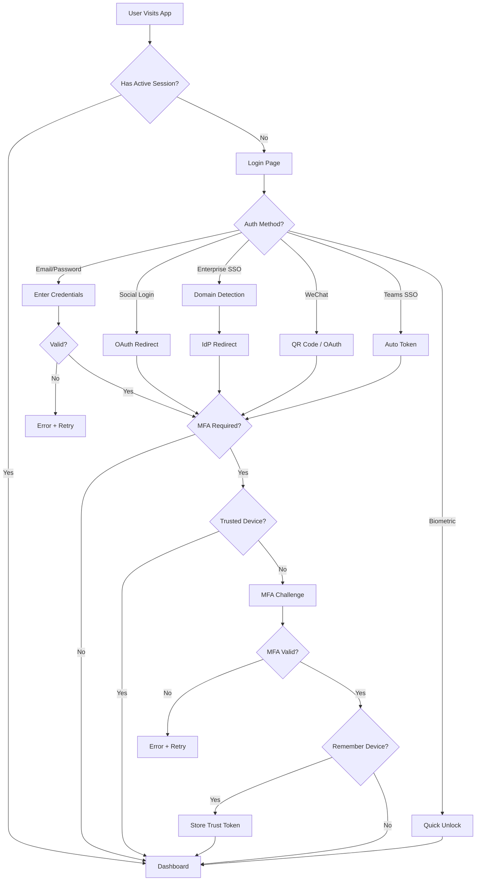
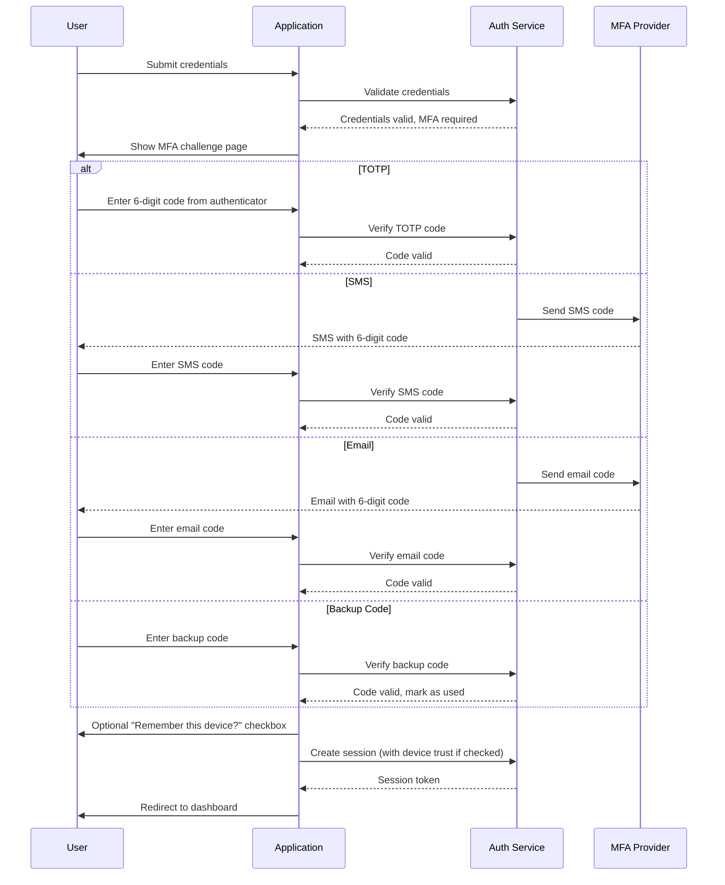
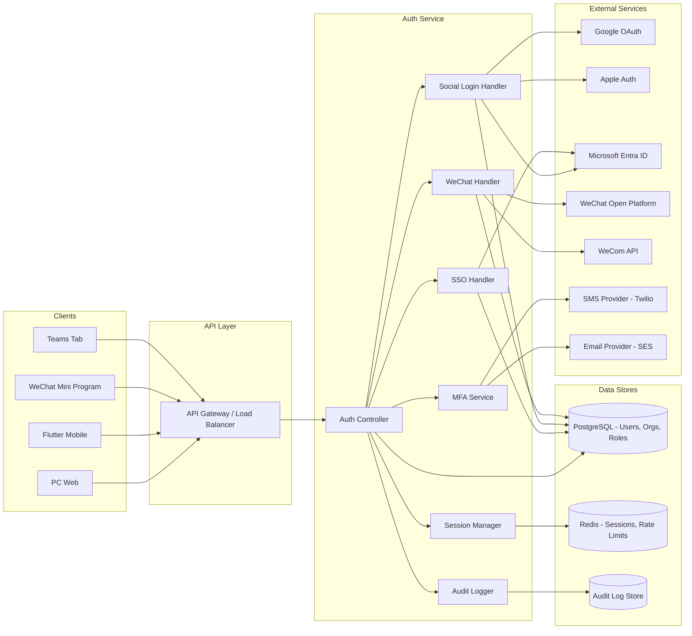
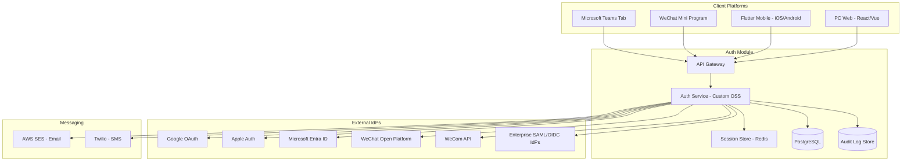
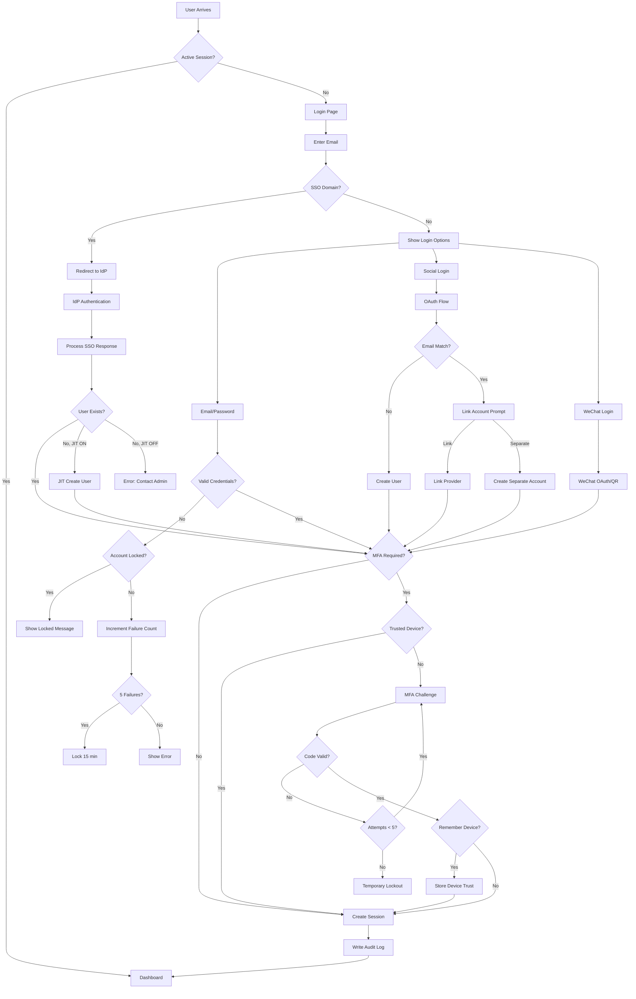

# Product Requirements Document (PRD)

## Document Information

| Field | Value |
|-------|-------|
| Document Title | User Login Module - Product Requirements Document |
| Version | 1.0 |
| Date | 2026-02-25 |
| Author | PRD Writer AI Agent |
| Status | Draft |
| Source BRD | `brd/user-login-jira-like/BRD-User-Login-Module-v1.0.md` (v1.0) |
| Confidentiality | Internal |

### Change Log

| Version | Date | Author | Changes |
|---------|------|--------|---------|
| 0.1 | 2026-02-25 | PRD Writer Agent | Initial draft |
| 1.0 | 2026-02-25 | PRD Writer Agent | Complete PRD after DoD self-check |

---

## 1. Executive Summary

This Product Requirements Document defines the detailed product specifications for a comprehensive user authentication and identity management module for a JIRA-like project management SaaS application. The module provides unified identity management across five platforms (PC Web, Flutter iOS/Android, WeChat Mini Program, Microsoft Teams) and supports multiple authentication methods including email/password, social login (Google, Apple, Microsoft, WeChat), enterprise SSO (SAML 2.0/OIDC), and WeChat/WeCom integration for the Chinese market.

The system is designed as a multi-tenant architecture serving both enterprise teams (up to 500 users per organization) and individual users. Key differentiators include per-organization MFA enforcement policies, domain-based SSO routing with SAML JIT provisioning, real-time security alerting, and a flexible RBAC system supporting both predefined and custom roles. The module will be custom-built using open-source libraries, with English and Simplified Chinese language support, targeting production deployment in Q2 2026 with SOC 2 Type II compliance by Q3 2026.

---

## 2. BRD Traceability

### 2.1 Source BRD Reference

| Field | Value |
|-------|-------|
| BRD Document | User Login Module for JIRA-Like Project Management Application (`brd/user-login-jira-like/BRD-User-Login-Module-v1.0.md`) |
| BRD Version | 1.0 |
| BRD Approval Date | 2026-02-25 |

### 2.2 BRD-to-PRD Requirements Mapping

| BRD Req ID | BRD Requirement Summary | PRD Req ID(s) | PRD Feature Module |
|------------|------------------------|---------------|-------------------|
| BR-01 | Email/password authentication with secure hashing | PRD-F001, PRD-F002, PRD-F003, PRD-F004, PRD-F005 | M-AUTH |
| BR-02 | Social login (Google, Apple, Microsoft, WeChat) | PRD-F006, PRD-F007, PRD-F008, PRD-F009, PRD-F010 | M-SOCIAL |
| BR-03 | Enterprise SSO via SAML 2.0 and OIDC | PRD-F011, PRD-F012, PRD-F013, PRD-F014 | M-SSO |
| BR-04 | Custom SAML/OIDC identity providers | PRD-F015 | M-SSO |
| BR-05 | WeChat authentication (Personal + Enterprise WeChat) | PRD-F016, PRD-F017, PRD-F018, PRD-F019, PRD-F020 | M-WECHAT |
| BR-06 | Microsoft Teams integration authentication | PRD-F021, PRD-F022 | M-PLATFORM |
| BR-07 | Enforce MFA for enterprise users | PRD-F023, PRD-F024, PRD-F025 | M-MFA |
| BR-08 | Allow MFA for individual users (optional) | PRD-F026, PRD-F027 | M-MFA |
| BR-09 | MFA via TOTP (authenticator apps) | PRD-F028 | M-MFA |
| BR-10 | MFA via SMS verification code | PRD-F029 | M-MFA |
| BR-11 | MFA via email verification code | PRD-F030 | M-MFA |
| BR-12 | Session management with configurable timeout | PRD-F031, PRD-F032, PRD-F033, PRD-F034, PRD-F035 | M-SESSION |
| BR-13 | Remember this device functionality | PRD-F036, PRD-F037 | M-SESSION |
| BR-14 | User self-registration (with email verification) | PRD-F038, PRD-F039 | M-USER |
| BR-15 | Admin user invitation via email | PRD-F040 | M-USER |
| BR-16 | Role-based access control (RBAC) | PRD-F041, PRD-F042, PRD-F043, PRD-F044 | M-RBAC |
| BR-17 | Multi-tenant organization structure | PRD-F045, PRD-F046, PRD-F047, PRD-F048 | M-RBAC |
| BR-18 | Audit logs of all authentication events | PRD-F049, PRD-F050, PRD-F051 | M-COMPLIANCE |
| BR-19 | Account lockout after failed login attempts | PRD-F052 | M-AUTH |
| BR-20 | Password complexity requirements | PRD-F053, PRD-F054 | M-AUTH |

**Scope Adjustment Note**: BR-14 originally required "admin approval" for self-registration. Per product owner decision, this has been changed to self-service registration with email verification (no admin approval gate). Admin approval may be offered as an optional enterprise-configurable feature in a future release.

---

## 3. Product Overview

### 3.1 Product Vision

Deliver a secure, scalable, and user-friendly authentication module that serves as the identity foundation for the JIRA-like project management platform — enabling seamless access across all platforms while meeting enterprise security and compliance requirements.

### 3.2 Product Goals & Objectives

| ID | Goal | Measurable Outcome | BRD Alignment |
|----|------|--------------------|---------------|
| G-01 | Deploy production-ready authentication across all platforms | All 5 platforms operational with < 200ms p95 login latency | BO-01, BO-03 |
| G-02 | Achieve enterprise-grade security compliance | SOC 2 Type II audit passed | BO-02 |
| G-03 | Zero authentication security incidents | 0 auth-related security breaches in 12 months | BO-04 |
| G-04 | Deliver excellent login user experience | > 95% user satisfaction score in login experience survey | BO-05 |
| G-05 | Enable enterprise customer onboarding via SSO | 10+ enterprises onboarded with SSO within 6 months of launch | BO-06 |
| G-06 | Support Chinese market access via WeChat ecosystem | WeChat/WeCom login operational for Chinese users | BO-01 |

### 3.3 Success Metrics (KPIs)

| Metric | Target | Measurement Method | Frequency |
|--------|--------|-------------------|-----------|
| Login success rate | > 99% | Successful logins / Total login attempts | Daily |
| Login API response time (p95) | < 200ms | APM monitoring (API latency) | Real-time |
| Token validation latency (p95) | < 50ms | APM monitoring | Real-time |
| MFA adoption rate (enterprise orgs) | > 80% | Users with MFA enabled / Total enterprise users | Monthly |
| SSO adoption rate | > 60% | SSO logins / Total enterprise logins | Monthly |
| Account lockout rate | < 1% | Locked accounts / Total accounts | Monthly |
| Login-related support tickets | < 5% of users | Support ticket count tagged with "auth" | Monthly |
| Audit log completeness | 100% | Events logged / Events expected | Real-time |
| Security incidents (auth-related) | 0 | Incident reports | Continuous |
| User satisfaction (login experience) | > 95% | User survey score | Quarterly |

---

## 4. Scope

### 4.1 In Scope

- Email/password registration and authentication with secure password hashing (bcrypt/argon2)
- Social login integration: Google, Apple, Microsoft, WeChat
- Enterprise SSO: SAML 2.0, OIDC with Azure AD, Google Workspace, custom IdPs
- WeChat ecosystem: Personal WeChat QR (PC), WeChat OAuth (mobile), WeCom OAuth, WeCom workplace SSO, WeChat Mini Program
- Microsoft Teams tab SSO integration
- Multi-factor authentication: TOTP, SMS, email; per-org configurable enforcement
- Trusted device management with configurable duration (default 7 days)
- Session management: configurable timeout, max 5 concurrent sessions, force logout
- User self-registration with email verification (no admin approval gate)
- Admin user invitation via email
- RBAC: 4 predefined roles + custom roles
- Multi-tenant organization with multi-org membership and org switcher
- SAML JIT provisioning, domain-based SSO routing, SCIM support
- Audit logging of all authentication events with real-time security alerts
- Account lockout (5 failures, 15 min auto-unlock)
- Password policy: complexity requirements, configurable expiration per org, history enforcement
- GDPR data handling: soft-delete with 30-day grace, data export
- Platform adapters: PC Web (responsive), Flutter iOS/Android (with biometric), WeChat Mini Program, Teams
- Mobile biometric: quick unlock + MFA factor
- i18n: English + Simplified Chinese, extensible framework
- Custom-built auth service using open-source libraries

### 4.2 Out of Scope

- Hardware token authentication (YubiKey, FIDO2/WebAuthn)
- Biometric authentication on web browsers
- Desktop native applications (Electron)
- Smart TV apps
- Passwordless authentication (magic links, passkeys)
- Live chat support integration
- Legacy system integrations
- Custom enterprise directory sync beyond SCIM
- Admin approval workflow for registration (deferred to future release)

### 4.3 Future Considerations

- Passwordless authentication (FIDO2/WebAuthn, magic links, passkeys)
- Admin approval workflow as optional enterprise feature for registration
- Additional language support (Japanese, Korean, etc.)
- Hardware token MFA (YubiKey)
- AI-based anomaly detection for login security
- Conditional access policies based on device, location, and risk level
- Social login expansion (GitHub, LinkedIn, Twitter/X)

---

## 5. User Personas

### Persona 1: Emma - Enterprise Admin

| Attribute | Detail |
|-----------|--------|
| Role | Organization Admin / Super Admin |
| Demographics | 30-45, high tech proficiency, IT or engineering background |
| Goals | Configure SSO for the organization, enforce MFA policies, manage user accounts, monitor security through audit logs |
| Pain Points | Complex IdP configuration processes, lack of visibility into authentication events, users locked out and needing manual intervention |
| Behaviors | Manages 50-500 users, configures security policies monthly, reviews audit logs weekly |
| Scenarios | Setting up Azure AD SSO for the company, enforcing MFA for all employees, investigating suspicious login activity, inviting new team members |

### Persona 2: David - Enterprise Team Member

| Attribute | Detail |
|-----------|--------|
| Role | User (team member within enterprise organization) |
| Demographics | 25-40, moderate tech proficiency, knowledge worker |
| Goals | Quick and seamless login to access project boards, minimal friction from security measures, work across devices (PC, mobile, Teams) |
| Pain Points | Too many login steps, forgetting passwords, MFA friction when switching devices |
| Behaviors | Logs in 3-5 times daily across 2-3 devices, uses SSO when available, prefers biometric on mobile |
| Scenarios | Logging in via Azure AD SSO on PC, using biometric unlock on iPhone, accessing PM board from Teams tab, working from a new device and completing MFA |

### Persona 3: Lisa - Individual User

| Attribute | Detail |
|-----------|--------|
| Role | Self-registered individual user (freelancer, small team) |
| Demographics | 22-35, moderate tech proficiency, independent worker |
| Goals | Quick registration and login, use familiar social accounts, optional security features |
| Pain Points | Long registration forms, remembering yet another password, forced security features she doesn't need |
| Behaviors | Prefers social login (Google), rarely changes passwords, single-device usage |
| Scenarios | Registering with Google account, logging in daily on laptop, optionally enabling TOTP MFA, switching from personal to team organization |

### Persona 4: Wei - Chinese Market User

| Attribute | Detail |
|-----------|--------|
| Role | User accessing primarily through WeChat ecosystem |
| Demographics | 25-40, high mobile proficiency, uses WeChat as primary communication tool |
| Goals | Login with WeChat without creating separate credentials, seamless experience within WeChat ecosystem |
| Pain Points | Creating separate accounts for every service, services not supporting WeChat login, poor WeChat Mini Program experience |
| Behaviors | Scans QR codes for PC login, uses WeChat in-app browser on mobile, uses WeCom for enterprise access |
| Scenarios | Scanning WeChat QR code on PC to log in, opening PM tool from WeCom workplace, accessing Mini Program within WeChat |

### Persona 5: Tom - Microsoft Teams User

| Attribute | Detail |
|-----------|--------|
| Role | Enterprise user accessing through Microsoft Teams |
| Demographics | 30-50, moderate tech proficiency, heavily uses Microsoft 365 suite |
| Goals | Single-click access to PM tool from Teams tab, no separate credentials needed |
| Pain Points | Being asked to log in again when already signed in to Teams, popup authentication dialogs |
| Behaviors | Lives in Teams all day, accesses tools from Teams tabs, uses Microsoft 365 account for everything |
| Scenarios | Clicking on PM tool tab in Teams and being instantly authenticated, accessing project board without leaving Teams |

---

## 6. Feature Modules

### 6.1 Feature Module Overview

```mermaid
graph TD
    A[User Login Module] --> B[M-AUTH: Core Authentication]
    A --> C[M-SOCIAL: Social Login]
    A --> D[M-SSO: Enterprise SSO]
    A --> E[M-WECHAT: WeChat & WeCom]
    A --> F[M-MFA: Multi-Factor Auth]
    A --> G[M-SESSION: Session Management]
    A --> H[M-USER: User Management]
    A --> I[M-RBAC: Role & Org Management]
    A --> J[M-PLATFORM: Platform Adapters]
    A --> K[M-COMPLIANCE: Security & Compliance]

    B --> B1[Registration]
    B --> B2[Login]
    B --> B3[Password Management]
    B --> B4[Account Lockout]

    C --> C1[Google OAuth]
    C --> C2[Apple Sign-In]
    C --> C3[Microsoft OAuth]
    C --> C4[Account Linking]

    D --> D1[SAML 2.0 SSO]
    D --> D2[OIDC SSO]
    D --> D3[Domain Routing]
    D --> D4[JIT Provisioning]
    D --> D5[SCIM]

    E --> E1[WeChat QR - PC]
    E --> E2[WeChat OAuth - Mobile]
    E --> E3[WeCom OAuth]
    E --> E4[WeCom Workplace SSO]
    E --> E5[Mini Program]

    F --> F1[TOTP Setup]
    F --> F2[SMS Verification]
    F --> F3[Email Verification]
    F --> F4[MFA Challenge]
    F --> F5[Backup Codes]
    F --> F6[Per-Org Policy]

    G --> G1[Session Create/Validate]
    G --> G2[Session Timeout]
    G --> G3[Concurrent Sessions]
    G --> G4[Device Trust]
    G --> G5[Force Logout]

    H --> H1[Self-Registration]
    H --> H2[Email Verification]
    H --> H3[Admin Invitation]
    H --> H4[Profile Management]
    H --> H5[Account Deletion]

    I --> I1[Predefined Roles]
    I --> I2[Custom Roles]
    I --> I3[Org Creation]
    I --> I4[Multi-Org Membership]
    I --> I5[Org Switcher]

    J --> J1[PC Web]
    J --> J2[Flutter iOS]
    J --> J3[Flutter Android]
    J --> J4[WeChat Mini Program]
    J --> J5[Teams Tab]

    K --> K1[Audit Logging]
    K --> K2[Security Alerts]
    K --> K3[Admin Dashboard]
    K --> K4[GDPR Compliance]
```

### 6.2 Module: M-AUTH (Core Authentication)

#### 6.2.1 Description

Provides fundamental email/password-based authentication including user registration, login, password management, and account security mechanisms. This is the foundational authentication layer that all other modules build upon.

#### 6.2.2 User Stories

**US-001: User Self-Registration**

> As a new user (Lisa), I want to register with my email and password, so that I can create an account and start using the platform.

**Acceptance Criteria:**
- Given a user visits the registration page, When they enter a valid email, password meeting complexity requirements, and display name, Then the system creates an account in "unverified" status and sends a verification email
- Given a user submits a registration form with an email that already exists, When the form is submitted, Then the system displays "An account with this email already exists" without revealing whether the account is active
- Given a user has registered but not verified email, When they log in, Then they can access a limited set of features with a banner prompting email verification

**Priority:** Must Have
**BRD Trace:** BR-01, BR-14

---

**US-002: Email Verification**

> As a registered user (Lisa), I want to verify my email address, so that I can unlock full platform access.

**Acceptance Criteria:**
- Given a user has registered, When they click the verification link in the email within 24 hours, Then their account status changes to "active" with full access
- Given a verification link has expired (> 24 hours), When the user clicks it, Then the system shows "Link expired" with an option to resend
- Given a user requests a new verification email, When they click "Resend", Then a new verification email is sent with a rate limit of max 3 per hour

**Priority:** Must Have
**BRD Trace:** BR-01

---

**US-003: User Login with Email/Password**

> As a registered user (David), I want to log in with my email and password, so that I can access my projects.

**Acceptance Criteria:**
- Given a user enters valid credentials, When they submit the login form, Then the system creates a session, returns a token, and redirects to the dashboard
- Given a user enters an invalid password, When they submit the login form, Then the system displays "Invalid email or password" (generic message) and increments the failed attempt counter
- Given a user enters credentials for a locked account, When they submit, Then the system displays "Account temporarily locked. Try again in X minutes."

**Priority:** Must Have
**BRD Trace:** BR-01

---

**US-004: Password Reset**

> As a user (Lisa) who forgot my password, I want to reset it via email, so that I can regain access to my account.

**Acceptance Criteria:**
- Given a user clicks "Forgot Password" and enters their email, When the form is submitted, Then the system sends a reset link (valid for 1 hour) regardless of whether the email exists (prevent enumeration)
- Given a user clicks a valid reset link, When they enter a new password meeting complexity requirements, Then the password is updated, all existing sessions are invalidated, and the user is redirected to login
- Given a user clicks an expired reset link, When they access the page, Then the system shows "Link expired" with option to request a new one

**Priority:** Must Have
**BRD Trace:** BR-01

---

**US-005: Password Change**

> As a logged-in user (David), I want to change my password, so that I can maintain my account security.

**Acceptance Criteria:**
- Given a logged-in user navigates to password change, When they enter their current password and a new password meeting complexity requirements, Then the password is updated and the user remains logged in on the current session
- Given a user enters a new password that matches one of the last 10 passwords, When they submit, Then the system rejects with "Cannot reuse a recent password"
- Given a user enters an incorrect current password, When they submit, Then the system rejects with "Current password is incorrect"

**Priority:** Must Have
**BRD Trace:** BR-01, BR-20

---

**US-052: Account Lockout**

> As the system, I want to lock accounts after repeated failed login attempts, so that brute force attacks are prevented.

**Acceptance Criteria:**
- Given a user has 5 consecutive failed login attempts, When the 5th failure occurs, Then the account is locked for 15 minutes and the user is notified
- Given a locked account, When 15 minutes have passed, Then the account automatically unlocks and the failed attempt counter resets
- Given a user successfully logs in, When the login succeeds, Then the failed attempt counter resets to 0

**Priority:** Must Have
**BRD Trace:** BR-19

---

**US-053: Password Complexity Enforcement**

> As the system, I want to enforce password complexity rules, so that users create strong passwords.

**Acceptance Criteria:**
- Given a user creates or changes a password, When the password has fewer than 8 characters, lacks uppercase, lowercase, number, or special character, Then the system rejects it with specific feedback on which rules are not met
- Given an organization admin configures password expiration, When the policy is set (e.g., 90 days), Then users in that organization are prompted to change their password when it expires
- Given no password expiration is configured, When a user's password ages, Then no forced rotation occurs

**Priority:** Must Have
**BRD Trace:** BR-20

---

**US-054: Password History Enforcement**

> As the system, I want to prevent password reuse, so that compromised passwords are not recycled.

**Acceptance Criteria:**
- Given a user changes their password, When the new password matches any of the last 10 passwords, Then the system rejects it with "Cannot reuse a recent password"
- Given a user changes their password, When the new password is unique in history, Then the system accepts it and adds the old password hash to the history

**Priority:** Should Have
**BRD Trace:** BR-20

#### 6.2.3 Business Rules

| Rule ID | Rule | Condition | Action |
|---------|------|-----------|--------|
| BR-AUTH-01 | Password complexity minimum | User creates/changes password | Enforce: min 8 chars, 1 uppercase, 1 lowercase, 1 number, 1 special char |
| BR-AUTH-02 | Account lockout threshold | 5 consecutive failed login attempts | Lock account for 15 minutes; auto-unlock after |
| BR-AUTH-03 | Verification email validity | User clicks verification link | Valid for 24 hours; max 3 resend requests per hour |
| BR-AUTH-04 | Password reset link validity | User clicks reset link | Valid for 1 hour; single-use |
| BR-AUTH-05 | Password history depth | User changes password | Check against last 10 password hashes |
| BR-AUTH-06 | Password expiration | Org admin configures policy | Prompt password change when expired; configurable per org |
| BR-AUTH-07 | Login error messages | Invalid credentials | Always show generic "Invalid email or password" to prevent enumeration |

---

### 6.3 Module: M-SOCIAL (Social Login)

#### 6.3.1 Description

Enables authentication via third-party social identity providers (Google, Apple, Microsoft) using OAuth 2.0 / OpenID Connect protocols, with intelligent account linking when social email matches existing accounts.

#### 6.3.2 User Stories

**US-006: Google OAuth Login**

> As a user (Lisa), I want to log in with my Google account, so that I don't need to remember a separate password.

**Acceptance Criteria:**
- Given a user clicks "Sign in with Google", When they authorize access on Google's consent screen, Then the system receives the OAuth callback, creates or finds the user account, creates a session, and redirects to dashboard
- Given a new Google user's email does not exist in the system, When OAuth callback is processed, Then a new account is created with the Google profile information (name, email, avatar)
- Given a Google user's email already exists (registered via email/password), When OAuth callback is processed, Then the system shows a prompt: "An account with this email already exists. Would you like to link your Google account?"

**Priority:** Must Have
**BRD Trace:** BR-02

---

**US-007: Apple Sign-In**

> As an iOS user (Lisa), I want to log in with my Apple ID, so that I can use the platform without creating a new account.

**Acceptance Criteria:**
- Given a user clicks "Sign in with Apple", When they authorize access, Then the system processes the Apple ID token, creates or finds the user account, and creates a session
- Given a user chooses Apple's "Hide My Email" feature, When the private relay email is received, Then the system stores the proxy email and functions normally
- Given a user's Apple ID email matches an existing account, When the callback is processed, Then the account linking confirmation prompt is shown

**Priority:** Must Have
**BRD Trace:** BR-02

---

**US-008: Microsoft OAuth Login**

> As a user (David), I want to log in with my Microsoft account, so that I can use my work credentials.

**Acceptance Criteria:**
- Given a user clicks "Sign in with Microsoft", When they authorize access, Then the system processes the Microsoft OAuth callback, creates or finds the user, and creates a session
- Given a user's Microsoft email matches an existing account, When the callback is processed, Then the account linking confirmation prompt is shown

**Priority:** Must Have
**BRD Trace:** BR-02

---

**US-009: WeChat Social Login (via M-SOCIAL)**

> As a Chinese user (Wei), I want to log in with my WeChat account, so that I don't need to create a separate account.

**Acceptance Criteria:**
- Given a user clicks "Sign in with WeChat" on PC, When they scan the QR code with WeChat mobile app, Then the system receives the OAuth callback and creates or finds the user account
- Given a user accesses the platform on mobile within WeChat browser, When they tap "Sign in with WeChat", Then the system initiates WeChat OAuth redirect and processes the callback

**Priority:** Must Have
**BRD Trace:** BR-02, BR-05

---

**US-010: Account Linking Confirmation**

> As a user with an existing account, I want to be asked before my social login is linked, so that I maintain control over my account connections.

**Acceptance Criteria:**
- Given a social login email matches an existing account, When the user confirms linking, Then the social provider is linked and the user is logged in
- Given a social login email matches an existing account, When the user declines linking, Then a new separate account is created with the social provider
- Given a user has linked a social provider, When they view their profile settings, Then they can see linked providers and unlink them

**Priority:** Must Have
**BRD Trace:** BR-02

#### 6.3.3 Business Rules

| Rule ID | Rule | Condition | Action |
|---------|------|-----------|--------|
| BR-SOC-01 | Account linking trigger | Social login email matches existing account email | Show user confirmation prompt before linking |
| BR-SOC-02 | Apple proxy email handling | Apple "Hide My Email" enabled | Accept and store proxy email as primary identifier |
| BR-SOC-03 | Social account creation | New social user with no existing email match | Auto-create account with social profile data; mark as verified |
| BR-SOC-04 | Provider unlinking | User requests to unlink social provider | Allow only if user has a password set or another linked provider |

---

### 6.4 Module: M-SSO (Enterprise SSO)

#### 6.4.1 Description

Provides enterprise Single Sign-On capabilities via SAML 2.0 and OpenID Connect protocols, supporting Azure AD, Google Workspace, and custom identity providers. Includes domain-based SSO routing, SAML JIT provisioning, and SCIM for automated user lifecycle management.

#### 6.4.2 User Stories

**US-011: SAML 2.0 SSO Login (SP-Initiated)**

> As an enterprise user (David), I want to log in via my company's SAML SSO, so that I use my enterprise credentials without a separate password.

**Acceptance Criteria:**
- Given a user navigates to the login page and enters an email with a domain configured for SSO, When they proceed, Then the system redirects to the enterprise IdP's login page
- Given the user authenticates at the IdP, When the IdP sends the SAML Response back, Then the system validates the assertion (signature, conditions, audience), creates a session, and redirects to dashboard
- Given the SAML assertion is invalid or expired, When it is received, Then the system shows "Authentication failed. Please try again or contact your IT administrator."

**Priority:** Must Have
**BRD Trace:** BR-03

---

**US-012: SAML 2.0 SSO (IdP-Initiated)**

> As an enterprise user (David), I want to access the PM tool directly from my IdP portal, so that I don't need to visit the login page first.

**Acceptance Criteria:**
- Given a user clicks the app tile in their IdP portal (Azure AD, Okta, etc.), When the IdP sends an unsolicited SAML Response, Then the system validates the assertion and creates a session
- Given the IdP-initiated assertion passes validation, When the session is created, Then the user is redirected to the dashboard

**Priority:** Must Have
**BRD Trace:** BR-03

---

**US-013: OIDC SSO Login**

> As an enterprise user (David), I want to log in via OIDC-based SSO, so that I can use my Google Workspace or other OIDC-compatible IdP credentials.

**Acceptance Criteria:**
- Given a user's email domain is configured for OIDC SSO, When they enter their email on the login page, Then the system redirects to the OIDC provider's authorization endpoint
- Given the user authorizes at the OIDC provider, When the authorization code callback is received, Then the system exchanges the code for tokens, validates the ID token, creates or finds the user, and creates a session

**Priority:** Must Have
**BRD Trace:** BR-03

---

**US-014: Domain-Based SSO Routing**

> As an enterprise admin (Emma), I want users with our company email domain to be automatically routed to our IdP, so that they always use SSO.

**Acceptance Criteria:**
- Given an admin has configured SSO for domain "@company.com", When any user enters an @company.com email on the login page, Then the login form hides the password field and shows "Continue with SSO" button
- Given a domain is configured for SSO, When a user with that domain tries to use email/password login, Then the system redirects them to SSO with a message "Your organization requires SSO login"

**Priority:** Must Have
**BRD Trace:** BR-03

---

**US-015: Custom IdP Configuration**

> As an enterprise admin (Emma), I want to configure our organization's custom IdP (SAML or OIDC), so that our employees can use our corporate SSO.

**Acceptance Criteria:**
- Given an org admin navigates to SSO settings, When they upload SAML metadata XML or enter OIDC discovery URL, Then the system parses the configuration and validates connectivity
- Given the IdP configuration is saved, When the admin tests the SSO connection, Then the system performs a test authentication and reports success or detailed error
- Given an IdP is configured, When the admin enables domain routing, Then all users with matching email domains are routed to this IdP

**Priority:** Should Have
**BRD Trace:** BR-04

---

**US-SSO-JIT: SAML JIT Provisioning**

> As an enterprise admin (Emma), I want user accounts to be automatically created when employees first log in via SSO, so that I don't have to manually pre-create every user.

**Acceptance Criteria:**
- Given SAML JIT provisioning is enabled for an organization, When a new user authenticates via SAML for the first time, Then the system auto-creates the user account with attributes from the SAML assertion (email, name)
- Given a JIT-provisioned user, When their account is created, Then they are assigned the default "User" role in the organization

**Priority:** Must Have
**BRD Trace:** BR-03

---

**US-SSO-SCIM: SCIM User Provisioning**

> As an enterprise admin (Emma), I want users to be automatically provisioned and deprovisioned from our enterprise directory, so that account lifecycle is managed centrally.

**Acceptance Criteria:**
- Given SCIM is configured for an organization, When a user is created in the enterprise directory, Then the user is automatically provisioned in the system
- Given a user is deactivated in the enterprise directory, When SCIM sync runs, Then the user's account is deactivated and all sessions are terminated
- Given a user's attributes change in the directory, When SCIM sync runs, Then the user's profile is updated

**Priority:** Should Have
**BRD Trace:** BR-03

#### 6.4.3 Business Rules

| Rule ID | Rule | Condition | Action |
|---------|------|-----------|--------|
| BR-SSO-01 | Domain routing enforcement | User email domain matches SSO-configured domain | Redirect to IdP; block password login |
| BR-SSO-02 | JIT user default role | New user created via SAML JIT | Assign "User" role in the organization |
| BR-SSO-03 | SAML assertion validation | SAML Response received | Validate signature, audience, conditions, timestamps |
| BR-SSO-04 | SCIM deprovisioning | User deactivated in enterprise directory | Deactivate account and terminate all sessions |
| BR-SSO-05 | SSO session MFA | User logs in via SSO and org requires MFA | Challenge MFA after SSO authentication if not satisfied |

---

### 6.5 Module: M-WECHAT (WeChat & WeCom Integration)

#### 6.5.1 Description

Provides authentication integration with the WeChat ecosystem for the Chinese market, including WeChat QR code login (PC), WeChat OAuth (mobile), Enterprise WeChat (WeCom) authentication, WeCom workplace SSO, and WeChat Mini Program login.

#### 6.5.2 User Stories

**US-016: WeChat QR Code Login (PC)**

> As a Chinese user (Wei) on PC, I want to log in by scanning a WeChat QR code, so that I can use my WeChat identity without a password.

**Acceptance Criteria:**
- Given a user clicks "WeChat Login" on PC web, When the login page loads, Then a unique QR code is displayed with a 5-minute expiration timer
- Given the user scans the QR code with WeChat, When they confirm authorization in WeChat, Then the PC page auto-detects the confirmation (via polling or WebSocket) and completes login
- Given the QR code expires, When the timer reaches 0, Then the system shows "QR code expired" with a "Refresh" button

**Priority:** Must Have
**BRD Trace:** BR-05

---

**US-017: WeChat OAuth Login (Mobile)**

> As a Chinese user (Wei) on mobile within WeChat, I want to log in via WeChat OAuth, so that I can seamlessly access the platform from WeChat.

**Acceptance Criteria:**
- Given a user accesses the platform from WeChat's in-app browser, When WeChat is detected, Then the system automatically initiates WeChat OAuth authorization
- Given a user accesses the platform from the Flutter app, When WeChat is installed on the device, Then the system shows "Sign in with WeChat" option that launches WeChat for authorization
- Given WeChat is not installed on the device, When the Flutter app loads, Then the "Sign in with WeChat" option is hidden

**Priority:** Must Have
**BRD Trace:** BR-05

---

**US-018: WeCom (Enterprise WeChat) Login**

> As an enterprise user (Wei) using WeCom, I want to log in via my WeCom identity, so that I use my enterprise credentials.

**Acceptance Criteria:**
- Given a user clicks "Sign in with WeCom" on the login page, When they scan the WeCom QR code or authorize in WeCom app, Then the system authenticates via WeCom OAuth using CorpID and creates a session
- Given the user's WeCom identity matches an existing account, When authentication succeeds, Then the accounts are linked

**Priority:** Must Have
**BRD Trace:** BR-05

---

**US-019: WeCom Workplace SSO**

> As an enterprise user (Wei), I want to click the PM tool in WeCom workplace and be automatically logged in, so that I have a seamless experience.

**Acceptance Criteria:**
- Given the PM tool is configured as a WeCom workplace app, When a user clicks the app icon in WeCom workplace, Then the system automatically authenticates via WeCom OAuth without showing a login page
- Given the WeCom-authenticated user doesn't have an account, When workplace SSO is triggered, Then the system auto-creates the user account (similar to JIT provisioning)

**Priority:** Must Have
**BRD Trace:** BR-05

---

**US-020: WeChat Mini Program Login**

> As a Chinese user (Wei), I want to access the PM tool via WeChat Mini Program, so that I can use it directly within WeChat without installing a separate app.

**Acceptance Criteria:**
- Given a user opens the WeChat Mini Program, When the Mini Program loads, Then the system requests WeChat OAuth authorization
- Given the user authorizes, When the OAuth callback is received, Then the system creates a session and displays the main interface
- Given the user has previously authorized, When they re-open the Mini Program, Then the system auto-logs in using the stored session

**Priority:** Must Have
**BRD Trace:** BR-05

#### 6.5.3 Business Rules

| Rule ID | Rule | Condition | Action |
|---------|------|-----------|--------|
| BR-WC-01 | QR code expiration | WeChat QR code displayed | Expire after 5 minutes; show refresh option |
| BR-WC-02 | WeChat app detection | Mobile login page loaded | Check if WeChat is installed; show/hide WeChat login accordingly |
| BR-WC-03 | WeCom workplace auto-create | User accesses via WeCom workplace without existing account | Auto-create account with WeCom profile data |
| BR-WC-04 | WeChat OAuth endpoint routing | Login platform detected | Use Web endpoint for PC QR; use Mobile endpoint for in-app/Flutter |
| BR-WC-05 | WeCom domain validation | WeCom integration configured | Verify domain registration entity matches WeCom entity |

---

### 6.6 Module: M-MFA (Multi-Factor Authentication)

#### 6.6.1 Description

Provides multi-factor authentication capabilities with TOTP, SMS, and email verification codes. MFA enforcement is configurable per organization. Includes trusted device management, backup codes, and biometric integration for mobile platforms.

#### 6.6.2 User Stories

**US-023: MFA Enforcement Policy Configuration**

> As an enterprise admin (Emma), I want to configure MFA enforcement for my organization, so that I can meet our security requirements.

**Acceptance Criteria:**
- Given an org admin navigates to security settings, When they toggle "Require MFA for all users", Then all users in the organization must complete MFA setup on their next login
- Given MFA is enforced for an organization, When a user without MFA configured logs in, Then the system redirects them to MFA setup flow before allowing dashboard access
- Given an org admin configures MFA policy, When they select allowed MFA methods (TOTP, SMS, Email), Then only those methods are available to users in the organization

**Priority:** Must Have
**BRD Trace:** BR-07

---

**US-028: TOTP MFA Setup**

> As a user (David), I want to set up TOTP-based MFA using an authenticator app, so that I have a secure second factor.

**Acceptance Criteria:**
- Given a user initiates MFA setup and selects TOTP, When the setup page loads, Then the system displays a QR code encoding the TOTP secret and the secret key as text
- Given a user scans the QR code with their authenticator app, When they enter the generated 6-digit code, Then the system verifies the code and activates TOTP MFA
- Given TOTP is activated, When the system generates backup codes, Then 10 one-time backup codes are displayed with instructions to save them securely

**Priority:** Must Have
**BRD Trace:** BR-09

---

**US-029: SMS MFA Setup**

> As a user (David), I want to set up SMS-based MFA, so that I receive verification codes via text message.

**Acceptance Criteria:**
- Given a user selects SMS MFA, When they enter their phone number, Then the system sends a verification code via SMS
- Given the user enters the correct SMS code, When they submit, Then SMS MFA is activated for their account
- Given SMS MFA is active, When a login triggers MFA challenge, Then a new code is sent to the registered phone number

**Priority:** Should Have
**BRD Trace:** BR-10

---

**US-030: Email MFA Setup**

> As a user (Lisa), I want to set up email-based MFA, so that I receive verification codes via email.

**Acceptance Criteria:**
- Given a user selects email MFA, When setup is initiated, Then the system sends a verification code to the user's registered email
- Given the user enters the correct email code, When they submit, Then email MFA is activated
- Given email MFA is active, When a login triggers MFA challenge, Then a new code is sent to the registered email

**Priority:** Should Have
**BRD Trace:** BR-11

---

**US-024: MFA Challenge on Login**

> As a user with MFA enabled (David), I want to be prompted for my second factor after entering my password, so that my account is protected with an additional layer.

**Acceptance Criteria:**
- Given a user with MFA enabled enters correct credentials, When password verification succeeds, Then the system presents the MFA challenge page with the user's configured MFA method
- Given a user enters a valid TOTP/SMS/email code, When they submit, Then the system completes authentication and creates a session
- Given a user enters an invalid MFA code, When they submit, Then the system shows "Invalid code. Please try again." with a maximum of 5 attempts before temporary lockout
- Given a user cannot access their MFA device, When they click "Use backup code", Then the system allows authentication with a one-time backup code

**Priority:** Must Have
**BRD Trace:** BR-07, BR-08

---

**US-025: MFA Backup Codes**

> As a user (David), I want to generate backup codes, so that I can access my account if I lose my MFA device.

**Acceptance Criteria:**
- Given a user enables MFA, When MFA is activated, Then the system generates 10 one-time backup codes and displays them once
- Given a user uses a backup code, When the code is consumed, Then it is marked as used and cannot be reused
- Given a user wants new backup codes, When they click "Regenerate backup codes" in settings, Then all old codes are invalidated and 10 new codes are generated

**Priority:** Should Have
**BRD Trace:** BR-08

---

**US-026: MFA for Individual Users (Optional)**

> As an individual user (Lisa), I want to optionally enable MFA, so that I can add extra security if I choose.

**Acceptance Criteria:**
- Given an individual user (not in an MFA-enforced org) navigates to security settings, When they see MFA options, Then they can choose to enable TOTP, SMS, or email MFA
- Given MFA is optional and the user has not enabled it, When they log in, Then no MFA challenge is presented

**Priority:** Should Have
**BRD Trace:** BR-08

#### 6.6.3 Business Rules

| Rule ID | Rule | Condition | Action |
|---------|------|-----------|--------|
| BR-MFA-01 | Enterprise MFA enforcement | Org admin enables MFA enforcement | All users must complete MFA setup on next login |
| BR-MFA-02 | MFA code validity | TOTP/SMS/Email code entered | TOTP: 30-second window (1 step tolerance); SMS/Email: 5-minute validity |
| BR-MFA-03 | MFA attempt limit | User enters invalid MFA code | Max 5 attempts; then temporary 15-minute lockout |
| BR-MFA-04 | Backup code single-use | User enters backup code | Code is consumed and cannot be reused |
| BR-MFA-05 | Backup code regeneration | User regenerates codes | All previous codes invalidated; 10 new codes generated |
| BR-MFA-06 | MFA method restriction | Org admin configures allowed methods | Only allowed methods shown to users in that org |

---

### 6.7 Module: M-SESSION (Session Management)

#### 6.7.1 Description

Manages user sessions including creation, validation, timeout, concurrent session limits, trusted device management, and force logout capabilities.

#### 6.7.2 User Stories

**US-031: Session Creation**

> As the system, I want to create secure sessions on successful login, so that users remain authenticated across requests.

**Acceptance Criteria:**
- Given a user completes authentication (including MFA if required), When the session is created, Then the system generates a cryptographically random session token, stores it hashed in the session store (Redis), and returns it as an HttpOnly, Secure, SameSite cookie
- Given a session token is issued, When it is stored, Then the session record includes user_id, device_info, IP address, creation time, and expiration time

**Priority:** Must Have
**BRD Trace:** BR-12

---

**US-032: Session Validation**

> As the system, I want to validate session tokens on every API call, so that only authenticated users access protected resources.

**Acceptance Criteria:**
- Given an API request includes a session token, When the system validates it, Then it checks the token exists in the session store, is not expired, and the user is active
- Given a session token is invalid or expired, When validation fails, Then the system returns HTTP 401 Unauthorized

**Priority:** Must Have
**BRD Trace:** BR-12

---

**US-033: Logout**

> As a user (David), I want to log out, so that my session is terminated securely.

**Acceptance Criteria:**
- Given a logged-in user clicks "Logout", When the request is processed, Then the session token is invalidated in the session store, and the client cookie is cleared
- Given a user logs out, When the logout completes, Then they are redirected to the login page

**Priority:** Must Have
**BRD Trace:** BR-12

---

**US-034: Session Timeout**

> As an enterprise admin (Emma), I want to configure session timeout, so that idle sessions are automatically terminated.

**Acceptance Criteria:**
- Given an org admin configures session timeout (default 8 hours), When a user's session is idle beyond the timeout, Then the session is invalidated and the user must re-authenticate
- Given a user is active within the timeout period, When they make API calls, Then the session idle timer resets

**Priority:** Must Have
**BRD Trace:** BR-12

---

**US-035: Concurrent Session Management**

> As the system, I want to limit concurrent sessions per user, so that session sprawl is controlled.

**Acceptance Criteria:**
- Given a user has 5 active sessions (default maximum), When they log in on a 6th device, Then the oldest session is automatically terminated and the new session is created
- Given an org admin, When they configure the max concurrent sessions (1-10), Then the configured limit applies to all users in the organization

**Priority:** Should Have
**BRD Trace:** BR-12

---

**US-036: Trusted Device (Remember This Device)**

> As a user (David), I want to mark my device as trusted, so that I skip MFA on subsequent logins from this device.

**Acceptance Criteria:**
- Given MFA is enabled and the user completes MFA challenge, When they check "Remember this device", Then the system stores a trusted device token (default 7 days validity)
- Given a user logs in from a trusted device within the trust period, When MFA would normally be triggered, Then MFA is skipped
- Given the trust period expires, When the user logs in, Then MFA is required again

**Priority:** Should Have
**BRD Trace:** BR-13

---

**US-037: Device Management**

> As a user (David), I want to view and manage my trusted devices, so that I can revoke access from devices I no longer use.

**Acceptance Criteria:**
- Given a user navigates to device management in settings, When the page loads, Then they see a list of trusted devices with device name, last used date, and IP address
- Given a user clicks "Revoke" on a device, When confirmed, Then the device trust is removed and MFA will be required on next login from that device

**Priority:** Should Have
**BRD Trace:** BR-13

---

**US-FORCE-LOGOUT: Force Logout All Sessions**

> As a user (David) or admin (Emma), I want to force logout all sessions, so that I can respond to a security concern.

**Acceptance Criteria:**
- Given a user clicks "Sign out all devices" in security settings, When confirmed, Then all active sessions except the current one are terminated
- Given an admin suspects a security breach for a user, When they trigger force logout for that user, Then all of the user's sessions are terminated

**Priority:** Must Have
**BRD Trace:** BR-12

#### 6.7.3 Business Rules

| Rule ID | Rule | Condition | Action |
|---------|------|-----------|--------|
| BR-SES-01 | Default session timeout | No org-specific config | 8-hour idle timeout |
| BR-SES-02 | Max concurrent sessions | User exceeds limit | Terminate oldest session |
| BR-SES-03 | Default concurrent limit | No org-specific config | Max 5 concurrent sessions |
| BR-SES-04 | Default device trust duration | No org-specific config | 7 days |
| BR-SES-05 | Configurable trust duration | Org admin configures | Range: 1-90 days |
| BR-SES-06 | Session token storage | Session created | Store hashed token in Redis; HttpOnly Secure SameSite cookie |

---

### 6.8 Module: M-USER (User Management)

#### 6.8.1 Description

Handles user lifecycle management including self-registration, email verification, admin invitations, profile management, and account deletion with GDPR compliance.

#### 6.8.2 User Stories

**US-038: Self-Registration Flow**

> As a new user (Lisa), I want to register for an account, so that I can start using the platform.

(See US-001 and US-002 in M-AUTH for detailed acceptance criteria.)

**Priority:** Must Have
**BRD Trace:** BR-14

---

**US-040: Admin User Invitation**

> As an admin (Emma), I want to invite users by email, so that I can onboard team members to my organization.

**Acceptance Criteria:**
- Given an org admin enters one or more email addresses and clicks "Invite", When the invitations are sent, Then each invitee receives an email with a registration/join link valid for 7 days
- Given an invitee clicks the link and has no existing account, When they complete registration, Then they are automatically added to the inviting organization with the default "User" role
- Given an invitee clicks the link and already has an account, When they authenticate, Then they are added to the inviting organization (multi-org support)
- Given an invitation link expires, When the invitee clicks it, Then the system shows "Invitation expired. Please ask your admin to resend."

**Priority:** Should Have
**BRD Trace:** BR-15

---

**US-041: User Profile Management**

> As a user (David), I want to update my profile information, so that my account reflects my current details.

**Acceptance Criteria:**
- Given a user navigates to profile settings, When they update their display name, avatar, or phone number, Then the changes are saved immediately
- Given a user wants to add a password (social login user), When they set a password in profile settings, Then email/password login is enabled for their account
- Given a user wants to link/unlink social providers, When they manage connected accounts, Then they can add or remove social login providers (with at least one login method remaining)

**Priority:** Must Have
**BRD Trace:** BR-16

---

**US-DEACTIVATE: User Deactivation**

> As an admin (Emma), I want to deactivate a user, so that they can no longer access the platform.

**Acceptance Criteria:**
- Given an admin deactivates a user, When the action is confirmed, Then the user's status changes to "deactivated", all sessions are terminated, and the user cannot log in
- Given an admin reactivates a user, When the action is confirmed, Then the user can log in again with their existing credentials

**Priority:** Should Have
**BRD Trace:** BR-16

---

**US-DELETE: Account Deletion (GDPR)**

> As a user (Lisa), I want to delete my account, so that my personal data is removed per GDPR requirements.

**Acceptance Criteria:**
- Given a user requests account deletion, When they confirm with their password, Then the account enters "pending deletion" status with a 30-day grace period
- Given an account is in "pending deletion" status, When the user logs in within 30 days, Then they are offered the option to cancel deletion and restore the account
- Given the 30-day grace period expires, When the system processes pending deletions, Then all personal data is permanently deleted and the record is anonymized

**Priority:** Must Have
**BRD Trace:** BR-14 (GDPR)

#### 6.8.3 Business Rules

| Rule ID | Rule | Condition | Action |
|---------|------|-----------|--------|
| BR-USR-01 | Invitation validity | Admin sends invitation | Invitation link valid for 7 days |
| BR-USR-02 | Default role on invitation join | User joins via invitation | Assign "User" role in the organization |
| BR-USR-03 | Minimum login methods | User unlinking social provider | Block if it would leave zero login methods |
| BR-USR-04 | Deletion grace period | User requests account deletion | 30-day soft-delete grace period |
| BR-USR-05 | Data anonymization | Grace period expires | Permanently delete PII; anonymize audit records |

---

### 6.9 Module: M-RBAC (Role & Organization Management)

#### 6.9.1 Description

Provides role-based access control with predefined and custom roles, multi-tenant organization management, multi-org user membership, and an organization switcher for users belonging to multiple organizations.

#### 6.9.2 User Stories

**US-042: Predefined Role Assignment**

> As an admin (Emma), I want to assign predefined roles to users, so that I can control their access levels.

**Acceptance Criteria:**
- Given an admin views the user list, When they select a user and change their role to Super Admin, Org Admin, User, or Viewer, Then the role is updated and the user's permissions change immediately
- Given a user has the "Viewer" role, When they attempt to create or modify a resource, Then the API returns HTTP 403 Forbidden

**Priority:** Must Have
**BRD Trace:** BR-16

**Predefined Roles:**

| Role | Permissions |
|------|------------|
| Super Admin | Full platform access; manage all organizations; system configuration |
| Org Admin | Full access within their organization; manage members, roles, settings |
| User | Create, read, update resources within their organization |
| Viewer | Read-only access to resources within their organization |

---

**US-043: Custom Role Creation**

> As an admin (Emma), I want to create custom roles with specific permissions, so that I can fine-tune access control for my organization.

**Acceptance Criteria:**
- Given an org admin navigates to role management, When they click "Create Custom Role", Then they can define a role name, description, and select from a list of granular permissions
- Given a custom role is created, When an admin assigns it to a user, Then the user's access is governed by the custom role's permission set
- Given an admin deletes a custom role, When users have that role, Then those users are reassigned to the default "User" role

**Priority:** Should Have
**BRD Trace:** BR-16

---

**US-044: Role-Based Access Enforcement**

> As the system, I want to enforce role-based access on every API call, so that users only access resources they are authorized for.

**Acceptance Criteria:**
- Given a user makes an API request, When the system processes it, Then the user's role and permissions are checked before executing the action
- Given a user does not have the required permission, When the API check fails, Then the system returns HTTP 403 Forbidden with a message "You do not have permission to perform this action"

**Priority:** Must Have
**BRD Trace:** BR-16

---

**US-045: Organization Creation**

> As a new user (Lisa), I want to create an organization, so that I can start managing my team's projects.

**Acceptance Criteria:**
- Given a user creates a new organization, When they provide an org name, Then the organization is created and the user is assigned as "Org Admin"
- Given an organization is created, When viewing it, Then it has its own isolated namespace for projects, members, and settings

**Priority:** Must Have
**BRD Trace:** BR-17

---

**US-046: Multi-Organization Membership**

> As a user (David), I want to belong to multiple organizations, so that I can work with different teams.

**Acceptance Criteria:**
- Given a user is a member of multiple organizations, When they log in, Then they are placed in their most recently active organization
- Given a user is in a session, When they click the org switcher in the header, Then they see a dropdown list of all their organizations and can switch instantly without re-login
- Given a user switches organizations, When the switch completes, Then the UI updates to show the new org's context (projects, members, settings)

**Priority:** Must Have
**BRD Trace:** BR-17

---

**US-047: Organization Member Management**

> As an admin (Emma), I want to manage members in my organization, so that I can control who has access.

**Acceptance Criteria:**
- Given an org admin views the member list, When they see all members, Then each entry shows name, email, role, status, and last login date
- Given an org admin removes a member, When confirmed, Then the user's membership is removed (but their account remains for other organizations)

**Priority:** Must Have
**BRD Trace:** BR-17

---

**US-048: Organization Settings**

> As an admin (Emma), I want to configure organization-level settings, so that I can customize security and access policies.

**Acceptance Criteria:**
- Given an org admin navigates to org settings, When they view security settings, Then they can configure: MFA enforcement, session timeout, max concurrent sessions, device trust duration, password expiration, and allowed authentication methods
- Given an org admin changes a security setting, When saved, Then the setting takes effect for all users in the organization on their next login

**Priority:** Must Have
**BRD Trace:** BR-17

#### 6.9.3 Business Rules

| Rule ID | Rule | Condition | Action |
|---------|------|-----------|--------|
| BR-RBAC-01 | Org creator role | User creates a new organization | Automatically assigned Org Admin role |
| BR-RBAC-02 | Default org on login | User has multiple orgs | Load most recently active org |
| BR-RBAC-03 | Org context switching | User switches org | Update all API context to new org; no re-login required |
| BR-RBAC-04 | Custom role deletion | Admin deletes custom role with assigned users | Reassign affected users to default "User" role |
| BR-RBAC-05 | Permission check | Every API request | Validate user role + permissions before executing |
| BR-RBAC-06 | Tenant isolation | Any data access | Enforce tenant_id in all queries; no cross-tenant data access |

---

### 6.10 Module: M-PLATFORM (Platform Adapters)

#### 6.10.1 Description

Provides platform-specific authentication implementations for PC Web, Flutter iOS/Android, WeChat Mini Program, and Microsoft Teams, ensuring consistent yet platform-optimized login experiences.

#### 6.10.2 User Stories

**US-PLATFORM-WEB: PC Web Responsive Login**

> As a user (David), I want a responsive login page that works on desktop browsers, so that I can access the platform from any PC.

**Acceptance Criteria:**
- Given a user accesses the login page on a desktop browser, When the page loads, Then they see login options: email/password, social login buttons (Google, Apple, Microsoft, WeChat), and SSO (if domain configured)
- Given the login page is responsive, When accessed on different screen sizes, Then the layout adapts correctly (desktop, tablet, mobile browser)
- Given the user's browser is Chrome, Firefox, Safari, or Edge (latest 2 versions), When they use the login page, Then all features work correctly

**Priority:** Must Have
**BRD Trace:** BR-01, BR-02

---

**US-PLATFORM-IOS: Flutter iOS Authentication**

> As an iOS user (David), I want to log in using native iOS features, so that I have a smooth mobile experience.

**Acceptance Criteria:**
- Given a user opens the Flutter iOS app, When the login screen loads, Then they see email/password, social login options, and biometric login (if previously set up)
- Given a returning user has enabled biometric login, When the app opens, Then the user is prompted for Face ID / Touch ID to quick-unlock
- Given biometric authentication succeeds, When the stored session token is valid, Then the user is logged in directly

**Priority:** Must Have
**BRD Trace:** BR-01

---

**US-PLATFORM-ANDROID: Flutter Android Authentication**

> As an Android user, I want to log in using native Android features, so that I have a smooth mobile experience.

**Acceptance Criteria:**
- Given a user opens the Flutter Android app, When the login screen loads, Then they see email/password, social login options, and biometric login (if previously set up)
- Given a returning user has enabled biometric login, When the app opens, Then the user is prompted for fingerprint / face recognition to quick-unlock
- Given biometric authentication succeeds, When the stored session token is valid, Then the user is logged in directly

**Priority:** Must Have
**BRD Trace:** BR-01

---

**US-021: Microsoft Teams Tab SSO**

> As a Teams user (Tom), I want to be automatically logged in when I open the PM tool tab in Teams, so that I don't need separate credentials.

**Acceptance Criteria:**
- Given a user has the PM tool added as a Teams tab, When they click the tab, Then the system uses `microsoftTeams.authentication.getAuthToken()` to obtain an SSO token from Microsoft Entra ID
- Given the SSO token is valid, When the tab loads, Then the user is silently authenticated and sees the dashboard without any login form
- Given the SSO token exchange fails, When authentication cannot proceed silently, Then the system falls back to a popup-based Microsoft OAuth flow

**Priority:** Must Have
**BRD Trace:** BR-06

---

**US-022: Teams Tab Token Exchange**

> As the system, I want to exchange the Teams SSO token for application-level access, so that the user can access protected resources.

**Acceptance Criteria:**
- Given a Teams SSO token is received, When the server processes it, Then it validates the token with Microsoft Entra ID and exchanges it for an application session token using the On-Behalf-Of (OBO) flow
- Given the user authenticated via Teams is not registered in the system, When the token exchange succeeds, Then the system auto-creates the user account from the Microsoft profile data

**Priority:** Must Have
**BRD Trace:** BR-06

---

**US-PLATFORM-BIO: Biometric MFA**

> As a mobile user (David), I want to use biometric authentication as an MFA factor, so that I can complete MFA without typing a code.

**Acceptance Criteria:**
- Given a user enables biometric as an MFA method in settings, When an MFA challenge is triggered on mobile, Then the user can choose biometric (Face ID/fingerprint) as their second factor
- Given a user selects biometric for MFA, When biometric verification succeeds, Then the MFA challenge is satisfied

**Priority:** Should Have
**BRD Trace:** BR-07, BR-08

#### 6.10.3 Business Rules

| Rule ID | Rule | Condition | Action |
|---------|------|-----------|--------|
| BR-PLT-01 | Biometric availability | Mobile app loaded | Check device biometric capability; show/hide option accordingly |
| BR-PLT-02 | Teams SSO fallback | Silent token acquisition fails | Fall back to popup-based OAuth |
| BR-PLT-03 | WeChat detection on Flutter | Flutter app login screen loaded | Check if WeChat SDK/app is available; show/hide WeChat login |
| BR-PLT-04 | Session token storage (mobile) | Session created on mobile | Store in platform secure storage (iOS Keychain / Android Keystore) |

---

### 6.11 Module: M-COMPLIANCE (Security & Compliance)

#### 6.11.1 Description

Provides comprehensive audit logging, real-time security alerting, admin audit dashboards, and GDPR compliance features.

#### 6.11.2 User Stories

**US-049: Authentication Event Audit Logging**

> As the system, I want to log all authentication events, so that a complete audit trail exists for compliance.

**Acceptance Criteria:**
- Given any authentication event occurs (login attempt, logout, MFA challenge, password change, account lockout, SSO authentication, etc.), When the event is processed, Then an audit log entry is created with: timestamp, user_id, event_type, IP address, user_agent, geolocation (derived from IP), result (success/failure), and metadata
- Given audit logs are created, When 12 months pass, Then the logs are available for the full 12-month retention period

**Priority:** Must Have
**BRD Trace:** BR-18

---

**US-050: Login Attempt Tracking**

> As the system, I want to track all login attempts, so that suspicious patterns can be detected.

**Acceptance Criteria:**
- Given a login attempt occurs, When the attempt is processed, Then the system records: user_id (or attempted email), IP address, user_agent, timestamp, authentication method, and result (success/failure/locked)
- Given a failed login attempt, When the attempt is recorded, Then the system checks for suspicious patterns (multiple failures from same IP, failures across multiple accounts)

**Priority:** Must Have
**BRD Trace:** BR-18

---

**US-051: Real-Time Security Alerts**

> As an admin (Emma), I want to receive real-time alerts for suspicious authentication activity, so that I can respond quickly to threats.

**Acceptance Criteria:**
- Given multiple failed login attempts for a user (5+ within 15 minutes), When the threshold is reached, Then the system sends a real-time alert to org admins
- Given a successful login from a new geographic location, When the location is significantly different from the user's typical locations, Then the system generates an alert
- Given concurrent logins from different geographic locations within a short time, When detected, Then the system alerts the admin and optionally terminates the suspicious session

**Priority:** Should Have
**BRD Trace:** BR-18

---

**US-DASHBOARD: Admin Audit Dashboard**

> As an admin (Emma), I want an audit dashboard, so that I can review authentication activity and security metrics.

**Acceptance Criteria:**
- Given an admin navigates to the audit dashboard, When the page loads, Then they see: login success/failure rate charts, active user count, MFA adoption rate, recent security alerts, and a searchable/filterable audit log table
- Given an admin filters the audit log, When they specify date range, user, event type, or result, Then the matching entries are displayed
- Given an admin clicks on an audit entry, When the detail view opens, Then they see the full event details including IP, device, geolocation, and session information

**Priority:** Should Have
**BRD Trace:** BR-18

---

**US-GDPR-EXPORT: Data Export**

> As a user (Lisa), I want to export my personal data, so that I comply with GDPR data portability.

**Acceptance Criteria:**
- Given a user requests data export in settings, When the request is processed, Then the system generates a downloadable file (JSON or CSV) containing all personal data: profile, login history, audit logs, and organization memberships
- Given a data export is requested, When the file is generated, Then the user is notified via email with a secure download link valid for 48 hours

**Priority:** Must Have
**BRD Trace:** BR-18

#### 6.11.3 Business Rules

| Rule ID | Rule | Condition | Action |
|---------|------|-----------|--------|
| BR-CMP-01 | Audit log retention | Audit records created | Retain for 12 months minimum |
| BR-CMP-02 | Alert: multiple failures | 5+ failed logins for one account in 15 min | Send real-time alert to org admins |
| BR-CMP-03 | Alert: new location | Login from significantly new geolocation | Generate alert for admin review |
| BR-CMP-04 | Alert: impossible travel | Concurrent logins from distant locations | Alert admin; optionally terminate suspicious session |
| BR-CMP-05 | Data export format | User requests data export | Generate JSON/CSV; download link valid 48 hours |
| BR-CMP-06 | Data anonymization on deletion | Account deletion grace period expires | Remove PII; retain anonymized audit records for compliance |

---

## 7. Functional Requirements

| Req ID | Requirement | Description | Priority | BRD Trace | User Story |
|--------|-------------|-------------|----------|-----------|------------|
| PRD-F001 | User registration | Users can register with email, password, and display name | P0 | BR-01, BR-14 | US-001 |
| PRD-F002 | Email verification | System sends verification email; link valid 24 hours | P0 | BR-01 | US-002 |
| PRD-F003 | Email/password login | Authenticated users receive session token and redirect to dashboard | P0 | BR-01 | US-003 |
| PRD-F004 | Password reset | Email-based password reset with 1-hour link validity | P0 | BR-01 | US-004 |
| PRD-F005 | Password change | Logged-in users can change password with current password verification | P0 | BR-01, BR-20 | US-005 |
| PRD-F006 | Google OAuth login | OAuth 2.0 login with Google | P0 | BR-02 | US-006 |
| PRD-F007 | Apple Sign-In | Apple Sign-In with support for "Hide My Email" | P0 | BR-02 | US-007 |
| PRD-F008 | Microsoft OAuth login | OAuth 2.0 login with Microsoft | P0 | BR-02 | US-008 |
| PRD-F009 | WeChat social login | WeChat OAuth login for both PC (QR) and mobile | P0 | BR-02, BR-05 | US-009 |
| PRD-F010 | Social account linking | Prompt user to link when social email matches existing account | P0 | BR-02 | US-010 |
| PRD-F011 | SAML 2.0 SSO (SP-initiated) | SP-initiated SAML SSO with assertion validation | P0 | BR-03 | US-011 |
| PRD-F012 | SAML 2.0 SSO (IdP-initiated) | IdP-initiated SAML SSO for portal access | P0 | BR-03 | US-012 |
| PRD-F013 | OIDC SSO login | OIDC-based SSO with authorization code flow | P0 | BR-03 | US-013 |
| PRD-F014 | Domain-based SSO routing | Auto-route users to their org's IdP based on email domain | P0 | BR-03 | US-014 |
| PRD-F015 | Custom IdP configuration | Admin configures SAML metadata or OIDC discovery URL | P1 | BR-04 | US-015 |
| PRD-F016 | WeChat QR login (PC) | QR code display, scan detection, 5-minute expiry | P0 | BR-05 | US-016 |
| PRD-F017 | WeChat OAuth (mobile) | WeChat OAuth in WeChat browser and Flutter app | P0 | BR-05 | US-017 |
| PRD-F018 | WeCom login | WeCom OAuth with CorpID authentication | P0 | BR-05 | US-018 |
| PRD-F019 | WeCom workplace SSO | Auto-authentication from WeCom workplace app | P0 | BR-05 | US-019 |
| PRD-F020 | WeChat Mini Program login | WeChat OAuth within Mini Program | P0 | BR-05 | US-020 |
| PRD-F021 | Teams tab SSO | Microsoft Entra ID SSO using Teams JS SDK | P0 | BR-06 | US-021 |
| PRD-F022 | Teams token exchange | OBO flow for application-level access from Teams token | P0 | BR-06 | US-022 |
| PRD-F023 | MFA enforcement policy | Per-org configurable MFA enforcement with method restriction | P0 | BR-07 | US-023 |
| PRD-F024 | MFA challenge on login | Present MFA challenge after primary authentication | P0 | BR-07, BR-08 | US-024 |
| PRD-F025 | MFA backup codes | Generate, use, and regenerate 10 one-time backup codes | P1 | BR-07 | US-025 |
| PRD-F026 | Optional MFA for individuals | Individual users can optionally enable MFA | P1 | BR-08 | US-026 |
| PRD-F027 | Biometric MFA factor | Mobile biometric (Face ID/fingerprint) as MFA method | P1 | BR-08 | US-PLATFORM-BIO |
| PRD-F028 | TOTP MFA setup | QR code-based TOTP setup with authenticator apps | P0 | BR-09 | US-028 |
| PRD-F029 | SMS MFA | SMS verification code for MFA | P1 | BR-10 | US-029 |
| PRD-F030 | Email MFA | Email verification code for MFA | P1 | BR-11 | US-030 |
| PRD-F031 | Session creation | Cryptographically random session tokens stored in Redis | P0 | BR-12 | US-031 |
| PRD-F032 | Session validation | Validate session token on every API call | P0 | BR-12 | US-032 |
| PRD-F033 | Logout | Invalidate session and clear client tokens | P0 | BR-12 | US-033 |
| PRD-F034 | Session timeout | Configurable idle session timeout (default 8 hours) | P0 | BR-12 | US-034 |
| PRD-F035 | Concurrent session limit | Max 5 sessions per user; oldest terminated on overflow | P1 | BR-12 | US-035 |
| PRD-F036 | Trusted device | Remember device to skip MFA (default 7 days, configurable 1-90) | P1 | BR-13 | US-036 |
| PRD-F037 | Device management | View and revoke trusted devices | P1 | BR-13 | US-037 |
| PRD-F038 | Self-registration | Self-service registration with email verification | P0 | BR-14 | US-001, US-002 |
| PRD-F039 | Limited access before verification | Unverified users have restricted feature access | P0 | BR-14 | US-001 |
| PRD-F040 | Admin invitation | Admin sends email invitations; 7-day link validity | P1 | BR-15 | US-040 |
| PRD-F041 | Predefined roles | Super Admin, Org Admin, User, Viewer with defined permissions | P0 | BR-16 | US-042 |
| PRD-F042 | Custom roles | Admin creates custom roles with granular permissions | P1 | BR-16 | US-043 |
| PRD-F043 | Role-based access enforcement | API-level permission checks on every request | P0 | BR-16 | US-044 |
| PRD-F044 | Profile management | Users update name, avatar, phone; link/unlink social providers | P0 | BR-16 | US-041 |
| PRD-F045 | Organization creation | Users create organizations; creator becomes Org Admin | P0 | BR-17 | US-045 |
| PRD-F046 | Multi-org membership | Users belong to multiple orgs with org switcher | P0 | BR-17 | US-046 |
| PRD-F047 | Organization member management | Admin manages members: view, invite, remove, change roles | P0 | BR-17 | US-047 |
| PRD-F048 | Organization settings | Admin configures org-level security policies | P0 | BR-17 | US-048 |
| PRD-F049 | Audit logging | Log all authentication events with full context | P0 | BR-18 | US-049 |
| PRD-F050 | Login attempt tracking | Track and analyze all login attempts | P0 | BR-18 | US-050 |
| PRD-F051 | Real-time security alerts | Alert admins on suspicious authentication patterns | P1 | BR-18 | US-051 |
| PRD-F052 | Account lockout | Lock after 5 failures; auto-unlock after 15 minutes | P0 | BR-19 | US-052 |
| PRD-F053 | Password complexity | Enforce min 8 chars with mixed character types | P0 | BR-20 | US-053 |
| PRD-F054 | Password history | Prevent reuse of last 10 passwords | P1 | BR-20 | US-054 |
| PRD-F055 | Force logout all sessions | User or admin can terminate all active sessions | P0 | BR-12 | US-FORCE-LOGOUT |
| PRD-F056 | User deactivation | Admin can deactivate/reactivate user accounts | P1 | BR-16 | US-DEACTIVATE |
| PRD-F057 | Account deletion (GDPR) | Soft-delete with 30-day grace; permanent delete after | P0 | BR-14 | US-DELETE |
| PRD-F058 | Data export (GDPR) | Users export personal data in JSON/CSV | P0 | BR-18 | US-GDPR-EXPORT |
| PRD-F059 | SAML JIT provisioning | Auto-create user accounts on first SSO login | P0 | BR-03 | US-SSO-JIT |
| PRD-F060 | SCIM provisioning | Automated user provisioning/deprovisioning from enterprise directories | P1 | BR-03 | US-SSO-SCIM |
| PRD-F061 | Admin audit dashboard | Dashboard with charts, filters, and detailed event views | P1 | BR-18 | US-DASHBOARD |
| PRD-F062 | i18n support | English + Simplified Chinese login UI; extensible framework | P0 | - | - |
| PRD-F063 | Biometric quick unlock | Mobile biometric as password alternative for returning users | P1 | - | US-PLATFORM-IOS |

---

## 8. Non-Functional Requirements

### 8.1 Performance

| Req ID | Requirement | Target | Measurement |
|--------|-------------|--------|-------------|
| PRD-NF001 | Login API response time | < 200ms p95 | APM monitoring (DataDog, New Relic, etc.) |
| PRD-NF002 | Session token validation | < 50ms p95 | APM monitoring |
| PRD-NF003 | Concurrent authenticated users | 500 concurrent users | Load testing (k6, JMeter) |
| PRD-NF004 | MFA code verification | < 300ms p95 | APM monitoring |
| PRD-NF005 | SSO redirect latency | < 500ms (excluding IdP time) | APM monitoring |
| PRD-NF006 | WeChat QR code generation | < 1s | APM monitoring |

### 8.2 Security

| Req ID | Requirement | Standard/Framework |
|--------|-------------|-------------------|
| PRD-NF010 | Password hashing with bcrypt or argon2 (cost factor >= 10) | OWASP Password Storage |
| PRD-NF011 | TLS 1.3 for all communications | NIST SP 800-52 |
| PRD-NF012 | Session tokens: cryptographically random, HttpOnly, Secure, SameSite=Lax cookies | OWASP Session Management |
| PRD-NF013 | OAuth state parameter for CSRF protection | OAuth 2.0 RFC 6749 |
| PRD-NF014 | PKCE for all OAuth authorization code flows | OAuth 2.0 RFC 7636 |
| PRD-NF015 | Rate limiting on authentication endpoints (100 req/min per IP) | OWASP Rate Limiting |
| PRD-NF016 | Input validation and sanitization on all auth inputs | OWASP Input Validation |
| PRD-NF017 | Secrets stored in environment variables or secret manager, never in code | OWASP Secrets Management |
| PRD-NF018 | SAML assertion signature validation | SAML 2.0 Spec |
| PRD-NF019 | Mobile token storage in platform secure storage (iOS Keychain, Android Keystore) | Platform Security Guidelines |

### 8.3 Scalability

| Req ID | Requirement | Target |
|--------|-------------|--------|
| PRD-NF020 | Auth service horizontally scalable (stateless) | Support load balancing across N instances |
| PRD-NF021 | Redis session store supports clustering | Handle session data for 500+ concurrent users |
| PRD-NF022 | Database connection pooling | Min 10, Max 50 connections per service instance |

### 8.4 Availability & Reliability

| Req ID | Requirement | Target |
|--------|-------------|--------|
| PRD-NF030 | Service uptime | 99.9% (excludes planned maintenance) |
| PRD-NF031 | Graceful degradation | If MFA SMS provider is down, offer TOTP and email alternatives |
| PRD-NF032 | Health check endpoint | `/health` endpoint returns 200 within 100ms |

### 8.5 Accessibility

| Req ID | Requirement | Standard |
|--------|-------------|----------|
| PRD-NF040 | Login page WCAG 2.1 AA compliance | WCAG 2.1 |
| PRD-NF041 | Keyboard navigable login flow | WCAG 2.1 AA |
| PRD-NF042 | Screen reader compatible forms and error messages | WCAG 2.1 AA |

### 8.6 Compliance

| Req ID | Requirement | Regulation |
|--------|-------------|------------|
| PRD-NF050 | User data export capability (data portability) | GDPR Article 20 |
| PRD-NF051 | Right to erasure with 30-day soft-delete | GDPR Article 17 |
| PRD-NF052 | Audit log retention for 12 months | SOC 2 Type II |
| PRD-NF053 | Consent logging for data processing | GDPR Article 7 |

### 8.7 Compatibility

| Req ID | Requirement | Target |
|--------|-------------|--------|
| PRD-NF060 | Browser support | Chrome, Firefox, Safari, Edge (latest 2 versions) |
| PRD-NF061 | Mobile OS support | iOS 14+, Android 10+ |
| PRD-NF062 | WeChat version support | WeChat 7.0+ |
| PRD-NF063 | Microsoft Teams client | Teams desktop and web (latest version) |

### 8.8 Internationalization

| Req ID | Requirement | Target |
|--------|-------------|--------|
| PRD-NF070 | Login UI languages | English (en) + Simplified Chinese (zh-CN) |
| PRD-NF071 | i18n framework | Extensible for adding new languages without code changes |
| PRD-NF072 | RTL support preparation | Architecture supports future RTL languages |

---

## 9. UX Flows & Interaction Design

### 9.1 High-Level Authentication Flow

### 9.2 Detailed Flow: Email/Password Registration

**Primary Flow:**
1. User navigates to the registration page
2. User enters email, password, display name
3. System validates input (email format, password complexity)
4. System creates account in "unverified" status
5. System sends verification email
6. User is logged in with limited access (banner: "Please verify your email")
7. User clicks verification link in email
8. Account status changes to "active" with full access

**Alternate Flows:**
- User enters existing email → System shows "Account already exists" (generic)
- User navigates back to login → Can log in with limited access
- User requests resend verification → System sends new link (max 3/hour)

**Exception Flows:**
- Verification link expired → Show "Link expired" with resend option
- Email delivery failure → User can request resend from their limited-access account

### 9.3 Detailed Flow: Social Login with Account Linking

**Primary Flow:**
1. User clicks social login button (Google/Apple/Microsoft/WeChat)
2. System redirects to social provider's consent screen
3. User authorizes access
4. Provider redirects back with authorization code
5. System exchanges code for tokens and retrieves user profile
6. If email does not match existing account: create new account → Dashboard
7. If email matches existing account: show linking prompt

**Account Linking Sub-Flow:**
1. System displays: "An account with this email already exists. Link your {Provider} account?"
2. User clicks "Link" → Social provider linked to existing account → Dashboard
3. User clicks "Create separate account" → New account created → Dashboard

### 9.4 Detailed Flow: Enterprise SSO Login

**Primary Flow:**
1. User enters email on login page
2. System detects SSO-configured domain
3. Password field is hidden; "Continue with SSO" button appears
4. User clicks "Continue with SSO"
5. System redirects to IdP (SAML AuthnRequest or OIDC authorize)
6. User authenticates at IdP
7. IdP redirects back with assertion/code
8. System validates and creates session
9. If MFA required by org → MFA challenge
10. Dashboard

**Alternate Flows:**
- User not found in system + JIT enabled → Auto-create account → Dashboard
- User not found + JIT disabled → "Account not found. Contact your IT administrator."
- IdP authentication fails → "Authentication failed. Please try again."

### 9.5 Detailed Flow: MFA Challenge

### 9.6 Detailed Flow: Organization Switching

**Primary Flow:**
1. User clicks org switcher dropdown in the header
2. Dropdown shows list of all organizations the user belongs to, with current org highlighted
3. User selects a different organization
4. System updates the session context to the new organization
5. UI refreshes to show the new org's projects, members, and settings
6. No re-authentication required

---

## 10. Data Requirements

### 10.1 Data Entities

```mermaid
erDiagram
    USER ||--o{ USER_ORGANIZATION : "belongs to"
    USER ||--o{ SESSION : "has"
    USER ||--o{ AUTH_PROVIDER : "linked to"
    USER ||--o{ MFA_DEVICE : "has"
    USER ||--o{ AUDIT_LOG : "generates"
    USER ||--o{ LOGIN_ATTEMPT : "attempts"
    USER ||--o{ TRUSTED_DEVICE : "trusts"
    USER ||--o{ BACKUP_CODE : "has"
    USER ||--o{ PASSWORD_HISTORY : "has"
    ORGANIZATION ||--o{ USER_ORGANIZATION : "has"
    ORGANIZATION ||--o{ SSO_CONFIG : "configured with"
    ORGANIZATION ||--o{ ORG_SETTINGS : "has"
    ORGANIZATION ||--o{ INVITATION : "sends"
    ORGANIZATION ||--o{ CUSTOM_ROLE : "defines"
    ROLE ||--o{ USER_ORGANIZATION : "assigned via"

    USER {
        uuid id PK
        string email UK
        string password_hash
        string display_name
        string avatar_url
        string phone
        enum status "unverified|active|deactivated|pending_deletion"
        boolean mfa_enabled
        string mfa_type
        string locale "en|zh-CN"
        datetime email_verified_at
        datetime password_changed_at
        datetime deletion_requested_at
        datetime created_at
        datetime updated_at
    }

    ORGANIZATION {
        uuid id PK
        string name
        string slug UK
        enum plan_type "free|pro|enterprise"
        datetime created_at
        datetime updated_at
    }

    USER_ORGANIZATION {
        uuid id PK
        uuid user_id FK
        uuid organization_id FK
        uuid role_id FK
        enum status "active|deactivated"
        datetime last_active_at
        datetime created_at
    }

    SESSION {
        uuid id PK
        uuid user_id FK
        string token_hash UK
        uuid organization_id FK
        jsonb device_info
        string ip_address
        datetime created_at
        datetime expires_at
        datetime last_activity_at
    }

    AUTH_PROVIDER {
        uuid id PK
        uuid user_id FK
        enum provider_type "google|apple|microsoft|wechat|wecom"
        string provider_user_id
        string access_token_encrypted
        string refresh_token_encrypted
        jsonb profile_data
        datetime created_at
    }

    MFA_DEVICE {
        uuid id PK
        uuid user_id FK
        enum type "totp|sms|email|biometric"
        string secret_encrypted
        string phone
        boolean verified
        datetime verified_at
        datetime created_at
    }

    TRUSTED_DEVICE {
        uuid id PK
        uuid user_id FK
        string device_fingerprint
        string device_name
        string ip_address
        datetime trusted_until
        datetime last_used_at
        datetime created_at
    }

    BACKUP_CODE {
        uuid id PK
        uuid user_id FK
        string code_hash
        boolean used
        datetime used_at
        datetime created_at
    }

    AUDIT_LOG {
        uuid id PK
        uuid user_id FK
        uuid organization_id FK
        enum event_type "login|logout|mfa_challenge|password_change|account_lockout|sso_auth|registration|invitation|role_change|settings_change"
        string ip_address
        string user_agent
        string geolocation
        enum result "success|failure"
        jsonb metadata
        datetime created_at
    }

    LOGIN_ATTEMPT {
        uuid id PK
        uuid user_id FK
        string attempted_email
        string ip_address
        string user_agent
        enum auth_method "password|social|sso|wechat|wecom|teams|biometric"
        boolean success
        string failure_reason
        datetime created_at
    }

    INVITATION {
        uuid id PK
        uuid organization_id FK
        uuid invited_by FK
        string email
        string token_hash
        uuid role_id FK
        enum status "pending|accepted|expired|cancelled"
        datetime expires_at
        datetime created_at
    }

    SSO_CONFIG {
        uuid id PK
        uuid organization_id FK
        enum protocol "saml|oidc"
        string domain
        jsonb config "metadata_url|entity_id|sso_url|certificate|client_id|discovery_url"
        boolean jit_provisioning_enabled
        boolean scim_enabled
        string scim_token_hash
        boolean active
        datetime created_at
        datetime updated_at
    }

    ORG_SETTINGS {
        uuid id PK
        uuid organization_id FK
        boolean mfa_enforced
        jsonb mfa_allowed_methods
        integer session_timeout_hours
        integer max_concurrent_sessions
        integer device_trust_days
        integer password_expiry_days
        datetime created_at
        datetime updated_at
    }

    ROLE {
        uuid id PK
        string name
        string description
        boolean is_system "true for predefined roles"
        jsonb permissions
        uuid organization_id FK "null for system roles"
        datetime created_at
    }

    CUSTOM_ROLE {
        uuid id PK
        uuid organization_id FK
        string name
        string description
        jsonb permissions
        datetime created_at
        datetime updated_at
    }

    PASSWORD_HISTORY {
        uuid id PK
        uuid user_id FK
        string password_hash
        datetime created_at
    }
```

### 10.2 Data Flow

### 10.3 Data Validation Rules

| Entity | Field | Validation Rule |
|--------|-------|----------------|
| User | email | Valid email format (RFC 5322); unique in system; max 255 chars |
| User | password | Min 8 chars; at least 1 uppercase, 1 lowercase, 1 number, 1 special char |
| User | display_name | Min 1 char, max 100 chars; no leading/trailing whitespace |
| User | phone | Valid E.164 format when provided |
| Organization | name | Min 1 char, max 100 chars; unique per system |
| Organization | slug | Lowercase alphanumeric + hyphens; unique; auto-generated from name |
| Session | token | 256-bit cryptographically random; stored as SHA-256 hash |
| Invitation | email | Valid email format; not already a member of the organization |
| SSO_Config | domain | Valid domain format; unique across all organizations |
| MFA_Device | secret | AES-256 encrypted at rest |
| Auth_Provider | tokens | AES-256 encrypted at rest |

---

## 11. System & Integration Requirements

### 11.1 System Architecture Context

### 11.2 Integration Points

| Integration | System | Protocol | Data Format | Direction |
|-------------|--------|----------|-------------|-----------|
| Google OAuth | Google Identity Platform | OAuth 2.0 + OIDC | JSON | Bidirectional |
| Apple Sign-In | Apple Authentication Services | OAuth 2.0 + OIDC | JSON / JWT | Bidirectional |
| Microsoft OAuth / Entra ID | Microsoft Identity Platform | OAuth 2.0 + OIDC | JSON / JWT | Bidirectional |
| WeChat Login | WeChat Open Platform | OAuth 2.0 | JSON | Bidirectional |
| WeCom Auth | WeCom (Enterprise WeChat) API | OAuth 2.0 | JSON | Bidirectional |
| Enterprise SAML SSO | Customer IdPs (Azure AD, Okta, etc.) | SAML 2.0 | XML | Bidirectional |
| Enterprise OIDC SSO | Customer IdPs | OIDC | JSON / JWT | Bidirectional |
| SCIM Provisioning | Enterprise Directories | SCIM 2.0 (REST) | JSON | In (from directory) |
| Email Delivery | AWS SES | SMTP / API | JSON | Out |
| SMS Delivery | Twilio | REST API | JSON | Out |
| Teams Tab SSO | Microsoft Teams JS SDK | OAuth 2.0 (OBO) | JSON / JWT | Bidirectional |

### 11.3 Environment Requirements

| Environment | Purpose | Requirements |
|-------------|---------|-------------|
| Development | Local development and unit testing | PostgreSQL 15+, Redis 7+, Node.js 20+ or Java 21+ |
| Staging | Integration testing with external IdPs | Cloud-hosted; mirrors production; test IdP configurations |
| Production | Live user traffic | Cloud-hosted; auto-scaling; Redis cluster; PostgreSQL with read replicas; TLS 1.3 |

---

## 12. Release Criteria

### 12.1 Release Readiness Checklist

- [ ] All P0 (Must Have) requirements implemented and tested
- [ ] All P1 (Should Have) requirements implemented or deferred with approval
- [ ] Login API response time < 200ms p95 under 500 concurrent users
- [ ] Session validation < 50ms p95
- [ ] Security penetration testing completed with no critical/high findings
- [ ] OWASP Top 10 security review passed
- [ ] WCAG 2.1 AA accessibility audit passed for login pages
- [ ] Load testing passed (500 concurrent users)
- [ ] All 5 platform adapters functional (Web, iOS, Android, Mini Program, Teams)
- [ ] SSO integration tested with Azure AD and Google Workspace
- [ ] WeChat/WeCom integration tested with production credentials
- [ ] MFA flows tested (TOTP, SMS, Email, backup codes)
- [ ] GDPR compliance verified (data export, account deletion)
- [ ] Audit logging validated for all authentication events
- [ ] User acceptance testing completed
- [ ] Documentation updated (API docs, admin guide, user guide)
- [ ] Deployment plan reviewed and approved
- [ ] Rollback plan documented and tested
- [ ] i18n verified for EN and ZH-CN

### 12.2 Go/No-Go Criteria

| Criterion | Target | Status |
|-----------|--------|--------|
| P0 requirements complete | 100% | Pending |
| Security audit passed | No critical/high findings | Pending |
| Performance benchmarks met | < 200ms p95 login | Pending |
| 500 concurrent user load test | Passed | Pending |
| Accessibility audit | WCAG 2.1 AA compliant | Pending |
| Platform coverage | All 5 platforms functional | Pending |
| SSO integration validated | Azure AD + Google Workspace | Pending |
| Audit log completeness | 100% event coverage | Pending |

---

## 13. Assumptions & Constraints

### 13.1 Assumptions

| ID | Assumption | Impact if Invalid |
|----|-----------|-------------------|
| A-01 | Backend uses RESTful API design with JSON payloads | May require API redesign and client adjustments |
| A-02 | Flutter app uses platform secure storage (iOS Keychain, Android Keystore) for tokens | Security vulnerability for mobile auth |
| A-03 | Custom auth service built with open-source libraries (e.g., Passport.js, Spring Security) | May need to evaluate managed IdP if build complexity is too high |
| A-04 | AWS SES available for email delivery | Email verification and MFA flows blocked |
| A-05 | Twilio available for SMS delivery | SMS MFA unavailable; must rely on TOTP/email |
| A-06 | WeChat Open Platform developer account and AppID available | WeChat login cannot be implemented |
| A-07 | WeCom admin access with CorpID and app registration | WeCom integration cannot be tested |
| A-08 | Microsoft Azure AD tenant available for testing SSO and Teams | SSO and Teams integration cannot be tested |
| A-09 | PostgreSQL 15+ used as primary database | May need to adjust queries for different DB |
| A-10 | Redis 7+ available for session storage and rate limiting | Session management performance may degrade |
| A-11 | GeoIP service available for geolocation-based security alerts | Security alerts will lack location context |

### 13.2 Constraints

| ID | Constraint | Type | Impact |
|----|-----------|------|--------|
| C-01 | Custom-built auth service (no managed IdP like Auth0) | Technology | Higher development effort; full control over customization |
| C-02 | Phase 1 core auth to be completed in 8 weeks | Time | May need to defer P1 requirements |
| C-03 | Flutter for mobile platforms | Technology | No React Native or native Swift/Kotlin option |
| C-04 | PostgreSQL as primary database | Technology | Data model designed for PostgreSQL features |
| C-05 | GDPR right to erasure compliance | Regulatory | Requires soft-delete workflow with data anonymization |
| C-06 | Backend team of 2-3 developers | Resource | Phased delivery; P0 requirements first |
| C-07 | Open-source libraries preferred | Budget | Limits vendor-specific features |
| C-08 | WeChat requires verified organization developer account (300 RMB) | External | Cannot use personal WeChat accounts for development |
| C-09 | WeChat mobile login only works within WeChat app | Platform | Cannot offer WeChat login in other mobile browsers |
| C-10 | EN + ZH-CN languages for Phase 1 | Scope | Other languages deferred to future releases |

---

## 14. Dependencies & Risks

### 14.1 Dependencies

| ID | Dependency | Type | Owner | Status |
|----|-----------|------|-------|--------|
| D-01 | Azure AD tenant for SSO/Teams testing | External | IT Admin | Pending |
| D-02 | Google Workspace instance for OIDC testing | External | IT Admin | Pending |
| D-03 | WeChat Open Platform developer account + AppID | External | Product Owner | Pending |
| D-04 | WeCom admin account + CorpID + app registration | External | Product Owner | Pending |
| D-05 | Microsoft Azure app registration for Teams | External | IT Admin | Pending |
| D-06 | AWS SES email delivery service | Internal | DevOps | In Progress |
| D-07 | Twilio SMS service account | Internal | DevOps | Pending |
| D-08 | Redis cluster for session storage | Internal | DevOps | Pending |
| D-09 | PostgreSQL database provisioned | Internal | DevOps | Pending |
| D-10 | SSL/TLS certificates for all domains | Internal | DevOps | Pending |
| D-11 | GeoIP service for location-based alerts | Internal | DevOps | Pending |
| D-12 | Flutter SDK and native platform setup | Internal | Mobile Dev | In Progress |

### 14.2 Risk Register

| ID | Risk | Probability | Impact | Mitigation Strategy | Owner |
|----|------|-------------|--------|---------------------|-------|
| R-01 | SSO integration complexity with multiple IdPs (Azure AD, Google, custom) | High | High | Build proof of concept for each IdP early; use established OSS libraries (passport-saml, openid-client) | Tech Lead |
| R-02 | WeChat API changes or deprecation breaking login flow | Medium | Medium | Version pin WeChat SDK; monitor WeChat developer announcements; maintain fallback auth methods | Backend Dev |
| R-03 | MFA user experience causing friction and support tickets | Medium | High | Clear onboarding UX; support trusted devices; provide backup codes; make MFA optional for individuals | Product Manager |
| R-04 | Session performance degradation under concurrent load | Low | High | Redis clustering; load testing early; connection pooling | DevOps |
| R-05 | Security vulnerability in open-source auth libraries | Low | Critical | Regular dependency scanning (Snyk/Dependabot); security audits; follow OWASP guidelines | Security Engineer |
| R-06 | Enterprise customer deadline pressure reducing quality | Medium | Medium | Prioritize P0 requirements; phased rollout; clear scope communication | Project Manager |
| R-07 | Mobile biometric integration compatibility issues across devices | Medium | Medium | Test on diverse devices; graceful fallback to password/PIN | Mobile Dev |
| R-08 | WeChat domain registration entity mismatch blocking WeCom integration | Medium | High | Verify domain entity ownership early; coordinate with legal/business teams | Product Owner |
| R-09 | Apple Sign-In review requirements delaying iOS release | Low | Medium | Submit for review early; ensure compliance with Apple Sign-In guidelines | Mobile Dev |
| R-10 | SCIM implementation complexity with diverse enterprise directories | Medium | Medium | Start with Azure AD SCIM; use established SCIM libraries; defer custom directories | Backend Dev |

---

## 15. Stakeholders

| Role | Name/Team | RACI | Responsibilities |
|------|-----------|------|-----------------|
| Product Owner | Product Team | A | Final decision authority on requirements and priorities |
| Project Manager | PM Team | C | Process oversight, timeline, cross-functional coordination |
| Tech Lead / Architect | Engineering | C | Technical feasibility, architecture decisions, code review |
| Security Engineer | Engineering | C | Security review, penetration testing, compliance verification |
| Backend Developer (2-3) | Engineering | R | Implement auth service, APIs, integrations |
| Frontend Developer | Engineering | R | Implement login UI, platform adapters |
| Mobile Developer (Flutter) | Engineering | R | Implement iOS/Android auth, biometric, WeChat SDK |
| QA Engineer | Engineering | C | Test planning, automation, acceptance testing |
| DevOps | Engineering | C | Infrastructure, Redis, PostgreSQL, CI/CD, monitoring |
| Enterprise Customer Rep | External | C | Validate SSO requirements, provide IdP configurations |
| End User Rep | External | I | Validate UX, provide feedback during UAT |
| Legal / Compliance | Legal | C | GDPR compliance validation, data handling review |

---

## 16. Glossary

| Term | Definition |
|------|-----------|
| SSO | Single Sign-On — authentication allowing users to access multiple applications with one credential set |
| SAML 2.0 | Security Assertion Markup Language — XML-based standard for exchanging authentication data between IdP and SP |
| OIDC | OpenID Connect — identity layer on top of OAuth 2.0 for authentication |
| OAuth 2.0 | Authorization framework enabling third-party access without sharing credentials |
| MFA / 2FA | Multi-Factor / Two-Factor Authentication — using two or more verification methods |
| TOTP | Time-based One-Time Password — algorithm generating temporary codes (e.g., Google Authenticator) |
| IdP | Identity Provider — service managing user identities (e.g., Azure AD, Okta) |
| SP | Service Provider — application consuming authentication services |
| SCIM | System for Cross-domain Identity Management — standard for automated user provisioning |
| JWT | JSON Web Token — compact, URL-safe token format for claims exchange |
| PKCE | Proof Key for Code Exchange — OAuth 2.0 extension preventing authorization code interception |
| JIT Provisioning | Just-in-Time Provisioning — auto-creating user accounts on first SSO login |
| RBAC | Role-Based Access Control — access management based on user roles |
| ABAC | Attribute-Based Access Control — access management based on user/resource attributes |
| WeChat OAuth | Authentication via WeChat (Personal) platform |
| WeCom | Enterprise WeChat (formerly WeChat Work) — Tencent's enterprise communication platform |
| OBO | On-Behalf-Of flow — OAuth 2.0 token exchange pattern used in Microsoft Teams SSO |
| Tenant | An organization entity in a multi-tenant SaaS system with isolated data and settings |
| GDPR | General Data Protection Regulation — EU regulation on data protection and privacy |
| SOC 2 | Service Organization Control 2 — auditing framework for service providers managing customer data |
| WCAG | Web Content Accessibility Guidelines — accessibility standards for web content |
| bcrypt / argon2 | Password hashing algorithms designed to be computationally expensive to resist brute force |
| HttpOnly Cookie | Cookie attribute preventing JavaScript access to mitigate XSS attacks |
| SameSite Cookie | Cookie attribute controlling cross-site request inclusion to mitigate CSRF |
| i18n | Internationalization — designing software to support multiple languages and regions |

---

## 17. Appendix

### A. Research References

| Source | URL | Topic |
|--------|-----|-------|
| Atlassian JIRA Cloud SSO | https://support.atlassian.com/atlassian-cloud/ | SAML/OIDC SSO patterns |
| Microsoft Multi-Tenant Identity | https://learn.microsoft.com/en-us/azure/architecture/guide/multitenant/ | Multi-tenant auth architecture |
| WorkOS Multi-Tenant Guide | https://workos.com/blog/developers-guide-saas-multi-tenant-architecture | SaaS multi-tenant patterns |
| Auth0 Authorization Models | https://auth0.com/blog/how-to-choose-the-right-authorization-model-for-your-multi-tenant-saas-application/ | Authorization patterns |
| WeChat OAuth Guide | https://developers.weixin.qq.com/doc/oplatform/en/Mobile_App/WeChat_Login/Development_Guide.html | WeChat login integration |
| Casdoor WeChat Provider | https://casdoor.org/docs/provider/oauth/Wechat/ | WeChat OAuth patterns |
| Microsoft Teams SSO | https://learn.microsoft.com/en-us/microsoftteams/platform/tabs/how-to/authentication/tab-sso-overview | Teams tab SSO |
| LoginRadius MFA for SaaS | https://www.loginradius.com/blog/identity/mfa-strategies-saas-platforms | MFA best practices |

### B. Related Documents

| Document | Location | Purpose |
|----------|----------|---------|
| BRD | `brd/user-login-jira-like/BRD-User-Login-Module-v1.0.md` | Source business requirements |
| Research Log | `prd/user-login-jira-like/research-log.md` | Research process and findings |
| Question Lists | `prd/user-login-jira-like/question-lists.md` | Elicitation question records |
| Conversation Log | `prd/user-login-jira-like/conversation-log.md` | User interaction records |
| Work Log | `prd/user-login-jira-like/work-log.md` | Agent activity timeline |

### C. Authentication Flow Diagrams

#### Complete Login Decision Flow

