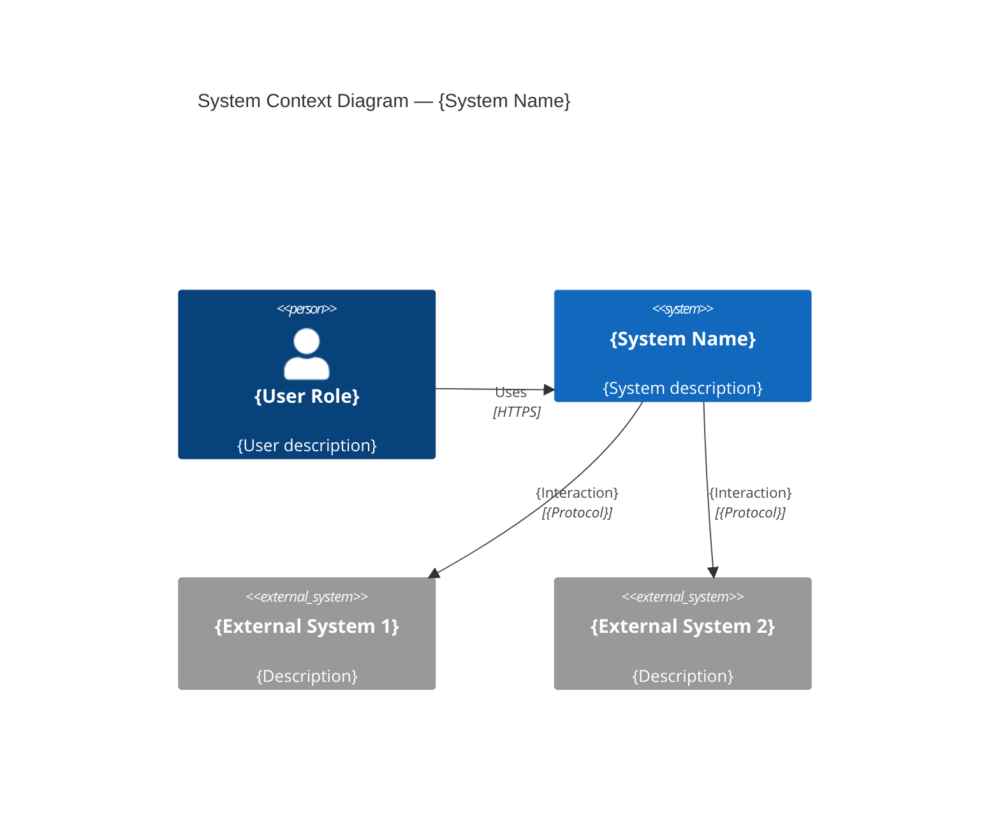
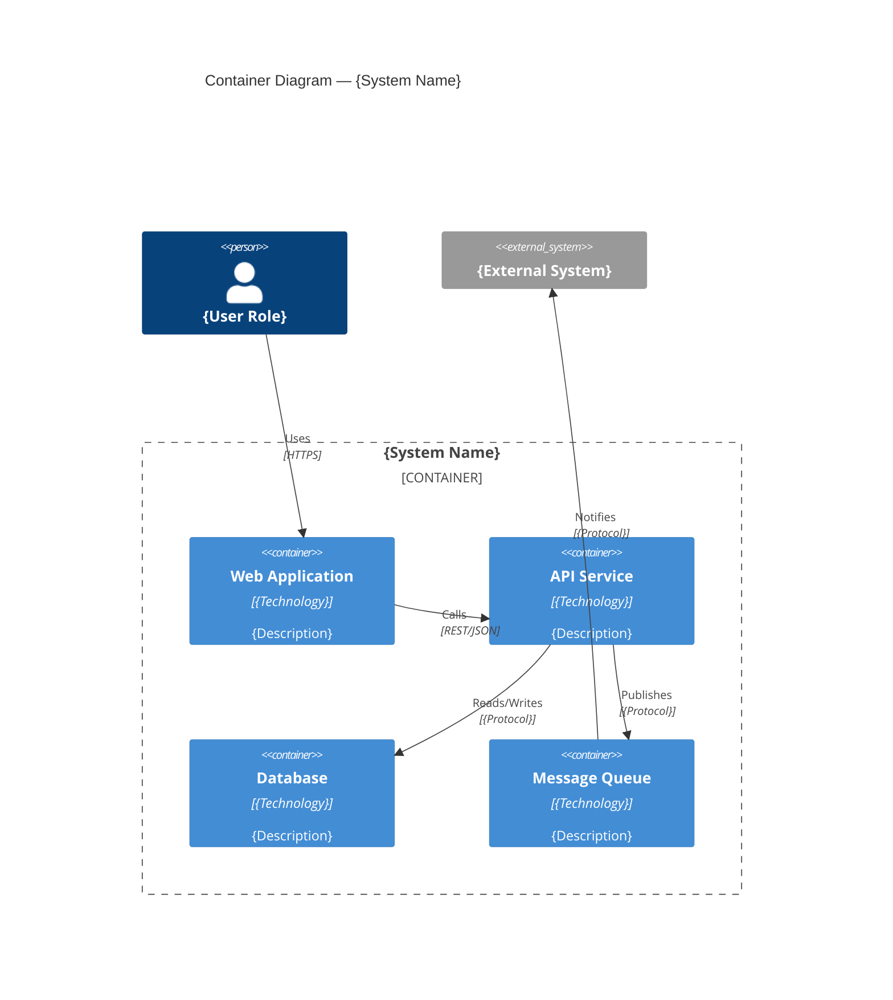
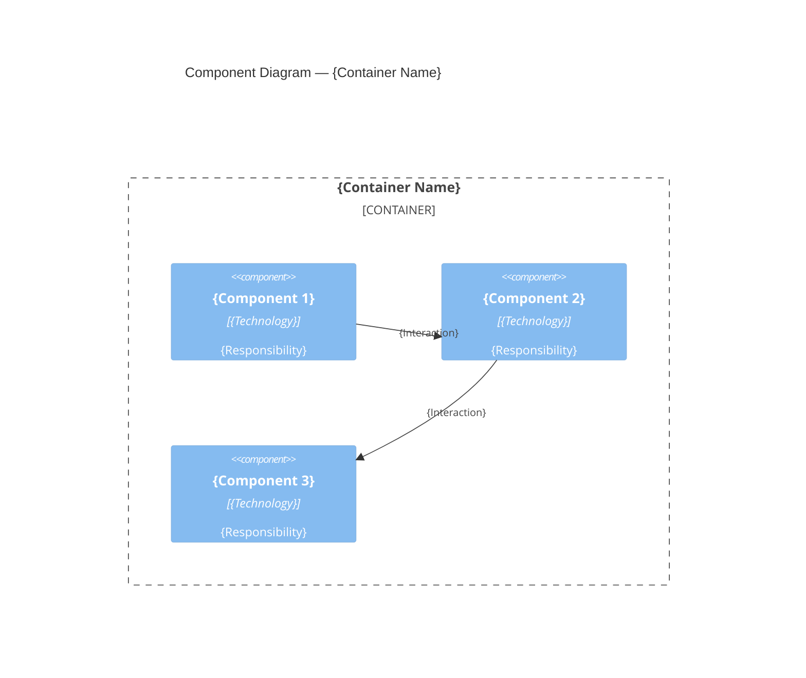
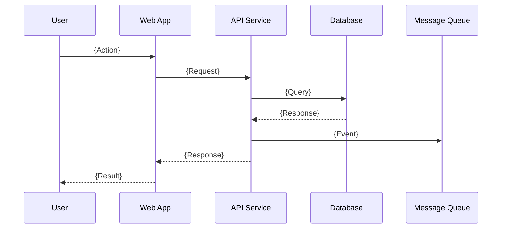
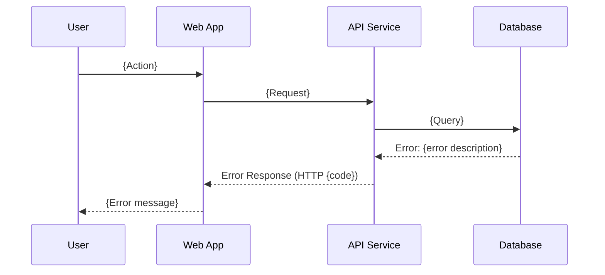
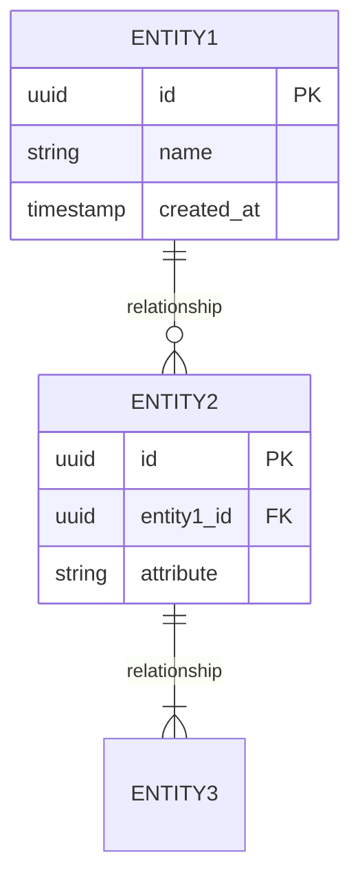

# Output Content List and Templates

## Role: Technical Lead (TL) — Technical Design & Solution Design Agent

## Output Content List

| # | Output Item | File Name | Format | Description |
|:--|:--|:--|:--|:--|
| O1 | Technical Design Document | `technical-design-document.md` | Markdown (arc42-based) | The main deliverable — detailed technical design with component diagrams, sequence diagrams, and specifications |
| O2 | Conversation Log | `conversation-log.md` | Markdown | Question-by-question record of all user interactions |
| O3 | Work Log | `work-log.md` | Markdown | Timeline-based record of agent activities |
| O4 | Question Lists | `question-lists.md` | Markdown | All question lists generated during each phase |
| O5 | Research Results | `research-results.md` | Markdown | Research process and findings saved for future use |
| O6 | DoD Verification Report | `dod-verification-report.md` | Markdown | Self-verification results against DoD checklist |

---

## Template: O1 — Technical Design Document

```markdown
---
title: "Technical Design: {Feature/System Name}"
author: TL Technical Design Agent
date: {YYYY-MM-DD}
version: {X.Y}
status: Draft | In Review | Approved
---

# Technical Design: {Feature/System Name}

## 1. Front Matter

| Field | Value |
|:--|:--|
| Project | {project_name} |
| Feature | {feature_name} |
| Author | TL Technical Design Agent |
| Created | {YYYY-MM-DD} |
| Last Updated | {YYYY-MM-DD} |
| Version | {X.Y} |
| Status | Draft / In Review / Approved |
| Reviewers | {list of reviewers} |

### Version History

| Version | Date | Author | Changes |
|:--|:--|:--|:--|
| 1.0 | {date} | TL Agent | Initial technical design |

---

## 2. Introduction / Overview

### 2.1 Problem Statement
{What problem does this design solve?}

### 2.2 Background and Context
{Why is this needed now? What business drivers exist?}

### 2.3 Scope
**In Scope:**
- {item 1}
- {item 2}

**Out of Scope:**
- {item 1}
- {item 2}

---

## 3. Goals and Non-Goals

### 3.1 Goals
1. {Goal 1 — measurable}
2. {Goal 2 — measurable}

### 3.2 Non-Goals
1. {Non-goal 1 — explicitly excluded}
2. {Non-goal 2 — explicitly excluded}

### 3.3 Success Criteria
- {Criterion 1}
- {Criterion 2}

---

## 4. Requirements Summary

### 4.1 Functional Requirements
| ID | Requirement | Priority |
|:--|:--|:--|
| FR-01 | {description} | Must Have |
| FR-02 | {description} | Should Have |

### 4.2 Non-Functional Requirements
| ID | Category | Requirement | Target |
|:--|:--|:--|:--|
| NFR-01 | Performance | {description} | {measurable target} |
| NFR-02 | Security | {description} | {measurable target} |
| NFR-03 | Scalability | {description} | {measurable target} |
| NFR-04 | Availability | {description} | {measurable target} |

### 4.3 Constraints
- {Technical constraint 1}
- {Business constraint 1}
- {Organizational constraint 1}

---

## 5. Architectural Overview (C4 Level 1 + Level 2)

### 5.1 System Context Diagram (C4 Level 1)



### 5.2 Container Diagram (C4 Level 2)



### 5.3 Technology Stack

| Layer | Technology | Rationale |
|:--|:--|:--|
| Frontend | {technology} | {rationale} |
| Backend | {technology} | {rationale} |
| Database | {technology} | {rationale} |
| Messaging | {technology} | {rationale} |
| Infrastructure | {technology} | {rationale} |

---

## 6. Detailed Component Design (C4 Level 3)

### 6.1 {Container Name} — Component Diagram



### 6.2 Component Responsibilities

| Component | Responsibility | Interfaces Provided | Dependencies |
|:--|:--|:--|:--|
| {Component 1} | {responsibility} | {interfaces} | {dependencies} |
| {Component 2} | {responsibility} | {interfaces} | {dependencies} |

---

## 7. Interaction / Behavior Design (Sequence Diagrams)

### 7.1 {Scenario Name} — Happy Path



### 7.2 {Scenario Name} — Error Path



---

## 8. Data Model / Database Schema

### 8.1 Entity-Relationship Diagram



### 8.2 Table Definitions

| Table | Column | Type | Constraints | Description |
|:--|:--|:--|:--|:--|
| {table1} | id | UUID | PK | Primary identifier |
| {table1} | {column} | {type} | {constraints} | {description} |

### 8.3 Data Flow

{Describe data transformations, ETL processes, or data pipeline designs}

---

## 9. API Specifications

### 9.1 API Overview

| Endpoint | Method | Description | Auth |
|:--|:--|:--|:--|
| `/api/v1/{resource}` | GET | {description} | Bearer Token |
| `/api/v1/{resource}` | POST | {description} | Bearer Token |
| `/api/v1/{resource}/{id}` | PUT | {description} | Bearer Token |
| `/api/v1/{resource}/{id}` | DELETE | {description} | Bearer Token |

### 9.2 API Details

#### `POST /api/v1/{resource}`

**Request:**
```json
{
  "field1": "value1",
  "field2": "value2"
}
```

**Response (201 Created):**
```json
{
  "id": "uuid",
  "field1": "value1",
  "field2": "value2",
  "created_at": "ISO 8601 timestamp"
}
```

**Error Response (400 Bad Request):**
```json
{
  "error": {
    "code": "VALIDATION_ERROR",
    "message": "Description of what went wrong",
    "details": [{"field": "field1", "issue": "required"}]
  }
}
```

---

## 10. Cross-Cutting Concerns

### 10.1 Security Design
- **Authentication**: {mechanism — OAuth 2.0 / JWT / API Key}
- **Authorization**: {model — RBAC / ABAC / Policy-based}
- **Encryption**: {at rest: AES-256; in transit: TLS 1.3}
- **Secrets Management**: {approach — Vault / AWS Secrets Manager / env vars}

### 10.2 Error Handling & Resilience
- **Retry Policy**: {exponential backoff with max N retries}
- **Circuit Breaker**: {threshold, timeout, half-open behavior}
- **Fallback Strategy**: {graceful degradation approach}
- **Dead Letter Queue**: {for unprocessable messages}

### 10.3 Logging & Observability
- **Structured Logging**: {format — JSON, log levels, correlation IDs}
- **Distributed Tracing**: {OpenTelemetry / Jaeger / Zipkin}
- **Metrics**: {RED method — Rate, Errors, Duration for services}
- **Alerting**: {thresholds and notification channels}

### 10.4 Caching Strategy
- **Cache Layer**: {Redis / Memcached / CDN / Application-level}
- **Cache Invalidation**: {TTL / Event-based / Write-through}
- **Cache Keys**: {naming convention}

### 10.5 Configuration Management
- **Environment Variables**: {approach}
- **Feature Flags**: {system — LaunchDarkly / custom}
- **Configuration Hierarchy**: {default → environment → runtime}

---

## 11. Deployment Architecture

### 11.1 Deployment Diagram
{Infrastructure topology — cloud services, regions, networking}

### 11.2 Scaling Strategy
- **Horizontal Scaling**: {auto-scaling policies, min/max instances}
- **Vertical Scaling**: {resource sizing per component}
- **Database Scaling**: {read replicas, sharding strategy}

### 11.3 CI/CD Considerations
- **Build Pipeline**: {stages}
- **Deployment Strategy**: {blue-green / canary / rolling}
- **Rollback Plan**: {approach}

---

## 12. Alternatives Considered (ADR)

### ADR-001: {Decision Title}

**Status**: Accepted

**Context**: {What is the issue that we are seeing that is motivating this decision?}

**Options Considered**:
| Option | Pros | Cons |
|:--|:--|:--|
| Option A: {name} | {pros} | {cons} |
| Option B: {name} | {pros} | {cons} |
| Option C: {name} | {pros} | {cons} |

**Decision**: {Which option was chosen and why}

**Consequences**:
- {Positive consequence 1}
- {Negative consequence / trade-off 1}
- {Follow-up action required}

---

## 13. Risks and Mitigations

| # | Risk | Probability | Impact | Mitigation |
|:--|:--|:--|:--|:--|
| R1 | {risk description} | High/Med/Low | High/Med/Low | {mitigation strategy} |
| R2 | {risk description} | High/Med/Low | High/Med/Low | {mitigation strategy} |

### Known Technical Debt
- {Tech debt item 1 — why it is acceptable for now}
- {Tech debt item 2}

---

## 14. Testing Strategy

### 14.1 Unit Testing
- {Approach, coverage targets, key areas}

### 14.2 Integration Testing
- {Approach, test boundaries, mock vs real services}

### 14.3 Performance / Load Testing
- {Approach, tools, target metrics, scenarios}

### 14.4 Rollback Plan
- {Step-by-step rollback procedure}

---

## 15. Glossary

| Term | Definition |
|:--|:--|
| {term 1} | {definition} |
| {term 2} | {definition} |
```

---

## Template: O2 — Conversation Log

```markdown
# Conversation Log — Technical Design: {Feature/System Name}

## Session Information
- **Project**: {project_name}
- **Task**: TL-REQ-001 — Technical Design & Solution Design
- **Started**: {YYYY-MM-DD HH:MM}

---

## Log Entries

### Entry #{N} — {YYYY-MM-DD HH:MM}
- **Phase**: {Step 1 / Step 2 / Step 3 / Step 4}
- **Agent Question**: {question asked}
- **User Response**: {user's answer}
- **Outcome**: {what was decided or confirmed}

---
```

---

## Template: O3 — Work Log

```markdown
# Work Log — Technical Design: {Feature/System Name}

## Session Information
- **Project**: {project_name}
- **Task**: TL-REQ-001 — Technical Design & Solution Design
- **Started**: {YYYY-MM-DD HH:MM}

---

## Timeline

### {YYYY-MM-DD HH:MM} — {Activity Title}
- **Phase**: {Step 1 / Step 2 / Step 3 / Step 4}
- **Activity**: {description of what the agent did}
- **Input**: {what was used}
- **Output**: {what was produced}
- **Status**: Completed / In Progress / Blocked
- **Notes**: {any relevant observations}

---
```

---

## Template: O4 — Question Lists

```markdown
# Question Lists — Technical Design: {Feature/System Name}

## Phase: {Step N} — {Phase Name}
Generated: {YYYY-MM-DD}

### Questions

| # | Question | Category | Status | Answer |
|:--|:--|:--|:--|:--|
| Q1 | {question text} | {category} | Asked / Answered / Deferred | {answer summary} |
| Q2 | {question text} | {category} | Asked / Answered / Deferred | {answer summary} |

---
```

---

## Template: O5 — Research Results

```markdown
# Research Results — Technical Design: {Feature/System Name}

## Research Session: {Topic}
- **Date**: {YYYY-MM-DD}
- **Phase**: {Step N}
- **Search Query**: {query used}

### Sources Consulted

| # | Source | URL | Key Finding |
|:--|:--|:--|:--|
| 1 | {source name} | {url} | {key finding} |
| 2 | {source name} | {url} | {key finding} |

### Summary of Findings
{Synthesized findings relevant to the design}

### Application to Design
{How these findings were applied to the technical design}

---
```

---

## Template: O6 — DoD Verification Report

```markdown
# DoD Verification Report — Technical Design: {Feature/System Name}

- **Date**: {YYYY-MM-DD}
- **Verification Round**: #{N}

## Verification Results

| # | DoD Item | Status | Evidence | Notes |
|:--|:--|:--|:--|:--|
| 1 | {DoD criterion} | PASS / FAIL | {file/section reference} | {notes} |
| 2 | {DoD criterion} | PASS / FAIL | {file/section reference} | {notes} |

## Overall Result: {PASS / FAIL} — {M}/{N} items passed ({X}%)

## Remediation Items (if FAIL)
1. {item}: {what needs to be fixed}
2. {item}: {what needs to be fixed}
```

## Configuration Notes

- Add new output items by appending rows to the Output Content List table
- Templates can be customized per project — maintain the required sections
- All outputs are saved to the `technical-design-solution-design` directory under the project directory
