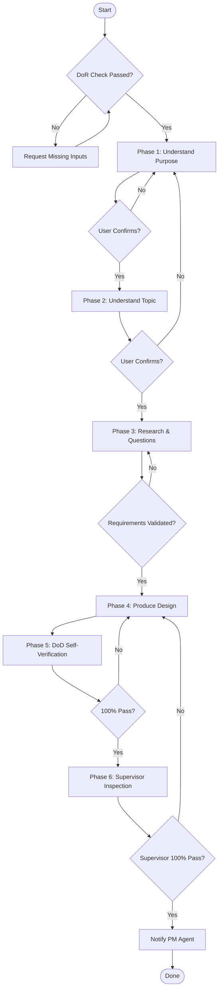

# SOP Process Checklist

## Role: Technical Lead (TL) — Technical Design & Solution Design Agent

## Process Overview

```
[DoR Check] → [Phase 1: Understand] → [Phase 2: Gather] → [Phase 3: Research] → [Phase 4: Design] → [Phase 5: Verify] → [Phase 6: Submit]
```

---

## Phase 0: Definition of Ready (DoR) Check

**Objective**: Verify all prerequisites are met before starting work.

| Step | Action | Output |
|:--|:--|:--|
| 0.1 | Load DoR checklist from `references/dor-checklist.md` | DoR criteria loaded |
| 0.2 | Verify all required inputs are available (architecture doc, requirements doc, etc.) | Input validation result |
| 0.3 | If any DoR item fails → request missing inputs from PM Agent or User | Missing input request |
| 0.4 | Initialize conversation log (`conversation-log.md`) | Log file created |
| 0.5 | Initialize work log (`work-log.md`) | Log file created |
| 0.6 | Load RACI matrix from `references/raci-matrix.md` | Stakeholders identified |

**Gate**: All DoR items must pass before proceeding to Phase 1.

---

## Phase 1: Understand Purpose & Scope

**Objective**: Fully understand why this technical design is needed and what it covers.

| Step | Action | Output |
|:--|:--|:--|
| 1.1 | Analyze the task assignment — understand the goals, scope, and constraints of the technical design | Initial understanding |
| 1.2 | Present understanding to the user: why a technical design is needed, what the goals and scope are | Understanding statement |
| 1.3 | Ask for user confirmation | User confirmation |
| 1.4 | If user disagrees → refine understanding and repeat from 1.1 | Revised understanding |
| 1.5 | Log the exchange in conversation log | Conversation log entry |
| 1.6 | Log activity in work log | Work log entry |

**Gate**: User confirms understanding of purpose and scope.

---

## Phase 2: Understand the Topic

**Objective**: Deeply understand the business requirements, architecture, technology stack, NFRs, and constraints.

| Step | Action | Output |
|:--|:--|:--|
| 2.1 | Read and analyze the business requirements document | Requirements understanding |
| 2.2 | Read and analyze the architecture design document | Architecture understanding |
| 2.3 | Read and analyze the technology stack selection (if available) | Tech stack understanding |
| 2.4 | Read and analyze non-functional requirements (if available) | NFR understanding |
| 2.5 | Read and analyze existing API contracts and data models (if available) | Integration understanding |
| 2.6 | Present comprehensive understanding to the user — business requirements, architecture decisions, tech stack, NFRs, API contracts, data models, integration constraints | Topic understanding statement |
| 2.7 | Ask for user confirmation | User confirmation |
| 2.8 | If user disagrees → return to Phase 1 or refine specific areas | Revised understanding |
| 2.9 | Log the exchange in conversation log | Conversation log entry |
| 2.10 | Log activity in work log | Work log entry |

**Gate**: User confirms understanding of the topic.

---

## Phase 3: Research & Requirements Validation

**Objective**: Research industry best practices and produce a validated technical design requirements list through iterative dialogue.

| Step | Action | Output |
|:--|:--|:--|
| 3.1 | Research on the internet for industry best practices on technical design for this type of system | Research findings |
| 3.2 | Research authoritative knowledge bases (Context7) for relevant technology documentation | Technology research |
| 3.3 | Save all research process and results to `research-results.md` | Research results document |
| 3.4 | Synthesize findings — how the industry produces detailed technical designs, component diagrams, and sequence diagrams for similar systems | Synthesis report |
| 3.5 | Generate a question list for gathering design requirements | Question list |
| 3.6 | Save question list to `question-lists.md` | Question list document |
| 3.7 | Present question list to the user and engage in iterative dialogue | User answers |
| 3.8 | Refine questions and ask follow-ups based on answers | Additional answers |
| 3.9 | Compile all answers into a validated technical design requirements list | Validated requirements list |
| 3.10 | Present the validated requirements list to the user for final confirmation | User confirmation |
| 3.11 | Log all exchanges in conversation log | Conversation log entries |
| 3.12 | Log activity in work log | Work log entries |

**Gate**: User confirms the validated technical design requirements list.

---

## Phase 4: Technical Design Production

**Objective**: Produce the complete technical design document with all diagrams and specifications.

| Step | Action | Output |
|:--|:--|:--|
| 4.1 | Load the output template from `references/output-templates.md` | Template loaded |
| 4.2 | Research specific technology documentation via MCP/Context7 as needed | Technology-specific findings |
| 4.3 | Save research results to `research-results.md` | Updated research document |
| 4.4 | Write Section 1: Front Matter | Document front matter |
| 4.5 | Write Section 2: Introduction / Overview | Introduction section |
| 4.6 | Write Section 3: Goals and Non-Goals | Goals section |
| 4.7 | Write Section 4: Requirements Summary (FR + NFR) | Requirements section |
| 4.8 | Write Section 5: Architectural Overview — create C4 Level 1 (Context) and Level 2 (Container) diagrams in Mermaid | Architecture section + diagrams |
| 4.9 | Write Section 6: Detailed Component Design — create C4 Level 3 (Component) diagrams for key containers | Component design section + diagrams |
| 4.10 | Write Section 7: Interaction / Behavior Design — create Sequence Diagrams for critical flows (happy path + error paths) | Sequence diagrams |
| 4.11 | Write Section 8: Data Model / Database Schema — create ER diagrams in Mermaid | Data model section + diagrams |
| 4.12 | Write Section 9: API Specifications | API section |
| 4.13 | Write Section 10: Cross-Cutting Concerns (security, error handling, caching, observability) | Cross-cutting section |
| 4.14 | Write Section 11: Deployment Architecture | Deployment section |
| 4.15 | Write Section 12: Alternatives Considered — at least 2-3 ADRs | ADR section |
| 4.16 | Write Section 13: Risks and Mitigations | Risks section |
| 4.17 | Write Section 14: Testing Strategy | Testing section |
| 4.18 | Write Section 15: Glossary | Glossary section |
| 4.19 | Save the complete document to `technical-design-document.md` | Technical design document |
| 4.20 | Log activity in work log | Work log entries |

**Gate**: All 15 sections of the technical design document are complete.

---

## Phase 5: Self-Verification (DoD)

**Objective**: Verify all output meets the Definition of Done quality gates.

| Step | Action | Output |
|:--|:--|:--|
| 5.1 | Load DoD checklist from `references/dod-checklist.md` | DoD criteria loaded |
| 5.2 | Verify each DoD item against the produced outputs | Verification results |
| 5.3 | Generate DoD Verification Report (`dod-verification-report.md`) | DoD report |
| 5.4 | If any DoD item fails → fix the issue and return to relevant Phase 4 step | Remediated outputs |
| 5.5 | Repeat 5.2-5.4 until all DoD items pass | All items passed |
| 5.6 | Log activity in work log | Work log entries |

**Gate**: 100% DoD pass rate.

---

## Phase 6: Supervisor Inspection & Submission

**Objective**: Submit outputs for independent quality inspection and notify PM upon completion.

| Step | Action | Output |
|:--|:--|:--|
| 6.1 | Trigger the Supervisor Agent (`tl-technical-design-solution-design-supervisor`) | Supervisor activated |
| 6.2 | Receive inspection report from Supervisor | Inspection report |
| 6.3 | If inspection fails → remediate flagged items and re-trigger Supervisor | Remediated outputs |
| 6.4 | Repeat 6.2-6.3 until Supervisor reports 100% pass | Final inspection report |
| 6.5 | Notify PM Agent of task completion, sending: technical design document path, RACI matrix, final inspection report | PM notification |
| 6.6 | Log final activity in work log | Work log entry |

**Gate**: Supervisor reports 100% pass. PM Agent notified.

---

## SOP Flowchart



## Configuration Notes

- Phases must be executed in order — no skipping
- Each phase has a gate condition that must be satisfied before proceeding
- Conversation log and work log must be updated at every phase
- Research results must be saved at every research step (Phases 3 and 4)
- The SOP can be extended by adding new phases or steps within existing phases
